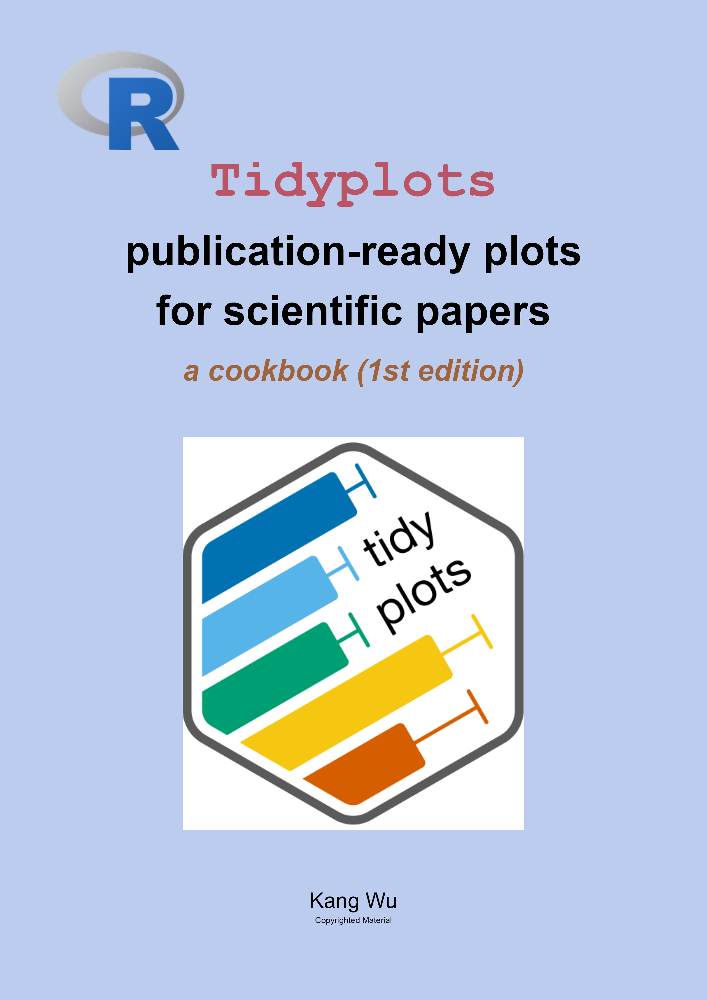

This is largely a curated compilation of codes & the corresponding plots, perhaps with some additional exploration, based on the official resources.

The official resources used for this compilation include:

- 🔗<https://tidyplots.org/>

- 🔗<https://github.com/jbengler/tidyplots>

- 🔗<https://bsky.app/profile/jbengler.de>

- 🔗[the paper: iMeta 2025](https://onlinelibrary.wiley.com/doi/10.1002/imt2.70018)

You may read it online here for free, or purchase a physical copy from ?? (independently published ??).

For the physical copy, code is primarily shown on the left-hand pages, with the corresponding plots displayed on the following right-hand pages to facilitate **reference, comparison, or interpretation**.

![A color scheme [@paul_tol_colors] is used throughout the codebook to ensure strong color contrast, including in **grayscale physical copies**, while also remaining color-blind friendly (see @sec-high-contrast).](left_right_pattern_v1.0.png)