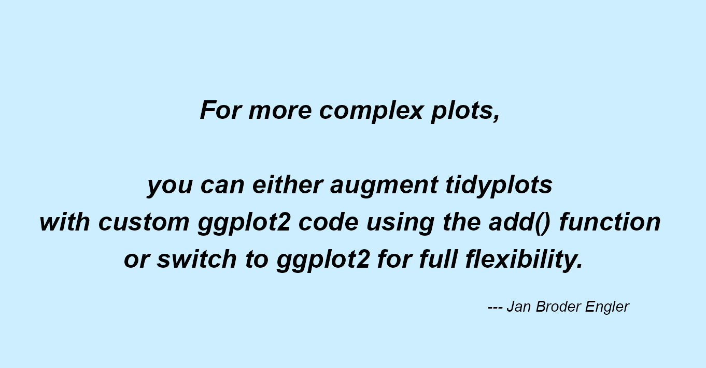
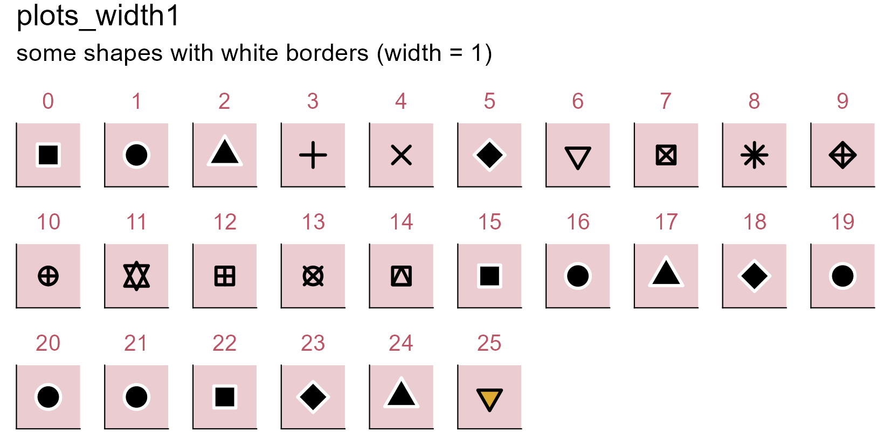
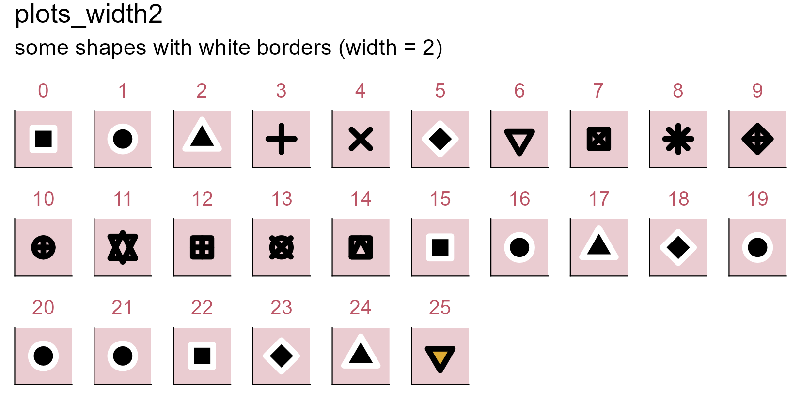
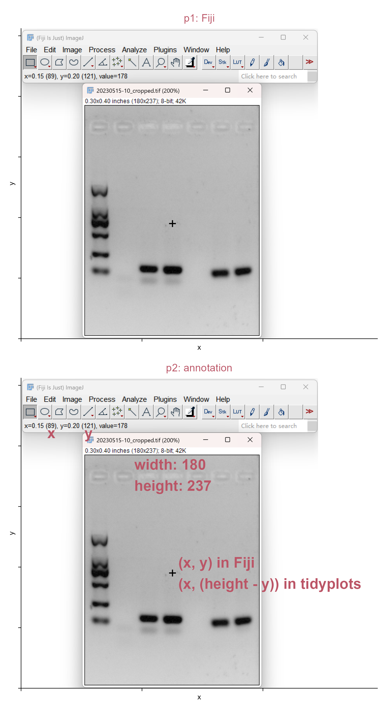
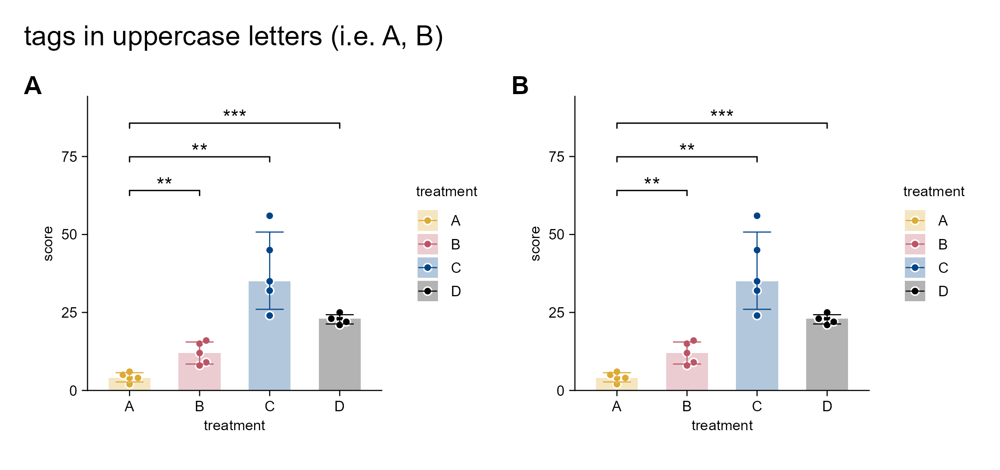

# Appendix

```{r}
#| eval: false
#| echo: false
tidyplots |> library()

# Define style
my_default_style <- function(x) {
  x |> 
  adjust_colors(new_colors = c("#ddaa33", "#bb5566", "#004488", "#000000")) |> 
  adjust_title(fontsize = 10, color = "#bb5566")
}

# Set global options
tidyplots_options(my_style = my_default_style)
```

```{r}
#| eval: false
#| echo: false
# For occupying a page
df <- tibble::tibble(
  x = 1,
  y = 1
)

df |> 
  tidyplot(x = x, y = y, paper = "#cceeff") |> 
  add_annotation_text(
    text = "For more complex plots, \n\nyou can either augment tidyplots \nwith custom ggplot2 code using the add() function \nor switch to ggplot2 for full flexibility.",
    x = 1,
    y = 1,
    fontsize = 12,
    fontface = "bold.italic") |> 
  add_annotation_text(
    text = "--- Jan Broder Engler",
    x = 1.9,
    y = 0.6,
    hjust = 1,
    fontface = "italic") |> 
  adjust_size(width = 100) |> 
  adjust_x_axis(limits = c(0, 2)) |> 
  adjust_y_axis(limits = c(0.5, 1.5)) |> 
  adjust_size(
    width = 100) |> 
  remove_x_axis() |> 
  remove_y_axis() |> 
  remove_clipping() |> 
  save_plot(
    "images/tidyplots-complex_add_ggplot2.png",
    view_plot = FALSE)
```

{width="100%" fig-align="center"}

## Point shapes {#sec-point-shapes}

Type `?tidyplots::add_data_points` in R console, you can view the `help` information of the function.

> *shape   An integer between 0 and 24, representing the shape of the plot symbol.*

Let's see: **which point shapes in `tidyplots` allow simultaneous use of `color` and `fill` aesthetics?**

```{r}
#| message: false
#| warning: false
library(tidyplots)

# Set a df for point plotting
df <- tibble::tibble(
  x = rep(1:20, length.out = 200),
  y = rep(letters[1:10], each = 20),
  shape = seq(0, 199)) # testing more numbers here

# View top 10 rows
df |> 
  dplyr::slice_head(n = 10)
```

```{r}
#| eval: false
#| warning: false
# Plot
df |> tidyplot(
    x = x, 
    y = y) |> 
  add_data_points(
    shape = df$shape, 
    size = 3, 
    color = "#000000", 
    fill = "#bb5566") |> 
  add_annotation_text(
    text = df$shape, 
    x = df$x, 
    y = df$y, 
    vjust = 2.5, 
    color = "#004488") |> 
  adjust_size(
    width = 150, 
    height = 100) |> 
  adjust_y_axis(
    limits = c(0.3, NA)) |>  
  remove_x_axis_labels() |> 
  remove_y_axis_labels() |> 
  remove_x_axis_title() |> 
  remove_y_axis_title() |> 
  add_title(
    title = "Just shapes 21 - 25 in tidyplots use both 'color' and 'fill' aesthetics") |> 
  save_plot(
    filename = "images/point-shape-color-fill.png",
    view_plot = FALSE)
```

{width="100%" fig-align="center"}

## Point white borders and width {#sec-point-white-borders-and-width}

```{r}
library(tidyplots)

df <- tibble::tibble(x = 1, y = 1)

# View
df
```

```{r}
#| eval: false
# Define a style
my_style <- function(x) {
  x |> 
  adjust_size(width = 10, height = 10) |> 
  remove_x_axis_labels() |> remove_x_axis_title() |> remove_x_axis_ticks() |> 
  remove_y_axis_labels() |> remove_y_axis_title() |> remove_y_axis_ticks() |> 
  adjust_theme_details(
    panel.background = ggplot2::element_rect(fill = "#bb55664d"))}

# Set a function to plot
generate_plot <- function(point_shape, white_border_width) {
  df |> tidyplot(x = x, y = y) |> 
    my_style() |> 
    add_data_points(
      white_border = TRUE, 
      size = 3, 
      stroke = white_border_width, # border width
      color = "#000000", 
      shape = point_shape) |> # point shape
  add_title(title = as.character(point_shape))}

# Plots with point shapes 0 - 25 (white_border width: 1)
plots_width1 <- purrr::set_names(
  purrr::map(0:25, generate_plot, white_border_width = 1),
  paste0("p", 0:25))

# Plots with point shapes 0 - 25 (white_border width: 2)
plots_width2 <- purrr::set_names(
  purrr::map(0:25, generate_plot, white_border_width = 2),
  paste0("p", 0:25))

# Wrap plots together and save
(patchwork::wrap_plots(plots_width1, ncol = 10) +
  patchwork::plot_annotation(
    title = "plots_width1",
    subtitle = "some shapes with white borders (width = 1)")) |> 
  save_plot("images/point-white-borders1.png",
    view_plot = FALSE, width = 140, height = 70)

(patchwork::wrap_plots(plots_width2, ncol = 10) +
  patchwork::plot_annotation(
    title = "plots_width2",
    subtitle = "some shapes with white borders (width = 2)")) |> 
  save_plot("images/point-white-borders2.png",
    view_plot = FALSE, width = 140, height = 70)
```

{width="100%" fig-align="center"}

{width="100%" fig-align="center"}

:::{.callout-note icon="true"}
Some shapes become visually identical under this condition (i.e. when `white_border = TRUE`), such as shapes 0, 15, and 22.
:::

## xy coordinates in ImageJ/Fiji {#sec-xy-coordinates-imagej}

Here it uses `Fiji`.

> *`Fiji` is a distribution of ImageJ which includes many useful plugins contributed by the community.* <https://imagej.net/software/fiji/downloads>

```{r}
library(tidyplots)

img <- "images/fiji.png" |> magick::image_read()
# View image information
img_info <- img |> magick::image_info()
img_width <- img_info$width; img_height <- img_info$height
# Change to graphical object
img_grob <- img |> grid::rasterGrob()

# Create a data frame relevant to img_grob
df <- tibble::tibble(x = seq(0, img_width, length.out = 100),
  y = seq(0, img_height, length.out = 100))
# View the 1st row of df
df |> dplyr::slice_head(n = 1)
```

```{r}
#| eval: false
# The intended width of image
img_intend_width = 100 # unit: mm
# Tailor relative extra spaces of plot
top_extra = 0 # 0 (0%) - 1 (100%)
right_extra = 0.2; bottom_extra = 0; left_extra = 0

# The width and height of plot
plot_width = img_intend_width * (1 + left_extra + right_extra) # unit: mm
plot_height = img_intend_width * (img_height/img_width) * (1 + top_extra + bottom_extra)

# Plot
p1 <- df |> tidyplot(x = x, y = y) |> 
  add_data_points(alpha = 0) |> 
  add(ggplot2::annotation_custom(img_grob, xmin = 0, xmax = img_width, 
    ymin = img_height, ymax = 0)) |> 
  add_title(title = "p1: Fiji") |> 
  add_annotation_text(text = "+", x = 626, y = c(img_height - 804), fontsize = 14) |> 
  adjust_size(width = plot_width, height = plot_height) |> 
  adjust_x_axis(limits = c(-img_width*left_extra, img_width*(1 + right_extra))) |> 
  adjust_y_axis(limits = c(-img_height*bottom_extra, img_height*(1+top_extra))) |> 
  remove_x_axis_labels() |> remove_y_axis_labels()

p2 <- p1 |> 
  adjust_title(title = "p2: annotation") |> 
  add_annotation_text(text = "x", x = 125, y = c(img_height - 226), fontsize = 14, 
    color = "#bb5566", fontface = "bold") |> 
  add_annotation_text(text = "y", x = 279, y = c(img_height - 226), fontsize = 14, 
    color = "#bb5566", fontface = "bold") |>
  add_annotation_text(text = "width: 180\nheight: 237", x = 468, 
    y = c(img_height - 334),fontsize = 14, color = "#bb5566", 
    hjust = 0, vjust = 1, fontface = "bold") |>  
  add_annotation_text(text = "(x, y) in Fiji\n(x, (height - y)) in tidyplots", x = 650,
    y = c(img_height - 804), color = "#bb5566", fontsize = 14, 
    hjust = 0, fontface = "bold")
```

```{r}
#| eval: false
#| echo: false
patchwork::wrap_plots(p1, p2, ncol = 1) |> 
  save_plot("images/fiji_annotate.png", 
    view_plot = FALSE, width = 130, height = 240)
```

{width="77%" fig-align="center"}

## `Patchwork` package for combining multiple plots

:::{.callout-note icon="true"}
Patchwork <https://patchwork.data-imaginist.com/> was not initially designed to handle plots with **absolute dimensions**.
:::

All multi-panel figures throughout this book (except the figure in @sec-plot-size and @sec-plot-panel-padding), due to differences in **absolute dimensions**, are combined using the `patchwork` package.

In general, `patchwork` can be used to **combine seperate plots into a multi-panel figure and tag each panel, which is a common practice in scientific papers**.

```{r}
library(tidyplots)

# View top 10 rows of the columns used
study |> dplyr::select(treatment, score) |> 
  dplyr::slice_head(n = 10)
```

```{r}
#| eval: false
# Plot
p1 <- study |> 
  tidyplot(
    x = treatment, y = score, color = treatment) |> 
  add_median_bar(alpha = 0.3) |> 
  add_data_points_beeswarm(white_border = TRUE) |> 
  add_sd_errorbar() |> 
  add_test_asterisks(ref.group = "A", hide_info = TRUE)

p2 <- p1
```

```{r}
#| eval: false
#| echo: true
multipanel_1 <- patchwork::wrap_plots(p1, p2, ncol = 2) + 
  patchwork::plot_annotation(
    tag_levels = "A", title = "tags in uppercase letters (i.e. A, B)") &
  ggplot2::theme(plot.tag = ggplot2::element_text(size = 12, face = "bold"))
multipanel_1 |> 
  save_plot("images/patchwork_multipanel_1.png",
    view_plot = FALSE, width = 170, height = 80) # width and height should be tailored

multipanel_2 <- patchwork::wrap_plots(p1, p2, ncol = 2) + 
  patchwork::plot_annotation(
    tag_levels = "a", title = "tags in lowercase letters (i.e. a, b)") &
  ggplot2::theme(plot.tag = ggplot2::element_text(size = 12, face = "bold"))  
multipanel_2 |> 
  save_plot("images/patchwork_multipanel_2.png",
    view_plot = FALSE, width = 170, height = 80) # width and height should be tailored
```




## Packages used throughout this cookbook

```{r}
os_version <- paste(Sys.info()[c("sysname", "release")], collapse = " ")
quarto_version <- system2("quarto", "--version", stdout = TRUE)
positron_version <- system2("positron", "--version", stdout = TRUE)
r_version <- R.version.string

r_packages_versions <- tibble::tibble(
  r_package = c(
    "tidyplots", "scales", "ggplot2", "patchwork", "ggtext", 
    "ggridges", "see", "legendry", "gggenes", "purrr", 
    "readr", "readxl", "tibble", "dplyr", "rphylopic", 
    "fs", "magick")) |> 
  dplyr::mutate(
    version = purrr::map_chr(r_package, \(x) as.character(packageVersion(x))))

os_version
paste0("quarto: ", quarto_version)
paste0("positron: ", positron_version[1])
r_version
r_packages_versions
```