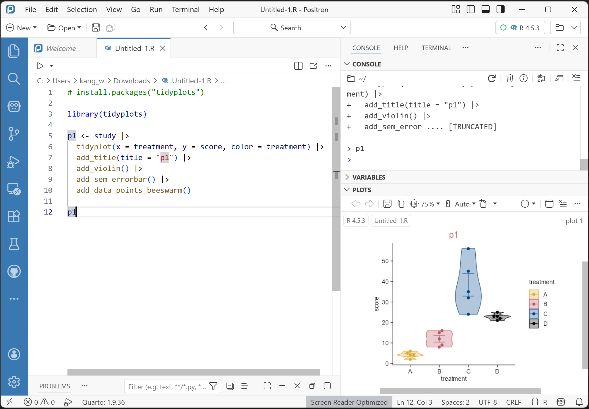
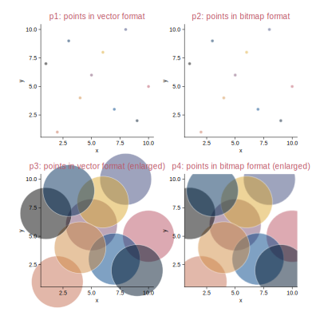
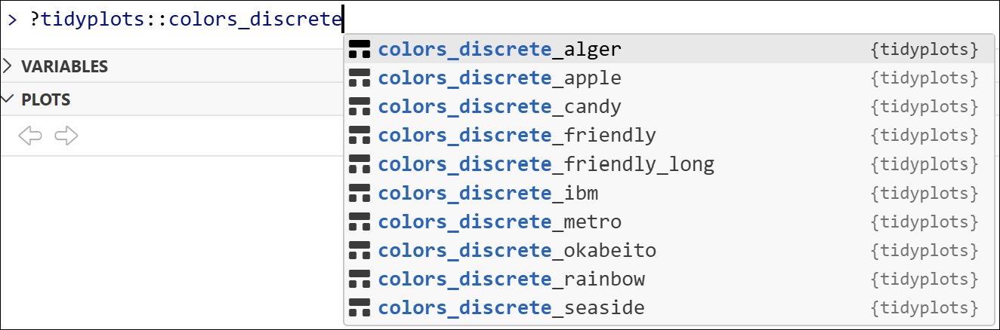
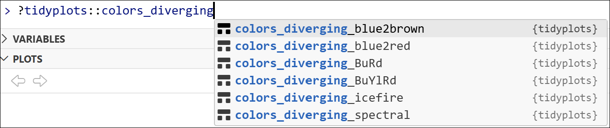
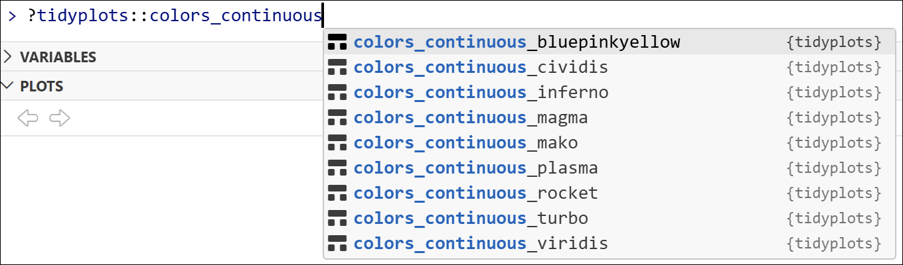
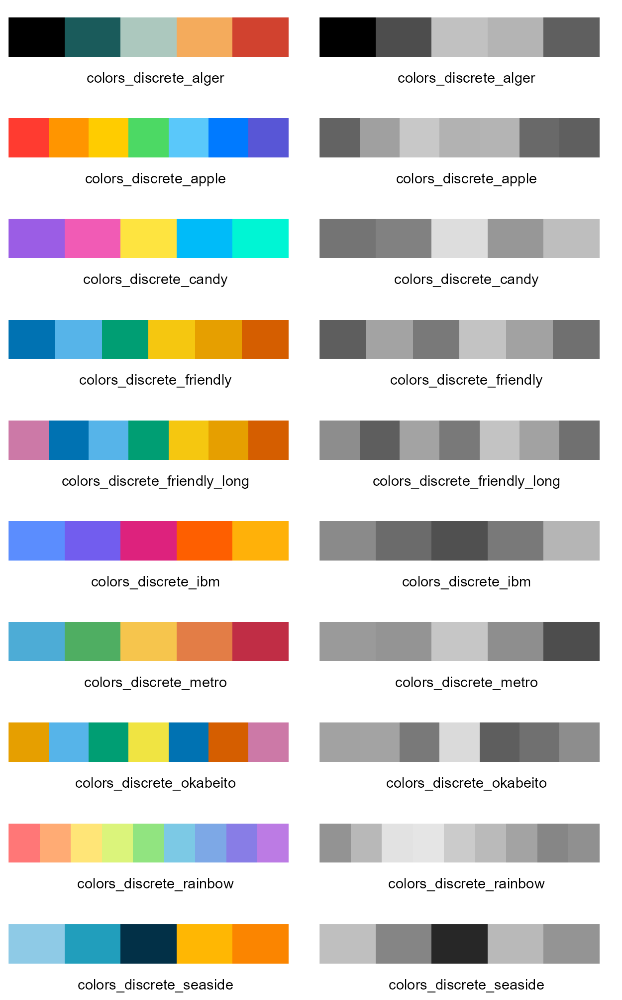
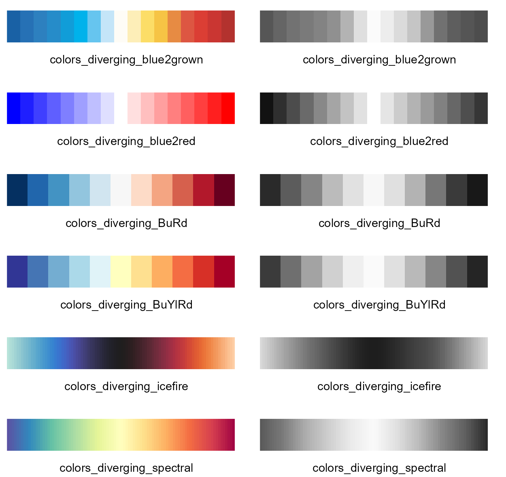
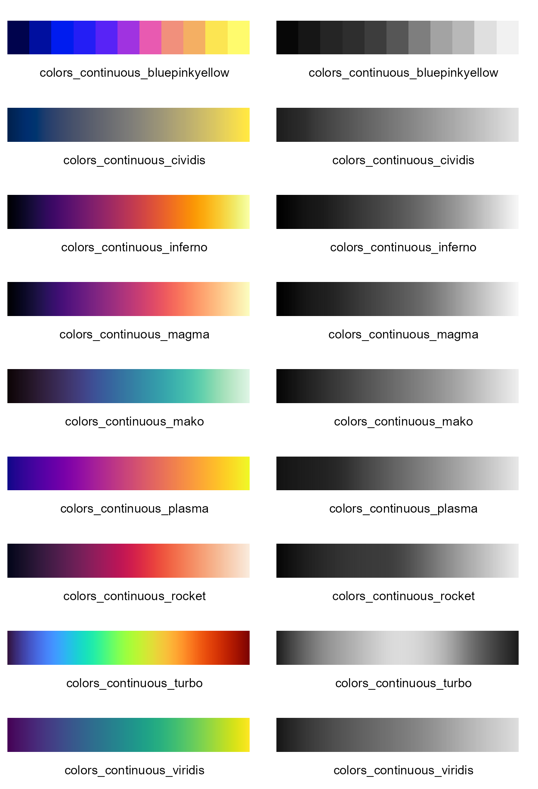
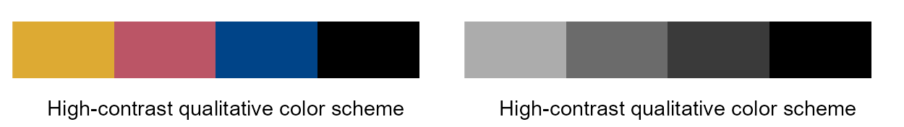
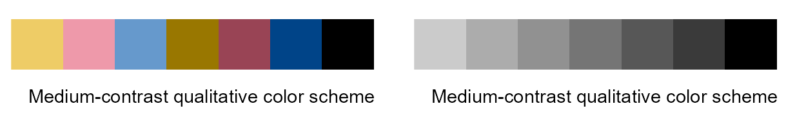

# Getting started

## What is `tidyplots`?

- 👉`Tidyplots`📦 is an R package to generate **publication-ready plots for scientific papers**, developed by Jan Broder Engler [@tidyplots].

- 👉`Tidyplots` is **based on `ggplot2`**.

- 👉Instead of extending the `ggplot2` syntax, `tidyplots` introduces a **novel interface** based on a consistent and intuitive grammar that **minimizes the need of programming experience**.

### Highlights {.unlisted}

- 👉**Easy** code-based data visualization for science.

- 👉**Intuitive syntax** to add, remove, and adjust plot components.

- 👉**Reduced code complexity** in comparison to `ggplot2` (making plotting easier for beginners).

```{r}
#| eval: false
#| echo: false
# Download the cheatsheet of tidyplots
url <- "https://tidyplots.org/tidyplots-cheatsheet-v1.pdf"

url_basename <- url |> 
  basename()

url |> download.file(
  destfile = file.path("data", url_basename),
  mode = "wb")
```

### Citation {.unlisted}

```{r}
citation("tidyplots")
```

## Prerequisites

### Install R and its integrated development environment (IDE) {.unlisted}

- 👉Install `R` (<https://www.r-project.org/>).

- 👉Install the IDE of `RStudio Desktop` (<https://posit.co/download/rstudio-desktop/>), or install the IDE of `Positron on desktop` (<https://positron.posit.co/>).

{width="100%" fig-align="center"}

### Install `tidyplots` package and other packages {.unlisted}

```{r}
#| eval: false
# Install the released version from CRAN:
install.packages("tidyplots")

# Install the development version from GitHub:
# Install.packages("pak") # install pak if not already installed
pak::pak("jbengler/tidyplots")
# Install a specific version
pak::pak("jbengler/tidyplots@v0.0.1")
# Install a specific commit
pak::pak("jbengler/tidyplots@4a08bfe")
```

```{r}
#| eval: false
# For example
install.packages("tidyverse")
```

{width=50% fig-align="center"}

### How to read your data {.unnumbered .unlisted}

Your (experimental) data might be in the formats of .xlsx, .csv (comma-seperated values), or .txt (saved as tab-seperated values).

```{r}
#| echo: false
#| eval: false

# Save study dataset as 'study.xlsx'
tidyplots::study |> writexl::write_xlsx("data/study.xlsx")

# Save study dataset as 'study.csv'
tidyplots::study |> readr::write_csv("data/study.csv")

# Save study dataset as 'study.txt'
tidyplots::study |> readr::write_tsv("data/study.txt")
```

Here are the saved files with different formats from the `tidyplots` `study` dataset for illustration.

```{r}
"data/" |> 
  fs::dir_tree(regexp = "^data/study")
```

:::{.callout-tip icon="true"}
The keyboard shortcut for the pipe operator `|>` is `Ctrl` + `Shift` + `M` (i.e. click `Ctrl`, `Shift`, and `M` simultaneously) on Windows and `Cmd` + `Shift` + `M` on the Mac.
:::

#### How to read .csv file {.unnumbered .unlisted}

```{r}
study_csv <- "data/study.csv" |> 
  readr::read_csv()

# The dimension (rows by columns) of study_csv
study_csv |> dim()
```

:::{.callout-note icon="true"}
`study.csv`, as well as several other example datasets used throughout this book, can be downloaded from `https://github.com/iamhealthy/tidyplots-book/tree/main/data`.
:::

```{r}
#| echo: false
# remove study_csv
study_csv |> rm()
```

:::{.callout-tip icon="true"}
The keyboard shortcut for the assignment operator `<-` is `Alt` + `-` (i.e. click `Alt` and `-` simultaneously) on Windows and `Option` + `-` (i.e. click `Option` and `-` simultaneously) on the Mac.
:::

#### How to read .txt file {.unnumbered .unlisted}

```{r}
study_txt <- "data/study.txt" |> 
  readr::read_tsv()

# The dimension (rows by columns) of study_csv
study_txt |> dim()
```

```{r}
#| echo: false
# remove study_txt
study_txt |> rm()
```

#### How to read .xlsx file {.unnumbered .unlisted}

```{r}
study_xlsx <- "data/study.xlsx" |> 
  readxl::read_xlsx(sheet = "Sheet1")

# The dimension (rows by columns) of study_xlsx
study_xlsx |> dim()
```

```{r}
#| echo: false
# remove study_xlsx
study_xlsx |> rm()
```

### Your data should be tidy data {.unlisted}

As stated in <https://tidyr.tidyverse.org/>, **tidy data** is data where:

1. 👉Each variable is a column; each column is a variable.
2. 👉Each observation is a row; each row is an observation.
3. 👉Each value is a cell; each cell is a single value.

Using the tidy data `tidyplots` `study` dataset for a quick overview. 

```{r}
tidyplots::study |> tibble::tibble()
```

```{r}
#| eval: false
#| echo: false
#| message: false
library(tidyplots)
library(magick)
library(ggplot2)
library(grid)
library(tibble)

# Read the figure
study <- "images/tidyplots-study.png" |> 
  magick::image_read()

# Print the size (dimensions) of the figure
study_info <- study |> magick::image_info()
study_width <- study_info$width
study_height <- study_info$height

study_grob <- study |> 
  grid::rasterGrob()

# Set a tibble
df <- tibble(
  x = c(-10:1200),
  y = c(-10:1200))

#
df |> 
  tidyplot(x = x, y = y) |> 
  add(ggplot2::annotation_custom(
    study_grob, 
    xmin = 0, 
    xmax = 0 + study_width, 
    ymin = 1000, 
    ymax = 1000 - study_height)) |> 
  add_annotation_line(
    x = c(55, 55, 965, 10, 10, 10),
    xend = c(965, 55, 965, 10, 30, 30),
    y = c(955, 955, 955, 885, 885, 515),
    yend = c(955, 940, 940, 515, 885, 515),
    color = "#bb5566") |> 
  add_annotation_rectangle(
    xmin = c(55),
    xmax = c(965),
    ymin = c(920),
    ymax = c(885),
    color = "#004488",
    fill = NA) |> 
  add_annotation_text(
    text = c("Variables", "Observations", "Data types"),
    x = c(510, 10, 965),
    y = c(955, 700, 902.5),
    vjust = c(-0.5, -0.5, 0.5),
    hjust = c(0.5, 0.5, -0.1),
    fontsize = 10,
    color = c("#bb5566", "#bb5566", "#004488"),
    angle = c(0, 90, 0)) |> 
  adjust_x_axis(
    limits = c(-40, 1200) # 1240 in x_axis_width
) |>
  adjust_y_axis( # in proportion to the original figure dimensions
    limits = c(510, 1010) # 500 in y_axis_height
  ) |> 
  add(ggplot2::theme_void()) |> 
  adjust_size( # in proportion to the original figure dimensions
    width = 100, # width in mm
    height = 100 * (500/1240) # width * (y_axis_height / x_axis_width
  ) |> 
  save_plot("images/tidyplots-study_marked.png", view_plot = FALSE, padding = 0)
```

{width=80% fig-align="center"}

The `study` dataset has the following features:

- 👉 A so-called data frame of tibble (20 rows by 7 columns).
- 👉 `7 columns` mean 7 variables (i.e. `treatment`, `group`, `dose`, `participant`, `age`, `sex`, and `score`).
- 👉 Each column/variable has a specific data type (e.g. `treatment` is character (`chr`), `age` is double (`dbl`) etc.)
- 👉 `20 rows` mean 20 observations.

:::{.callout-note icon="true"}
You should adjust your data to be tidy data
 
 (1) mannually;
 
 (2) or via code-based manipulation (e.g. _R for Data Science_ (<https://r4ds.hadley.nz/data-tidy>)).
:::

## Figure formats

*Opinions adapted from [@BankheadItBA].*

### Bitmaps *vs.* vector images {.unlisted}

> ***Bitmaps***. *These are composed of individual pixels: e.g. photographs* and micrographs (e.g. in tif/tiff, jpeg, png, and pdf formats).

> ***Vector images***. *These are composed of lines, curves, shapes, or text. The instructions needed to draw the image (i.e. coordinates, equations, fonts) are stored rather than pixels, and then the image is recreated from these instructions when necessary.* (e.g. in pdf, svg, and eps formats)

```{r}
#| eval: false
#| echo: false

library(tidyplots)

# Define style
my_default_style <- function(x) {
  x |> 
  adjust_colors(new_colors = c("#ddaa33", "#bb5566", "#004488", "#000000")) |> 
  adjust_title(fontsize = 10, color = "#bb5566")}

# Set global options
tidyplots_options(my_style = my_default_style)
```

```{r}
#| eval: false
#| echo: false
library(tidyplots)

# Generate a data frame for plotting
set.seed(2000)
df <- tibble::tibble(
  x = c(1:10) |> sample(10), # random from 1 to 10
  y = c(1:10) |> sample(10),
  z = letters |> sample(10))

# View the data frame
df
```

```{r}
#| eval: false
#| echo: false
# Plot
p0 <- df |> 
  tidyplot(x = x, y = y, color = z) |> 
  remove_legend()

p1 <- p0 |> 
  add_title(title = "p1: points in vector format") |> 
  add_data_points(size = 1, alpha = 0.5, white_border = TRUE)

p2 <- p0 |> 
  add_title(title = "p2: points in bitmap format") |> 
  add_data_points(size = 1, alpha = 0.5, white_border = TRUE, 
    rasterize = TRUE, rasterize_dpi = 100)

p3 <- p0 |> 
  add_title(title = "p3: points in vector format (enlarged)") |> 
  add(ggplot2::coord_cartesian(clip = "off")) |> 
  add_data_points(size = 20, alpha = 0.5, white_border = TRUE)

p4 <- p0 |> 
  add_title(title = "p4: points in bitmap format (enlarged)") |> 
  add(ggplot2::coord_cartesian(clip = "off")) |> 
  add_data_points(size = 20, alpha = 0.5, white_border = TRUE, 
    rasterize = TRUE, rasterize_dpi = 100)
```

```{r}
#| eval: false
#| echo: false
patchwork::wrap_plots(p1, p2, p3, p4, ncol = 2) |> 
  save_plot("images/vector-bitmap.svg",
    view_plot = FALSE, width = 140, height = 140)
```

{width="90%" fig-align="center"}

### Figure format selection {.unlisted}

- **For journals**: the bitmap format of tiff (perhaps with lossless LZW compression), or the vector formats (e.g. pdf and svg).

- **For presentation**: png (file size is small).

- **For website**: jpeg or png (file size is small).

## Color schemes and the cognate gray ones

`Tidyplots` comes with a number of default color schemes, as accessed via typing `?tidyplots::colors_` in R console.

```{r}
#| eval: false
#| echo: false

# Add borders

magick |> library()

discrete <- "images/discrete-schemes.png" |> 
    image_read()
discrete <- discrete |> 
    image_border(color = "#000000", geometry = "1x1")
discrete |> 
    image_write("images/discrete-schemes_border.png")
discrete |> 
    remove()

diverging <- "images/diverging-schemes.png" |> 
    image_read() |> 
    image_border(color = "#000000", geometry = "1x1") |> 
    image_write("images/diverging-schemes_border.png")
diverging |> 
    remove()

continuous <- "images/continuous-schemes.png" |> 
    image_read() |> 
    image_border(color = "#000000", geometry = "1x1") |> 
    image_write("images/continuous-schemes_border.png")
continuous |> 
    remove()
```

{width="100%" fig-align="center"}

{width="100%" fig-align="center"}

{width="100%" fig-align="center"}

```{r}
#| eval: false
#| echo: false
tidyplots |> library()

# Set a function to plot
plot_scheme <- function(color_scheme, color_scheme_name) {
    color_number <- color_scheme |> 
        length()

    y <- 1 |> 
        rep(n = color_number)

    df <- tibble::tibble(
        x = seq(1:color_number) |> 
            as.character(),
        y = y
    )

    df |> 
        tidyplot(x = y, color = x) |> 
        add_barstack_relative(reverse = TRUE) |>  
        adjust_x_axis_title(title = color_scheme_name) |> 
        adjust_size(height = 10) |> 
        adjust_colors(new_colors = color_scheme) |>  
        remove_legend() |>  
        remove_y_axis() |>  
        remove_x_axis_labels() |> 
        remove_x_axis_line() |> 
        remove_x_axis_ticks()
}
```

### Discrete color schemes and the cognate gray ones {.unlisted}

```{r}
#| eval: false
#| echo: false
# For discrete color schemes
p1 <- colors_discrete_alger |> 
    plot_scheme("colors_discrete_alger")
p2 <- colors_discrete_apple |> 
    plot_scheme("colors_discrete_apple")
p3 <- colors_discrete_candy |> 
    plot_scheme("colors_discrete_candy")
p4 <- colors_discrete_friendly |> 
    plot_scheme("colors_discrete_friendly")
p5 <- colors_discrete_friendly_long |> 
    plot_scheme("colors_discrete_friendly_long")
p6 <- colors_discrete_ibm |> 
    plot_scheme("colors_discrete_ibm")
p7 <- colors_discrete_metro |> 
    plot_scheme("colors_discrete_metro")
p8 <- colors_discrete_okabeito |> 
    plot_scheme("colors_discrete_okabeito")
p9 <- colors_discrete_rainbow |> 
    plot_scheme("colors_discrete_rainbow")
p10 <- colors_discrete_seaside |> 
    plot_scheme("colors_discrete_seaside")

patchwork::wrap_plots(p1, p2, p3, p4, p5, p6, p7, p8, p9, p10, ncol = 1) |> 
    save_plot("images/discrete-schemes_all.png",
        width = 53, height = 170, padding = 0)

discrete <- "images/discrete-schemes_all.png" |> 
    magick::image_read()

discrete_gray <- discrete |> 
    magick::image_convert(colorspace = "gray")

c(discrete, discrete_gray) |> 
    image_append() |> 
    image_write("images/discrete-schemes_all_color-gray.png")
```

{width="90%" fig-align="center"}

### Discrete color schemes and the cognate gray ones {.unlisted}

```{r}
#| eval: false
#| echo: false
# For diverging color schemes
p1 <- colors_diverging_blue2brown |> 
    plot_scheme("colors_diverging_blue2grown")
p2 <- colors_diverging_blue2red |> 
    plot_scheme("colors_diverging_blue2red")
p3 <- colors_diverging_BuRd |> 
    plot_scheme("colors_diverging_BuRd")
p4 <- colors_diverging_BuYlRd |> 
    plot_scheme("colors_diverging_BuYlRd")
p5 <- colors_diverging_icefire |> 
    plot_scheme("colors_diverging_icefire")
p6 <- colors_diverging_spectral |> 
    plot_scheme("colors_diverging_spectral")

patchwork::wrap_plots(p1, p2, p3, p4, p5, p6, ncol = 1) |> 
    save_plot("images/diverging-schemes_all.png",
        width = 53, height = 100, padding = 0)

diverging <- "images/diverging-schemes_all.png" |> 
    magick::image_read()

diverging_gray <- diverging |> 
    magick::image_convert(colorspace = "gray")

c(diverging, diverging_gray) |> 
    image_append() |> 
    image_write("images/diverging-schemes_all_color-gray.png")
```

{width="100%" fig-align="center"}

### Continuous color schemes and the cognate gray ones {.unlisted}

```{r}
#| eval: false
#| echo: false
# For continuous color schemes
p1 <- colors_continuous_bluepinkyellow |> 
    plot_scheme("colors_continuous_bluepinkyellow")
p2 <- colors_continuous_cividis |> 
    plot_scheme("colors_continuous_cividis")
p3 <- colors_continuous_inferno |> 
    plot_scheme("colors_continuous_inferno")
p4 <- colors_continuous_magma |> 
    plot_scheme("colors_continuous_magma")
p5 <- colors_continuous_mako |> 
    plot_scheme("colors_continuous_mako")
p6 <- colors_continuous_plasma |> 
    plot_scheme("colors_continuous_plasma")
p7 <- colors_continuous_rocket |> 
    plot_scheme("colors_continuous_rocket")
p8 <- colors_continuous_turbo |> 
    plot_scheme("colors_continuous_turbo")
p9 <- colors_continuous_viridis |> 
    plot_scheme("colors_continuous_viridis")

patchwork::wrap_plots(p1, p2, p3, p4, p5, p6, p7, p8, p9, ncol = 1) |> 
    save_plot("images/continuous-schemes_all.png",
        width = 53, height = 155, padding = 0)

continuous <- "images/continuous-schemes_all.png" |> 
    magick::image_read()

continuous_gray <- continuous |> 
    magick::image_convert(colorspace = "gray")

c(continuous, continuous_gray) |> 
    image_append() |> 
    image_write("images/continuous-schemes_all_color-gray.png")
```

{width="100%" fig-align="center"}

### High/medium-contrast qualitative color schemes {#sec-high-contrast .unlisted}

Paul Tol discribed high/medium-contrast qualitative colour schemes, which are colour-blind safe, and the cognage gray ones also show appropriate contrast (<https://sronpersonalpages.nl/~pault/>) [@paul_tol_colors].

Here below are the high/medium-contrast qualitative color schemes, and the cognate gray ones (except the 1st color of white "#ffffff").

#### High-contrast qualitative color scheme and the cognate gray one {.unnumbered .unlisted}

```{r}
#| eval: false
#| echo: false
high_scheme <- c("#ddaa33", "#bb5566", "#004488", "#000000")

p1 <- high_scheme |> 
    plot_scheme("High-contrast qualitative color scheme")

p1 |> 
    save_plot("images/high-contrast_qualitative_color.png",
        width = 53, height = 15, padding = 0)

high_c <- "images/high-contrast_qualitative_color.png" |> 
    magick::image_read()

high_c_gray <- high_c |> 
    magick::image_convert(colorspace = "gray")

c(high_c, high_c_gray) |> 
    image_append() |> 
    image_write("images/high-contrast_qualitative_color-gray.png")
```

{width="100%" fig-align="center"}

#### Medium-contrast qualitative color scheme and the cognate gray one {.unnumbered .unlisted}

```{r}
#| eval: false
#| echo: false
medium_scheme <- c("#eecc66", "#ee99aa", "#6699cc", "#997700", "#994455", "#004488", "#000000")

p1 <- medium_scheme |> 
    plot_scheme("Medium-contrast qualitative color scheme")

p1 |> 
    save_plot("images/medium-contrast_qualitative_color.png",
        width = 53, height = 15, padding = 0)

medium_c <- "images/medium-contrast_qualitative_color.png" |> 
    magick::image_read()

medium_c_gray <- medium_c |>
    magick::image_convert(colorspace = "gray")

c(medium_c, medium_c_gray) |> 
    image_append() |>
    image_write("images/medium-contrast_qualitative_color-gray.png")
```

{width="100%" fig-align="center"}

:::{.callout-note icon="true"}
The figures throughout this book use the high-contrast qualitative color scheme by default, unless a different scheme is explicitly specified in the code.

This choice ensures not only strong visual contrast and color-blind safe, but also that distinctions **remain clear when the book are printed in grayscale**.
:::

## Acknowledgements

This cookbook is based on `tidyplots`, an R package developed by Jan Broder Engler.

For more information about the package, please see:

- 🔗<https://tidyplots.org/>

- 🔗<https://github.com/jbengler/tidyplots>

- 🔗The paper: iMeta 2025 (<https://doi.org/10.1002/imt2.70018>)