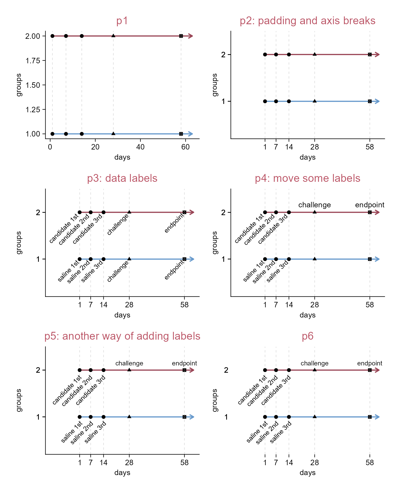
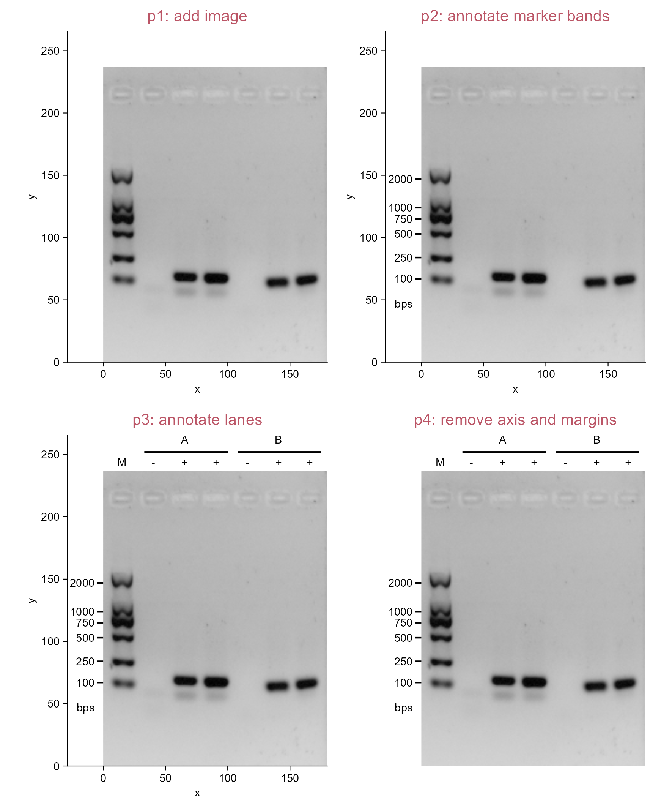
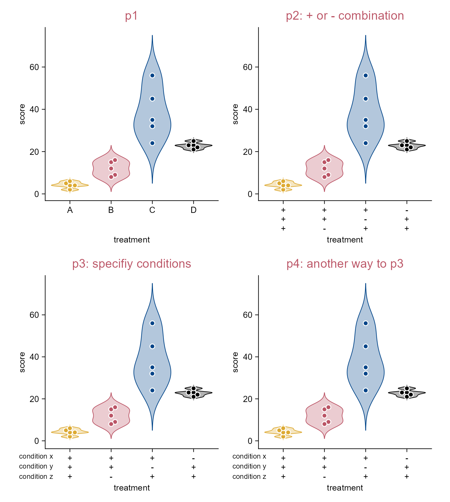
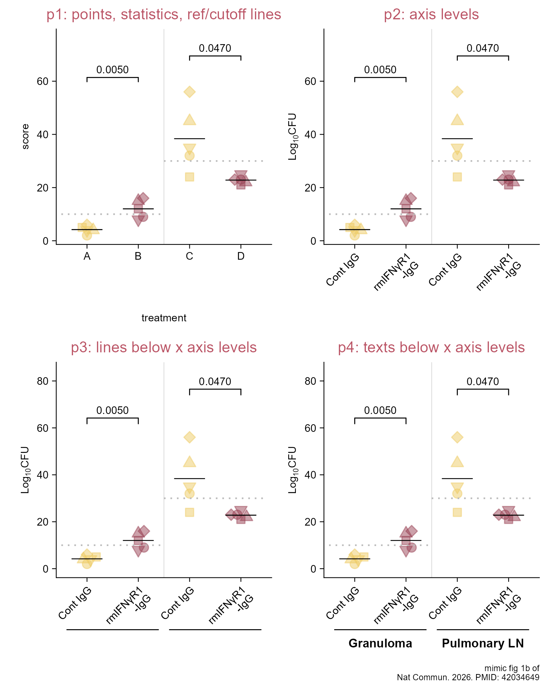
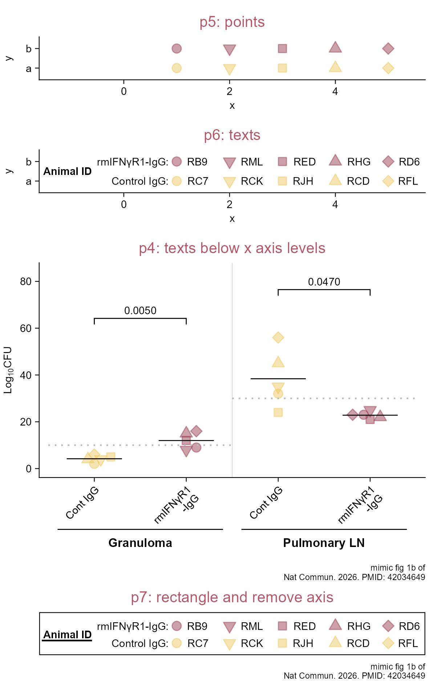
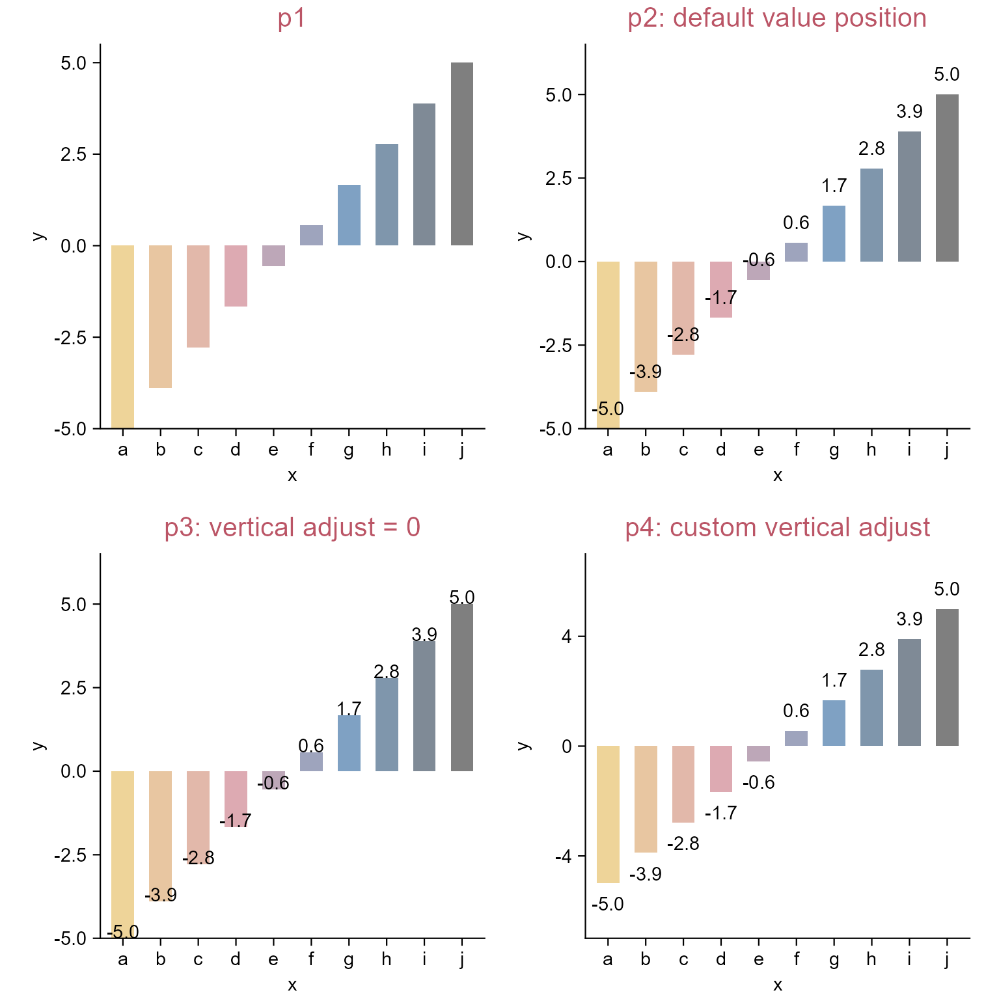
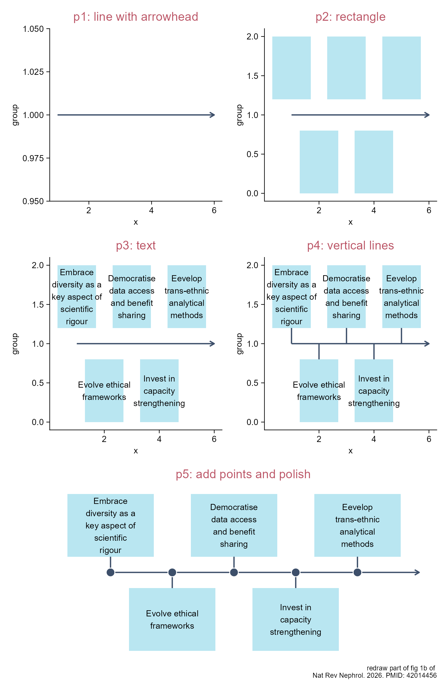
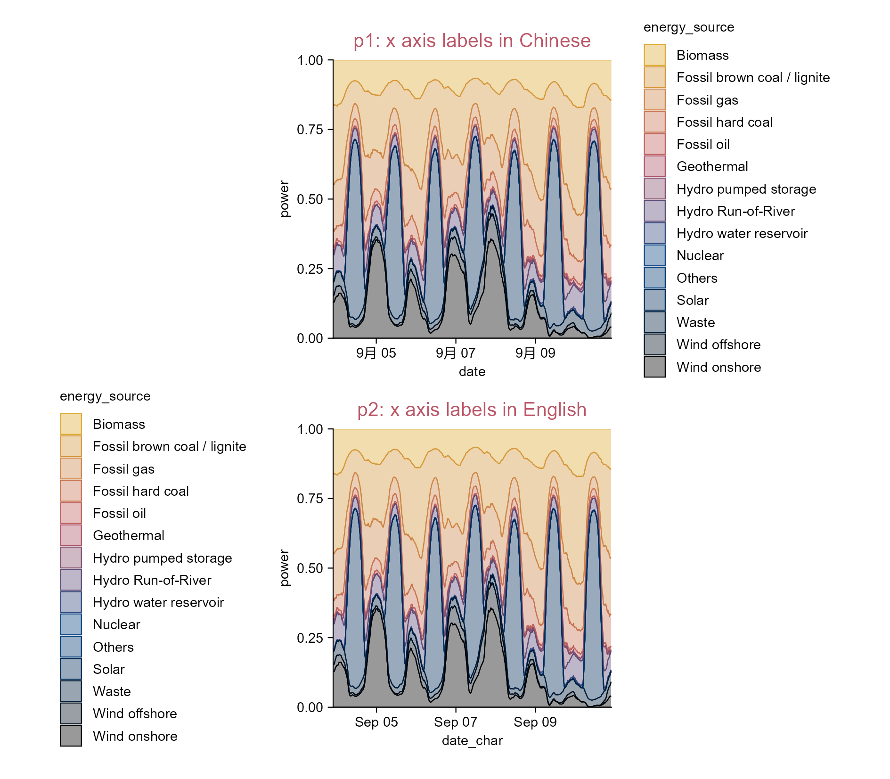
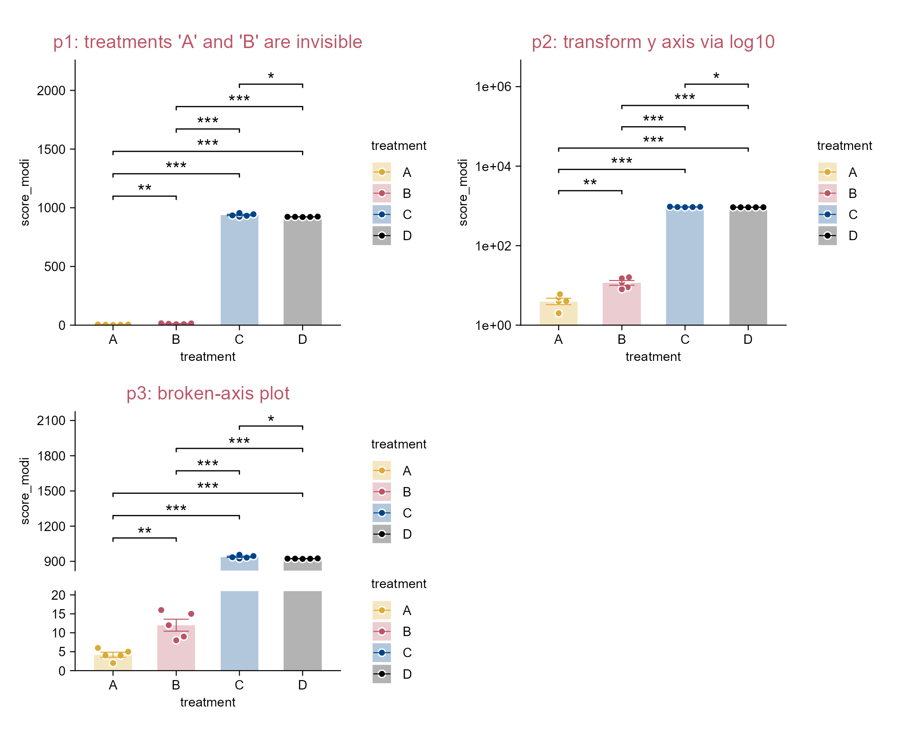
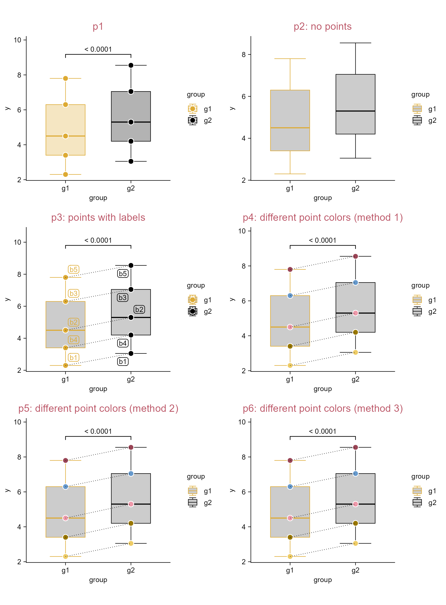

# More custom plots

```{r}
#| eval: false
#| echo: false
tidyplots |> library()

# Define style
my_default_style <- function(x) {
  x |> 
  adjust_colors(new_colors = c("#ddaa33", "#bb5566", "#004488", "#000000")) |> 
  adjust_title(fontsize = 10, color = "#bb5566")
}

# Set global options
tidyplots_options(my_style = my_default_style)
```

```{r}
#| eval: false
#| echo: false
# For occupying a page
df <- tibble::tibble(
  x = 1,
  y = 1
)

df |> 
  tidyplot(x = x, y = y, paper = "#cceeff") |> 
  add_annotation_text(
    text = "There is tension between simple and powerful.\n\nTidyplots will never be as powerful as ggplot2.",
    x = 1,
    y = 1,
    fontsize = 12,
    fontface = "bold.italic") |> 
  add_annotation_text(
    text = "--- Jan Broder Engler",
    x = 1.9,
    y = 0.6,
    hjust = 1,
    fontface = "italic") |> 
  adjust_size(width = 100) |> 
  adjust_x_axis(limits = c(0, 2)) |> 
  adjust_y_axis(limits = c(0.5, 1.5)) |> 
  adjust_size(
    width = 100) |> 
  remove_x_axis() |> 
  remove_y_axis() |> 
  save_plot(
    "images/tidyplots-tension.png",
    view_plot = FALSE)
```

{width="100%" fig-align="center"}

## Schematic of experiment design

```{r}
#| message: false
library(tidyplots)

df <- "data/experimental-design.csv" |> 
    readr::read_csv(show_col_types = FALSE)

# View df (the "63" of "days" column is just a placeholder for arrow head)
# type "?tidyplots::add_data_points()" in R consule for available shape values
df
```

```{r}
#| eval: false
p1 <- df |> 
  tidyplot(x = days, y = groups, color = groups) |> 
  add_reference_lines(x = df$days[1:5], color = "#dddddd") |>   
  add_line(linewidth = 0.5, arrow = grid::arrow(length = grid::unit(0.15, "cm"))) |> 
  add_data_points(shape = df$shape, color = "#000000", na.rm = TRUE) |> 
  add_title(title = "p1") |> 
  adjust_size(height = 35) |> # adjust width and height as needed
  adjust_colors(new_colors = c("#6699cc", "#994455")) |> 
  remove_legend()

p2 <- p1 |> 
  adjust_title(title = "p2: padding and axis breaks") |>
  adjust_padding(left = 0.3, bottom = 0.8, top = 0.5) |> 
  adjust_x_axis(breaks = df$days[1:5]) |> 
  adjust_y_axis(breaks = df$groups)

p3 <- p2 |> 
  adjust_title(title = "p3: data labels") |> 
  add_data_labels(label = manipulation, label_position = "left", 
    angle = 45, color = "#000000", na.rm = TRUE, fontsize = 6)

p4 <- p2 |> 
  adjust_title(title = "p4: move some labels") |> 
  add_data_labels(label = manipulation_1, label_position = "left",
    angle = 45, color = "#000000", na.rm = TRUE, fontsize = 6) |> 
  add_data_labels(label = manipulation_2, label_position = "above",
    color = "#000000", na.rm = TRUE)

p5 <- p2 |> 
  adjust_title(title = "p5: another way of adding labels") |> 
  add_annotation_text(text = df$manipulation_1, x = df$days, y = df$groups, 
    angle = 45, hjust = 1.1, vjust = 1.5, na.rm = TRUE, fontsize = 6) |> 
  add_annotation_text(text = df$manipulation_2, x = df$days,
    y = df$groups, hjust = 0.5, vjust = -1, na.rm = TRUE, fontsize = 6)

p6 <- p5 |> 
  adjust_title(title = "p6") |> 
  remove_x_axis_line() |> 
  remove_y_axis_line() |> 
  remove_y_axis_ticks()
```

```{r}
#| eval: false
#| echo: false
patchwork::wrap_plots(p1, p2, p3, p4, p5, p6, ncol = 2) |> 
    save_plot("images/experimental-design.png", width = 130, height = 160)
```

{width="89%" fig-align="center"}

## Inset image to a figure

```{r}
library(tidyplots)

df <- "data/experimental-design.csv" |> 
    readr::read_csv(show_col_types = FALSE)

# View df (the "63" of "days" column is just a placeholder for arrow head)
# type "?tidyplots::add_data_points()" in R consule for available shape values
df
```

```{r}
#| eval: false
# See the last section (i.e. Schemetic of experiment design) for the detail of p1
p1 <- df |> 
  tidyplot(x = days, y = groups, color = groups) |> 
  add_reference_lines(x = df$days[1:5], color = "#dddddd") |>   
  add_line(linewidth = 0.5, arrow = grid::arrow(length = grid::unit(0.15, "cm"))) |> 
  add_data_points(shape = df$shape, color = "#000000", na.rm = TRUE) |> 
  add_title(title = "p1: experiment design") |> 
  adjust_size(height = 35) |> # adjust width and height as needed
  adjust_colors(new_colors = c("#6699cc", "#994455")) |> 
  remove_legend() |> 
  adjust_padding(left = 0.3, bottom = 0.8, top = 0.5) |> 
  adjust_x_axis(breaks = df$days[1:5]) |> 
  adjust_y_axis(breaks = df$groups) |> 
  add_annotation_text(text = df$manipulation_1, x = df$days, y = df$groups, 
    angle = 45, hjust = 1.1, vjust = 1.5, na.rm = TRUE, fontsize = 6) |> 
  add_annotation_text(text = df$manipulation_2, x = df$days,
    y = df$groups, hjust = 0.5, vjust = -1, na.rm = TRUE, fontsize = 6)

# Read mouse image (from https://bioart.niaid.nih.gov/bioart/20)
mouse <- "images/ApodemusSilhouette0001-grey.svg" |> magick::image_read()

mouse_pattern <- mouse |> grid::rasterGrob(x = 0.7, y = 0.5,
  width = grid::unit(0.4, "snpc"), height = grid::unit(0.4, "snpc")) |> 
  grid::pattern() # snpc: Square Normalised Parent Coordinates

p2 <- p1 |> 
  adjust_title(title = "p2: via 'adjust_theme_details()'") |> 
  adjust_theme_details(panel.background = ggplot2::element_rect(fill = mouse_pattern))

mouse_grob <- mouse |> grid::rasterGrob()

p3 <- p1 |> 
  adjust_title(title = "p3: via 'add()'") |> 
  add(
    ggplot2::annotation_custom(mouse_grob,
    xmin = 30, xmax = 55, ymin = 1.1, ymax = 1.9)) # tailored

p4 <- p1 |> 
  adjust_title(title = "p4: via 'rphylopic' package") + 
  rphylopic::add_phylopic(
    uuid = "36dc0476-ae7d-49ed-85c4-220139930bfc",
    x = 44, y = 1.5, height = 0.4, alpha = 0.4)
# See https://rphylopic.palaeoverse.org/index.html for detail
```

```{r}
#| eval: false
#| echo: false
patchwork::wrap_plots(p1, p2, p3, p4, ncol = 2) |> 
  save_plot("images/inset-image.png",
    view_plot = FALSE, width = 120, height = 100)
```

![Inset an image. See reference [@rphylopic] or the rphylopic documentation (<https://rphylopic.palaeoverse.org/index.html>) for details on p4.](images/inset-image.png){width="100%" fig-align="center"}

:::{.callout-tip}
Stephen D. Turner has compiled and reviewed a collection of resources under the title "*Free and open-source images, icons, and tools for creating scientific illustrations*" <https://blog.stephenturner.us/p/free-open-source-images-tools-scientific-illustrations> [@stephen_icon]
:::

## Annotate gel image

```{r}
#| eval: false
#| echo: false
# The image is from R&S\01_项目或任务\03____Bladder cancer\3_18_gel images
tif_fig <- "images/20230515-10.tif" |> 
  magick::image_read()

tif_fig_clip <- tif_fig |> 
  magick::image_crop(geometry = "180x237+300+260") |> # crop 180(right)x237(below) at from position (300,260)
  magick::image_flop() |> # left and right exchange
  magick::image_negate() # black to white, white to black

tif_fig_clip |> base::plot()

tif_fig_clip |> magick::image_write("images/20230515-10_cropped.tif")
```

```{r}
library(tidyplots)
img <- "images/20230515-10_cropped.tif" |> magick::image_read()

# View image information
img_info <- img |> magick::image_info()
img_width <- img_info$width; img_height <- img_info$height
img_info |> print()
# Change to graphical object
img_grob <- img |> grid::rasterGrob()
# Create a data frame relevant to img_grob
df <- tibble::tibble(x = seq(0, img_width, length.out = 100),
  y = seq(0, img_height, length.out = 100))
# View 1st row of df
df |> dplyr::slice_head(n = 1)
```

```{r}
#| eval: false

# The intended width of image in plot
img_intend_width = 50 # unit: mm
# Tailor relative extra spaces of plot (0 (0%) - 1 (100%))
top_extra = 0.12; right_extra = 0; bottom_extra = 0; left_extra = 0.16
# The width and height of plot
plot_width = img_intend_width * (1 + left_extra + right_extra) # unit: mm
plot_height = img_intend_width * (img_height/img_width) * (1 + top_extra + bottom_extra)

# Plot
p1 <- df |> tidyplot(x = x, y = y) |> 
  add_data_points(alpha = 0) |> 
  add(ggplot2::annotation_custom(img_grob, xmin = 0, xmax = img_width, 
    ymin = 0, ymax = img_height)) |> 
  add_title(title = "p1: add image") |> 
  adjust_size(width = plot_width, height = plot_height) |> 
  adjust_x_axis(limits = c(-img_width*left_extra, img_width*(1 + right_extra))) |> 
  adjust_y_axis(limits = c(-img_height * bottom_extra, img_height * (1 + top_extra)))
p2 <- p1 |> 
  adjust_title(title = "p2: annotate marker bands") |> 
  add_annotation_line(x = 0, xend = -5, 
    y = img_height - c(90, 113, 122, 134, 153, 170), # numbers are obtained via ImageJ
    yend = img_height - c(90, 113, 122, 134, 153, 170)) |> 
  add_annotation_text(text = c("2000", "1000", "750", "500", "250", "100", "bps"),
    x = -7, y = img_height - c(90, 113, 122, 134, 153, 170, 190), hjust = 1)    
p3 <- p2 |> 
  adjust_title(title = "p3: annotate lanes") |> 
  add_annotation_line(x = c(33, 108), xend = c(100, 175),
    y = img_height + 15, yend = img_height + 15) |> 
  add_annotation_text(text = c("A", "B"), x = c(65.3, 140.8), y = img_height + 25) |> 
  add_annotation_text(text = c("M", "-", "+", "+", "-", "+", "+"),
    x = seq(15, 166, length.out = 7), y = img_height + 7)
p4 <- p3 |>
  adjust_title(title = "p4: remove axis and margins") |> 
  remove_x_axis() |> remove_y_axis() |> 
  adjust_theme_details(plot.margin = ggplot2::margin(0, 0, 0, 0))
```

```{r}
#| eval: false
#| echo: false
patchwork::wrap_plots(p1, p2, p3, p4, ncol = 2) |> 
  save_plot("images/20230515-10_cropped_annotated.png",
    view_plot = FALSE, width = 150, height = 180, padding = 0)
```

{width="90%" fig-align="center"}

:::{.callout-tip icon="true"}
Open the image in ImageJ/Fiji and hover over it; the pixel coordinates will be displayed in real time under the toolbar.

Note that the origin differs between systems: in ImageJ/Fiji, the top-left corner is (0, 0); whereas in `tidyplots`, the bottom-left corner is (0, 0) (also see @sec-xy-coordinates-imagej). 
:::

## Combining multiple images together

```{r}
#| eval: false
library(tidyplots)

# Get list of image names (four); All images are nearly identical in size here
img_names <- fs::dir_ls(path = "images", regexp = "^images/OS-2_.*")

# Read images
imgs <- purrr::set_names(
  purrr::map(img_names, magick::image_read),
  paste0("img", 1:length(img_names)))

# Get width and height of the 1st image
img_width <- magick::image_info(imgs[[1]])$width
img_height <- magick::image_info(imgs[[1]])$height

# Change images to graphic objectives
imgs_grob <- purrr::set_names(
  purrr::map(imgs, grid::rasterGrob),
  paste0("img", 1:length(imgs)))

# The intended width of combined image
img_intend_width = 50 # unit: mm
# Tailor relative extra spaces of plot (0 (0%) - 1 (100%))
top_extra = 0.1; right_extra = 0; bottom_extra = 0; left_extra = 0.1
# The width and height of plot
plot_width = img_intend_width * (1 + left_extra + right_extra) # unit: mm
plot_height = img_intend_width * (img_height/img_width) * (1 + top_extra + bottom_extra)

# Set a data frame for plotting
df <- tibble::tibble(x = 1:100, y = 1:100)

# Set the range of each img covered
image_cover_width <- 45 # note that df is 1:100 in x, and 1:100 in y
image_cover_height <- image_cover_width * (img_height/img_width) * (plot_width/plot_height)

# Set an intuitive function to add image to plot this time
add_image <- function(
  x, grob, top_left_x, top_left_y, 
  img_cover_width, img_cover_height) {
  x |> add(ggplot2::annotation_custom(
    grob = grob,
    xmin = top_left_x, xmax = top_left_x + img_cover_width,
    ymin = top_left_y - img_cover_height, ymax = top_left_y))}

# Plot
p1 <- df |> 
  tidyplot(x = x, y = y) |> 
  add_data_points(alpha = 0) |> 
  add_title(title = "p1: add 1st image") |> 
  adjust_size(width = plot_width, height = plot_height) |> 
  adjust_x_axis(limits = c(-100 * left_extra, 100 * (1 + right_extra))) |> 
  adjust_y_axis(limits = c(-100 * bottom_extra, 100 * (1 + top_extra))) |> 
  add_image(
    grob = imgs_grob$img1, top_left_x = 0, top_left_y = 100,
    img_cover_width = image_cover_width, img_cover_height = image_cover_height)

p2 <- p1 |> 
  adjust_title(title = "p2: add 2nd image") |> 
  add_image(
    grob = imgs_grob$img2, top_left_x = 50, top_left_y = 100,
    img_cover_width = image_cover_width, img_cover_height = image_cover_height)

p3 <- p2 |> 
  adjust_title(title = "p3: add 3rd and 4th images") |> 
  add_image(
    grob = imgs_grob$img3, top_left_x = 0, top_left_y = 50,
    img_cover_width = image_cover_width, img_cover_height = image_cover_height) |> 
  add_image(
    grob = imgs_grob$img4, top_left_x = 50, top_left_y = 50,
    img_cover_width = image_cover_width, img_cover_height = image_cover_height)

p4 <- p3 |> 
  adjust_title(title = "p4: add texts and remove axis") |> 
  add_annotation_text(
    text = paste("text", 1:4),
    x = c(22, 72, -5, -5), y = c(105, 105, 27, 77), angle = c(0, 0, 90, 90)) |> 
  remove_x_axis() |> remove_y_axis()
```

```{r}
#| eval: false
#| echo: false
patchwork::wrap_plots(p1, p2, p3, p4, ncol = 2) |> 
  save_plot("images/combine_multiple_images.png",
    view_plot = FALSE, width = 140, height = 140)
```

![Combining multiple images together. The images are cropped from <https://openslide.cs.cmu.edu/download/openslide-testdata/Hamamatsu/OS-2.ndpi> using the QuPath software [@Bankhead2017].](images/combine_multiple_images.png){width="95%" fig-align="center"}

## Display condition combinations in axis labels

```{r}
library(tidyplots)

# View top 10 rows of the columns used
study |> dplyr::select(treatment, score) |> 
  dplyr::slice_head(n = 10)
```

```{r}
#| eval: false
# Plot
p1 <- study |> 
  tidyplot(x = treatment, y = score, color = treatment) |> 
  add_violin(trim = FALSE) |> 
  add_data_points_beeswarm(white_border = TRUE) |> 
  add_title(title = "p1") |> 
  remove_legend()

p2 <- p1 |> 
  adjust_title(title = "p2: + or - combination") |> 
  rename_x_axis_levels(new_names = c(
    "A" = "+\n+\n+", "B" = "+\n+\n-",
    "C" = "+\n-\n+", "D" = "-\n+\n+"))

p3 <- p2 |> 
  adjust_title(title = "p3: specifiy conditions") |> 
  add_annotation_text( # space could be used to offset the length differences
    text = "condition x\ncondition y\ncondition z", 
    x = 1, y = 0, # location of panel lowerleft
    vjust = 1.5, # should be tailored
    hjust = 1.5, # should be tailored
    fontsize = 5.8) |> # should be tailored
  add(ggplot2::coord_cartesian(clip = "off")) # ensure text could be visualized outside panel.

# Another way to p3
axis_labels <- c("+\n+\n+", "+\n+\n-", "+\n-\n+", "-\n+\n+")

p4 <- p1 |> 
  adjust_title(title = "p4: another way to p3") |> 
  adjust_x_axis(labels = axis_labels) |> 
  add_annotation_text(
    text = "condition x\ncondition y\ncondition z",
    x = 1, y = 0,
    vjust = 1.5, hjust = 1.5, fontsize = 5.8) |> 
  add(ggplot2::coord_cartesian(clip = "off")) 
```

```{r}
#| eval: false
#| echo: false
patchwork::wrap_plots(p1, p2, p3, p4, ncol = 2) |> 
  save_plot("images/conditon-combinations.png",
    view_plot = FALSE, width = 130, height = 145)
```

{width="100%" fig-align="center"}

:::{.callout-note icon="true"}
So far so good, then perhaps minor adjustment might be needed via inkscape, adobe illustrator, or some other softwares for vector images.
:::

## Display condition combinations in axis labels (using `add()`)

```{r}
library(tidyplots)

# Add a column indicating combinations
study_comb <- study |> 
  dplyr::mutate(comb = c(
    rep("a,b,c", 5),
    rep("a,b", 5),
    rep("a,c", 5),
    rep("b,c", 5)))

# View top 10 rows of the columns used
study_comb |> 
  dplyr::select(comb, score) |> 
  dplyr::slice_head(n = 10)
```

```{r}
#| eval: false
p1 <- study_comb |> 
  tidyplot(x = comb, y = score, color = comb) |> 
  add_violin(trim = FALSE) |> 
  add_data_points_beeswarm(white_border = TRUE) |> 
  add_title(title = "p1")

p2 <- p1 |> 
  adjust_title(title = "p2: reorder x levels") |> 
  reorder_x_axis_levels("a,b,c", "a,b", "a,c", "b,c")

p3 <- p2 |> 
  adjust_title(title = "p3: via 'add()' 1") |> 
  add(ggplot2::guides(x = legendry::guide_axis_upset(
    legendry::key_upset(sep = ","), 
    override.aes = list(size = 2),
    connect = NULL)))

p4 <- p2 |> 
  adjust_title(title = "p4: via 'add()' 2") |> 
  add(ggplot2::guides(x = legendry::guide_axis_upset(
    legendry::key_upset(sep = ","),
    override.aes = list(shape = c("+", "-", NA), size = 4),
    connect = NULL))) |> 
  theme_minimal_xy()
```

```{r}
#| eval: false
#| echo: false
patchwork::wrap_plots(p1, p2, p3, p4, ncol = 2) |> 
  save_plot("images/conditon-combinations_add.png",
    view_plot = FALSE, width = 160, height = 145)
```

{width="100%" fig-align="center"}

## Change point shape/color and annotate axis

```{r}
library(tidyplots)

# Add two columns to specify point shapes and colors
study_shape <- study |> 
  dplyr::mutate(
    shape = rep(c(21, 25, 22, 24, 23), 4),
    color = rep(c("#eecc66", "#994455"), each = 5, length.out = 20))

# View top 10 rows of the columns used
study_shape |> dplyr::select(treatment, score, shape, color) |> 
  dplyr::slice_head(n = 10)
```

```{r}
#| eval: false
# Plot
p1 <- study_shape |> 
  tidyplot(x = treatment, y = score) |> 
  add_data_points_beeswarm(shape = study_shape$shape, size = 2.5, 
    color = study_shape$color, fill = study_shape$color, alpha = 0.5) |> 
  add_mean_dash(color = "#000000") |> 
  add_test_pvalue(hide_info = TRUE, comparisons = list(c(1, 2), c(3, 4))) |> 
  add_reference_lines(x = 2.5, linetype = "solid", color = "#dddddd") |> 
  add_annotation_line(x = c(0.5, 2.5), xend = c(2.5, 4.5), 
    y = c(10, 30), yend = c(10, 30), linetype = "dotted", color = "#bbbbbb") |> 
  add_title(title = "p1: points, statistics, ref/cutoff lines")

p2 <- p1 |> 
  adjust_title(title = "p2: axis levels") |> 
  rename_x_axis_levels(new_names = c(
    "A" = "Cont IgG", "B" = "rmIFNγR1\n-IgG",
    "C" = "Cont IgG\n", "D" = "rmIFNγR1\n-IgG\n")) |> 
  adjust_x_axis(rotate_labels = TRUE, title = "") |> 
  adjust_y_axis(title = "$Log[10]*CFU$")

p3 <- p2 |> 
  adjust_title(title = "p3: lines below x axis levels") |> 
  add_annotation_line(x = c(0.6, 2.6), xend = c(2.4, 4.4), y = c(-26, -26),
    yend = c(-26, -26), linewidth = 0.3) |> 
  add(ggplot2::coord_cartesian(clip = "off", ylim = c(0, NA)))

p4 <- p3 |> 
  adjust_title(title = "p4: texts below x axis levels") |> 
  add_annotation_text(text = c("Granuloma", "Pulmonary LN"), 
    x = c(1.5, 3.5), y = c(0, 0), vjust = 9, fontsize = 8, fontface = "bold") |> 
  add_caption("mimic fig 1b of\nNat Commun. 2026. PMID: 42034649")
```

```{r}
#| eval: false
#| echo: false
patchwork::wrap_plots(p1, p2, p3, p4, ncol = 2) |> 
  save_plot("images/point-shape-color-axis.png",
    view_plot = FALSE, width = 130, height = 160)
```

{width="100%" fig-align="center"}

## Point annotation

```{r}
library(tidyplots)

# Set a df for point annotation
df <- tibble::tibble(
  x = rep(1:5, length.out = 10),
  y = rep(c("a", "b"), each = 5),
  label = c("RC7", "RCK", "RJH", "RCD", "RFL", "RB9", "RML", "RED", "RHG", "RD6"),
  shape = rep(c(21, 25, 22, 24, 23), 2),
  color = rep(c("#eecc66", "#994455"), each = 5))

# View df
df
```

```{r}
#| eval: false
# Plot
p5 <- df |>   
  tidyplot(x = x, y = y) |> 
  add_data_points(shape = df$shape, color = df$color, 
    fill = df$color, size = 2.5, alpha = 0.5) |> 
  remove_legend() |> 
  add_title(title = "p5: points") |> 
  adjust_size(width = 90, height = 10) |> 
  adjust_x_axis(limits = c(-1.6, 5.7))

p6 <- p5 |> 
  adjust_title(title = "p6: texts") |> 
  add_annotation_text(text = df$label, x = df$x, y = df$y, hjust = -0.5) |> 
  add_annotation_text(text = c("Control IgG:", "rmIFNγR1-IgG:"), x = c(0.85, 0.85),
    y = c(1, 2), hjust = 1) |> 
  add_annotation_text(text = "Animal ID", x = -0.6, y = 1.5, 
    hjust = 1, fontface = "bold")

p7 <- p6 |> 
  adjust_title(title = "p7: rectangle and remove axis") |> 
  add_annotation_line(x = -1.55, xend = -0.6, y = 1.15, yend = 1.15) |>
  add_annotation_rectangle(xmin = -1.6, xmax = 5.7, 
    ymin = 0.3, ymax = 2.8, color = "#000000", alpha = 0) |> 
  remove_x_axis() |> remove_y_axis() |> 
  adjust_theme_details(plot.margin = ggplot2::margin(0, 0, 0, 0)) |> 
  add_caption("mimic fig 1b of\nNat Commun. 2026. PMID: 42034649")
```

```{r}
#| eval: false
#| echo: false
patchwork::wrap_plots(p5, p6, p4, p7, ncol = 1) |> 
  save_plot("images/point-annotation.png",
    view_plot = FALSE, width = 100, height = 160)
```

{width="80%" fig-align="center"}

:::{.callout-note icon="true"}
Then perhaps adjustment might be needed via inkscape, adobe illustrator, or some other softwares for vector images.
:::

## Add sum values for negative bars

```{r}
library(tidyplots)

df <- tibble::tibble(
  x = letters[1:10],
  y = seq(-5, 5, length.out = 10))

df <- df |> 
  dplyr::mutate(
    vjust_custom = c(ifelse(y >= 0, -1, 2)))

# View df
df
```

```{r}
#| eval: false
p1 <- df |> 
  tidyplot(
    x = x, 
    y = y, 
    color = y) |> 
  add_sum_bar(alpha = 0.5) |> 
  add_title(title = "p1") |> 
  remove_legend()

p2 <- p1 |> 
  adjust_title(title = "p2: default value position") |> 
  add_sum_value(color = "#000000")

p3 <- p1 |> 
  adjust_title(title = "p3: vertical adjust = 0") |> 
  add_sum_value(color = "#000000", vjust = 0)

p4 <- p1 |> 
  adjust_title(title = "p4: custom vertical adjust") |> 
  adjust_y_axis(
    limits = c(min(df$y) - 2, max(df$y) + 2)) |> 
  add_sum_value(
    color = "#000000", 
    vjust = vjust_custom, 
    extra_padding = 0) # no extra spacing above panel
```

```{r}
#| eval: false
#| echo: false
patchwork::wrap_plots(p1, p2, p3, p4, ncol = 2) |> 
  save_plot("images/sum-values-for-neg-bars.png",
    view_plot = FALSE, width = 130, height = 130)
```

{width="100%" fig-align="center"}

## Sequencial issues

```{r}
library(tidyplots)

df <- tibble::tibble(x = seq(1, 6), group = rep(1, 6))

# View df
df
```

```{r}
#| eval: false
# Plot
p1 <- df |> 
  tidyplot(x = x, y = group) |> 
  add_line(
    arrow = grid::arrow(length = grid::unit(0.15, "cm")),
    color = "#3d4f6a", linewidth = 0.5) |> 
  add_title(title = "p1: line with arrowhead") |> remove_legend()

# Set several fixed locations/constants for efficient adjustment
text_up_dn <- 0.6 # vertical distance (tailored) to line
text_x <- df$x[1:5] # x axis locations (center) of texts
text_y <- df$group[1:5] + ifelse(seq_along(text_x) %% 2, text_up_dn, -text_up_dn)
rectangle_half_width <- 0.7 # half length (tailored) of rectangle behind text
rectangle_half_height <- 0.4
line_yend <- text_y + ifelse(seq_along(text_y) %% 2, -rectangle_half_height, rectangle_half_height) # yend locations of vertical lines

p2 <- p1 |> 
  adjust_title(title = "p2: rectangle") |> 
  add_annotation_rectangle(
    xmin = text_x - rectangle_half_width, xmax = text_x + rectangle_half_width,
    ymin = text_y - rectangle_half_height, ymax = text_y + rectangle_half_height,
    fill = "#b9e6f1", alpha = 1)

labels <- c(
  "Embrace\ndiversity as a\nkey aspect of\nscientific\nrigour",
  "Evolve ethical\nframeworks",
  "Democratise\ndata access\nand benefit\nsharing",
  "Invest in\ncapacity\nstrengthening",
  "Eevelop\ntrans-ethnic\nanalytical\nmethods")

p3 <- p2 |> 
  adjust_title(title = "p3: text") |> 
  add_annotation_text(text = labels, x = text_x, y = text_y)

p4 <- p3 |> 
  adjust_title(title = "p4: vertical lines") |> 
  add_annotation_line(x = text_x, xend = text_x,
    y = df$group[1:5], yend = line_yend, color = "#3d4f6a")

p5 <- p4 |> 
  adjust_title(title = "p5: add points and polish") |> 
  add_data_points(
    data = filter_rows(x <= 5), color = "#3d4f6a", 
    white_border = TRUE, size = 2) |> 
  adjust_size(width = 100) |> 
  remove_x_axis() |> remove_y_axis() |> 
  add_caption("redraw part of fig 1b of \nNat Rev Nephrol. 2026. PMID: 42014456")
```

```{r}
#| eval: false
#| echo: false
design <- "AB
           CD
           EE"
patchwork::wrap_plots(p1, p2, p3, p4, p5, design = design) |> 
  save_plot("images/sequencial-issues.png",
    view_plot = FALSE, width = 130, height = 200)
```

{width="84%" fig-align="center"}

## Sequencial issues (using `add()`)

```{r}
library(tidyplots)

# Set a data frame
df <- tibble::tibble(
  phase = c("Phase 1", "Phase 2", "Phase 3", 
    "Candidate\na1", "Candidate\nb1", "Candidate\nc1", # \n means line feed
    "Candidate\nc2", "Candidate\nb2", "Candidate\na2"),
  x_start = c(rep(1:3, times = 2), 3:1),
  x_end = c(x_start[1:6] + 0.9, x_start[7:9] + 1.2),
  y = rep(3:1, each = 3))

# View
df
```

```{r}
#| eval: false
p1 <- df |> 
  tidyplot(y = y, color = x_start) |> 
  add(gggenes::geom_gene_arrow(
    mapping = ggplot2::aes(xmin = x_start, xmax = x_end),
    data = filter_rows(y == 3), 
    arrowhead_height = grid::unit(6, "mm"),
    color = "#000000", fill = "#ffffff")) |> 
  add_title(title = "p1") |> 
  adjust_size(width = 70, height = 30) |> 
  adjust_y_axis(limits = c(0.5, 3.5)) |> 
  remove_legend()

p2 <- p1 |> 
  adjust_title(title = "p2") |> 
  add(gggenes::geom_gene_label(
    mapping = ggplot2::aes(xmin = x_start, xmax = x_end, label = phase),
    data = dplyr::filter(df, y == 3),
    color = "#000000"))

p3 <- p2 |> 
  adjust_title(title = "p3") |> 
  add(gggenes::geom_gene_arrow(
    mapping = ggplot2::aes(xmin = x_start, xmax = x_end),
    data = filter_rows(y == 2), 
    arrowhead_width = grid::unit(0, "mm"),
    arrowhead_height = grid::unit(8, "mm"), 
    arrow_body_height = grid::unit(8, "mm"), 
    color = "#000000")) |> 
  adjust_colors(new_colors = c("#eecc66", "#ee99aa", "#6699cc"))

p4 <- p3 |> 
  adjust_title(title = "p4") |> 
  add_annotation_text(
    text = df$phase[4:6], 
    x = (df$x_start[4:6] + df$x_end[4:6])/2, 
    y = df$y[4:6]) |> 
  adjust_y_axis(limits = c(0, 3.5))

p5 <- p4 |> 
  adjust_title(title = "p5") |> 
  add(gggenes::geom_gene_arrow(
    mapping = ggplot2::aes(xmin = x_start, xmax = x_end, y = y),
    data = filter_rows(y == 1), 
    arrowhead_width = grid::unit(6, "mm"),
    arrowhead_height = grid::unit(5, "mm"),
    arrow_body_height = grid::unit(8, "mm"), 
    color = "#000000"))

p6 <- p5 |> 
  adjust_title(title = "p6") |> 
  add_annotation_text(
    text = df$phase[7:9], 
    x = (df$x_start[7:9] + df$x_end[7:9])/2, 
    y = df$y[7:9]) |> 
  remove_x_axis() |> remove_y_axis()
```

```{r}
#| eval: false
#| echo: false
patchwork::wrap_plots(p1, p2, p3, p4, p5, p6, ncol = 2) |> 
  save_plot("images/sequence_issues_2.png",
    view_plot = FALSE, width = 165, height = 130)
```

{width="100%" fig-align="center"}

## Change Chinese date axis labels into English ones

:::{.callout-note}
This is a (tedious) alternative way to @sec-custom-reuse. 
:::

```{r}
library(tidyplots)

# Change date column with <dttm> type to a new column with <chr> type
energy_week_chr <- energy_week |> 
  dplyr::mutate(date_chr = as.character(date))

# View top 10 rows of the columns used
energy_week_chr |> 
  dplyr::select(date, date_chr, power, energy_source) |> 
  dplyr::slice_head(n = 10)

# Also viewsome info about my computer
sessionInfo()$platform
Sys.getlocale("LC_TIME")
```

```{r}
#| eval: false
# Plot
p1 <- energy_week_chr |> 
  tidyplot(x = date, y = power, color = energy_source) |> 
  add_title(title = "p1: x axis labels in Chinese") |>  
  add_areastack_relative()
# you can see the Chinese character "月" in the x axis labels.

p2 <- energy_week_chr |> 
  tidyplot(x = date_chr, y = power, color = energy_source) |> 
  add_title(title = "p2: x axis labels in English") |> 
  add_areastack_relative() |> 
  adjust_legend_position(position = "left") |> 
  adjust_x_axis(
    breaks = c("2023-09-05", "2023-09-07", "2023-09-09"),
    labels = c("Sep 05", "Sep 07", "Sep 09"))
```

```{r}
#| eval: false
#| echo: false

energy_week_chr |> rm()

patchwork::wrap_plots(p1, p2, ncol = 1) |> 
  save_plot("images/axis-chinese-english.png",
    view_plot = FALSE, width = 160, height = 140)
```

{width="100%" fig-align="center"}

:::{.callout-note icon="true"}
What about the same issue in non-English operating systems other than Chinese?
:::

## Plot with a broken axis

```{r}
library(tidyplots)
library(patchwork)

# Enlarge score values of treatments "C" and "D" by adding 900
study_modi <- study |> 
  dplyr::mutate(score_modi = ifelse(treatment %in% c("C", "D"), score + 900, score))

# View rows 6 to 15 of the columns involved
study_modi |> dplyr::select(treatment, score, score_modi) |> 
  dplyr::slice(6:15)
```

```{r}
#| eval: false
p1 <- study_modi |> tidyplot(x = treatment, y = score_modi, color = treatment) |> 
  add_mean_bar(alpha = 0.3) |> 
  add_data_points_beeswarm(white_border = TRUE) |> 
  add_sem_errorbar() |> 
  add_test_asterisks(hide_info = TRUE) |> 
  add_title(title = "p1: treatments 'A' and 'B' are invisible")

p2 <- p1 |> 
  adjust_title(title = "p2: transform y axis via log10") |> 
  adjust_y_axis(transform = "log10")

study_AB <- study_modi |> 
  dplyr::filter(treatment %in% c("A", "B"))

p3_lower_segment <- p1 |> 
  adjust_y_axis(limits = c(0, max(study_AB$score_modi) + 5)) |> 
  adjust_size(height = 15) |> 
  remove_y_axis_title() |> 
  remove_title()

study_CD <- study_modi |> 
  dplyr::filter(treatment %in% c("C", "D"))

p3_upper_segment <- p1 |> 
  adjust_title(title = "p3: broken-axis plot") |> 
  adjust_y_axis(
    limits = c(min(study_CD$score_modi) - 100, NA)) |> 
  adjust_y_axis_title(hjust = -1) |> 
  adjust_size(height = 30) |> 
  adjust_padding(top = 0.1) |> 
  remove_x_axis()

# Combine plots into the same graphic
design <- "AB
           C#
           D#"

p1 + p2 + p3_upper_segment + p3_lower_segment + plot_layout(design = design)
```

```{r}
#| eval: false
#| echo: false
design <- "AB
           C#
           D#"

(p1 + p2 + p3_upper_segment + p3_lower_segment + plot_layout(design = design)) |> 
  save_plot("images/plot-with-broken-axis.png",
    view_plot = FALSE, width = 170, height = 140)
```

{width="100%" fig-align="center"}

:::{.callout-note icon="true"}
Inkscape or adobe illustrator can be used to adjust, modify, remove plot elements of p3 (e.g. axis labels and legends).

P3 is actually composed of two plots: `p3_upper_segment` and `p3_lower_segment`.

By the way, it seems that the `ggbreak` package is incompatible with ggplot or tidyplot that use absolute dimentions [@zepeng_mu].
:::

## Color each points within each group

```{r}
#| warning: false
library(tidyplots)

y <- c(2.3, 4.5, 6.3, 3.4, 7.8, 3.05, 5.30, 7.05, 4.20, 8.55)
colors <- c("#eecc66", "#ee99aa", "#6699cc", "#997700", "#994455")
df <- tibble::tibble(
  y = y, group = paste0("g", rep(c(1, 2), each = 5)), batch = paste0("b", c(1:5, 1:5)), 
  batch_color_1 = rep(colors, times = 2), batch_color_2 = rep(colors, each = 2))

# View df
df
```

```{r}
#| eval: false
p1 <- df |> 
  tidyplot(x = group, y = y, color = group) |> 
  add_boxplot() |> add_data_points(white_border = TRUE, size = 1.5) |> 
  add_title(title = "p1") |> add_test_pvalue(paired_by = batch, hide_info = TRUE)

p2 <- df |> 
  tidyplot(x = group, y = y, color = group) |> 
  add_boxplot(fill = "#000000", alpha = 0.2) |> add_title(title = "p2: no points")

p3 <- p2 |> 
  adjust_title(title = "p3: points with labels") |> 
  add_data_points(white_border = TRUE, size = 1.5) |> 
  add_data_labels_repel(label = batch) |> 
  add_line(group = batch, color = "#000000", linetype = "dotted") |> 
  add_test_pvalue(paired_by = batch, hide_info = TRUE, bracket.nudge.y = 0.2)

p4 <- p2 |> 
  adjust_title(title = "p4: different point colors (method 1)") |> 
  add_data_points(white_border = TRUE, size = 1.5, color = df$batch_color_2) |> 
  add_line(group = batch, color = "#000000", linetype = "dotted") |> 
  add_test_pvalue(paired_by = batch, hide_info = TRUE)

p5 <- p2 |> 
  adjust_title(title = "p5: different point colors (method 2)") |> 
  add_data_points(data = filter_rows(group == "g1"), white_border = TRUE, size = 1.5, color = df$batch_color_1[1:5]) |> 
  add_data_points(data = filter_rows(group == "g2"), white_border = TRUE, size = 1.5, color = df$batch_color_1[6:10]) |> 
  add_line(group = batch, color = "#000000", linetype = "dotted") |> 
  add_test_pvalue(paired_by = batch, hide_info = TRUE)

p6 <- p2 |> 
  adjust_title(title = "p6: different point colors (method 3)") |> 
  add(ggplot2::geom_point(
    ggplot2::aes(fill = I(batch_color_1)), shape = 21, 
    size = 2.25, color = "#ffffff", show.legend = FALSE)) |> 
  add_line(group = batch, color = "#000000", linetype = "dotted") |> 
  add_test_pvalue(paired_by = batch, hide_info = TRUE)
```

```{r}
#| eval: false
#| echo: false
patchwork::wrap_plots(p1, p2, p3, p4, p5, p6, ncol = 2) |> 
  save_plot("images/different_point_colors.png",
    view_plot = FALSE, width = 155, height = 210)
```

{width="100%" fig-align="center"}

## Forest plot

```{r}
library(tidyplots)

# Create a data frame (from Global Spine J. 2021. PMID: 33939533)
df <- tibble::tibble(
  studies = c(
    "Blumenthal et al, 2005", "Geisler et al, 2009", 
    "Gornet et al, 2011", "total"),
  weight = c(0.208, 0.279, 0.513, 1),
  rr = c(1.38, 1.15, 1.14, 1.19),
  ci95_lower = c(1.13, 0.97, 1.04, 1.07),
  ci95_upper = c(1.68, 1.35, 1.25, 1.32))

# View
df
```

```{r}
#| eval: false
p1 <- df |> 
  tidyplot(
    x = rr, 
    y = studies) |> 
  add(ggplot2::geom_linerange(
    ggplot2::aes(xmin = ci95_lower, xmax = ci95_upper), 
    color = "#000000")) |> 
  add_data_points(
    size = 8 * df$weight, 
    shape = c(15, 15, 15, 18), 
    color = "#000000") |> 
  add_title(title = "p1: involving `add()`") |> 
  reverse_y_axis_levels() |> 
  add_reference_lines(x = 1) # line of no effect

p2 <- df |> 
  tidyplot(
    x = rr, 
    y = studies) |> 
  add_annotation_line(
    x = df$ci95_lower, 
    xend = df$ci95_upper, 
    y = df$studies, 
    yend = df$studies) |> 
  add_data_points(
    size = 8 * df$weight, 
    shape = c(15, 15, 15, 18), 
    color = "#000000") |> 
  add_title(title = "p2: without involving `add()`") |> 
  reverse_y_axis_levels() |> 
  add_reference_lines(x = 1) # line of no effect
```

```{r}
#| eval: false
#| echo: false
patchwork::wrap_plots(p1, p2, ncol = 1) |> 
  save_plot("images/forest-plot.png", 
    view_plot = FALSE, height = 140)
```

![Forest plot. The data involved are from [@Dettori2021].](images/forest-plot.png){width="100%" fig-align="center"}