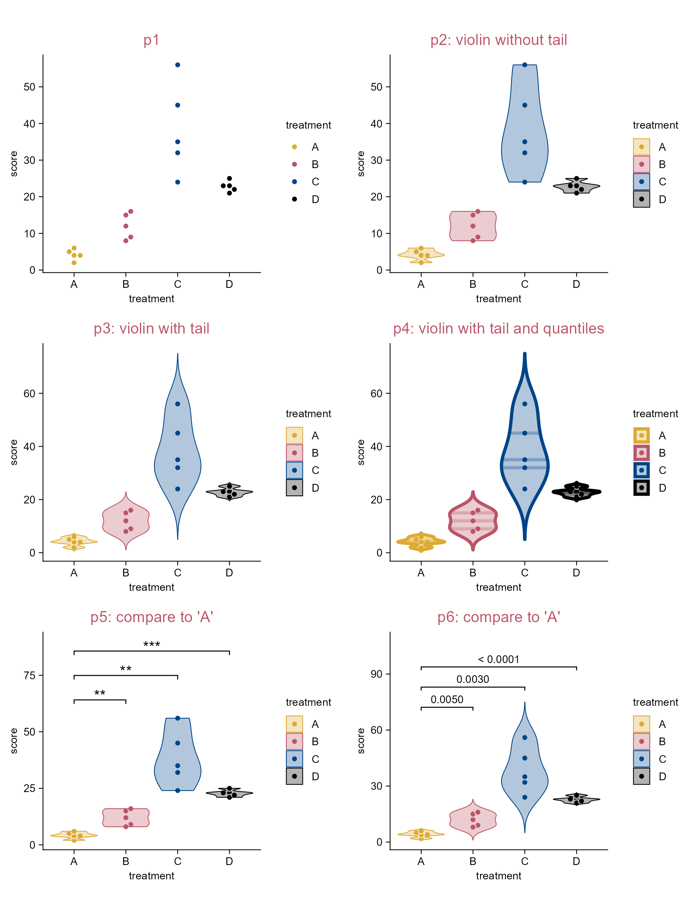
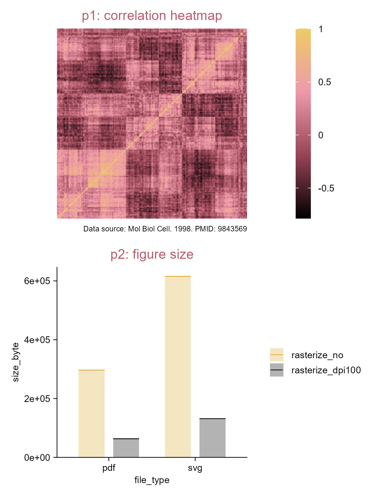
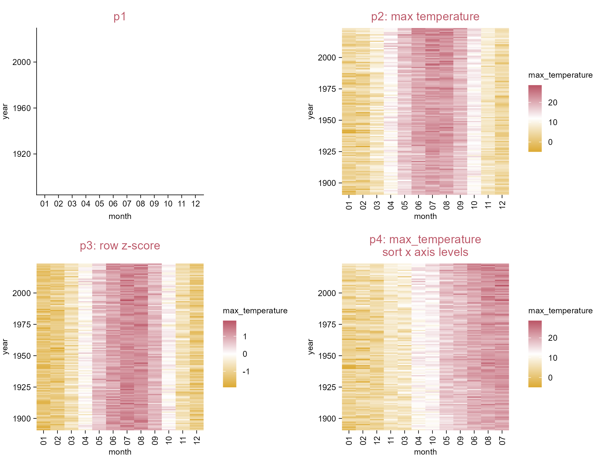
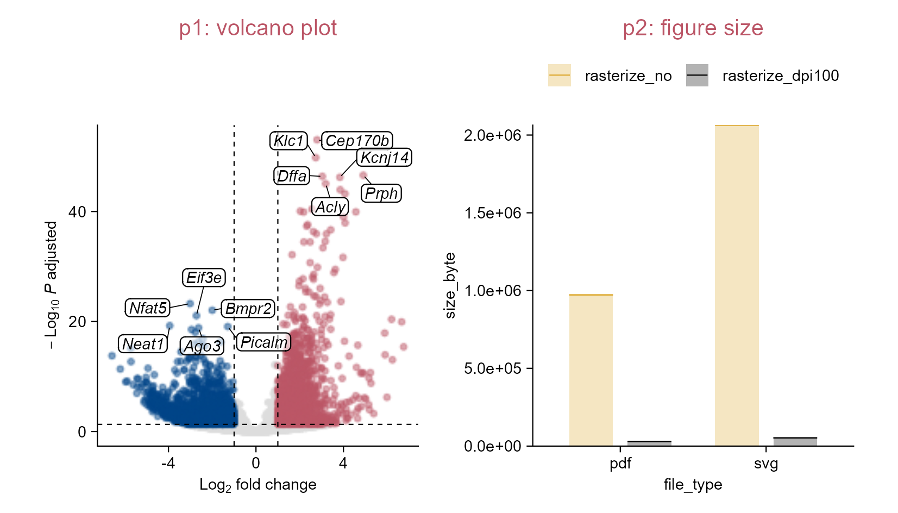
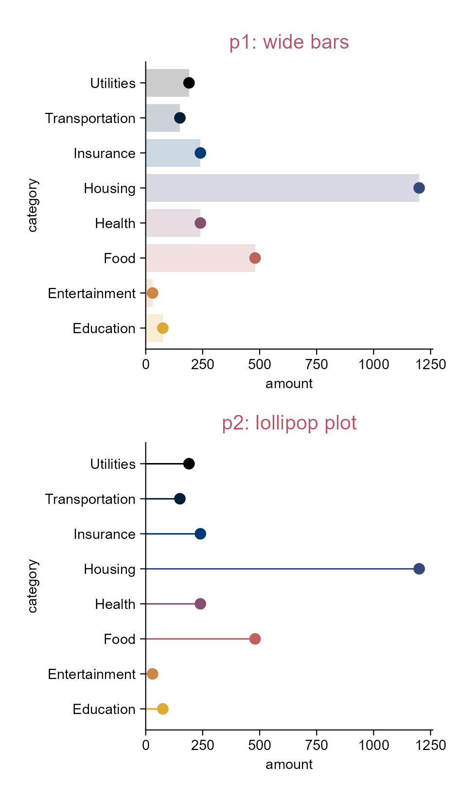
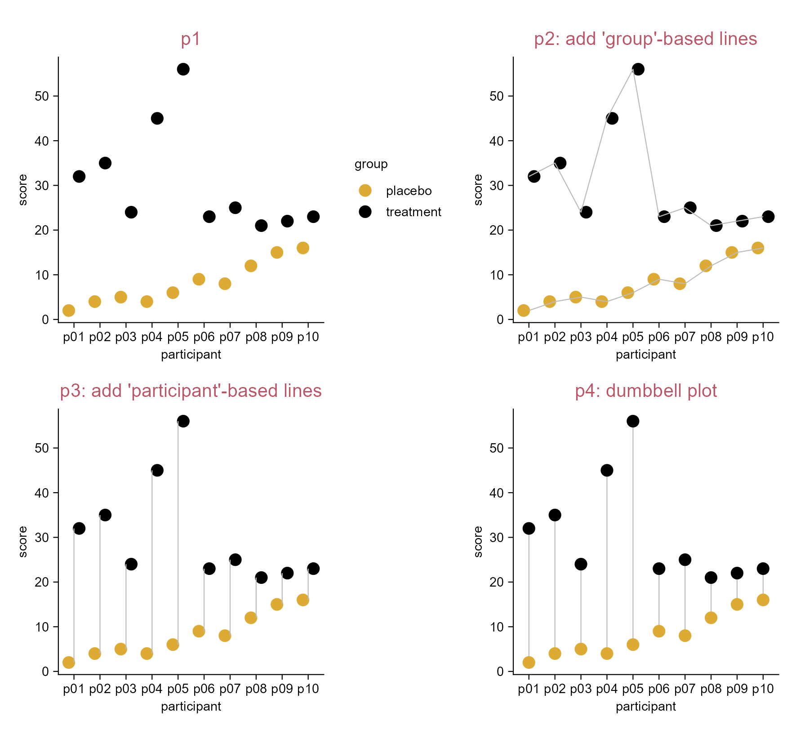
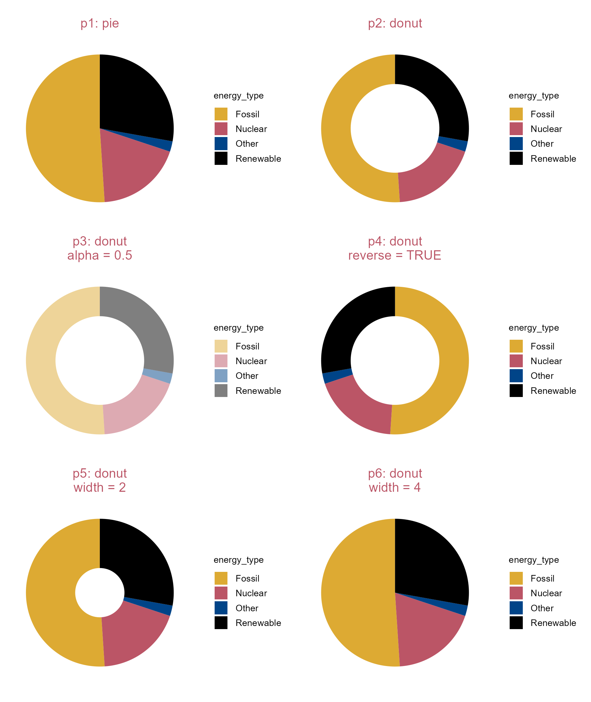
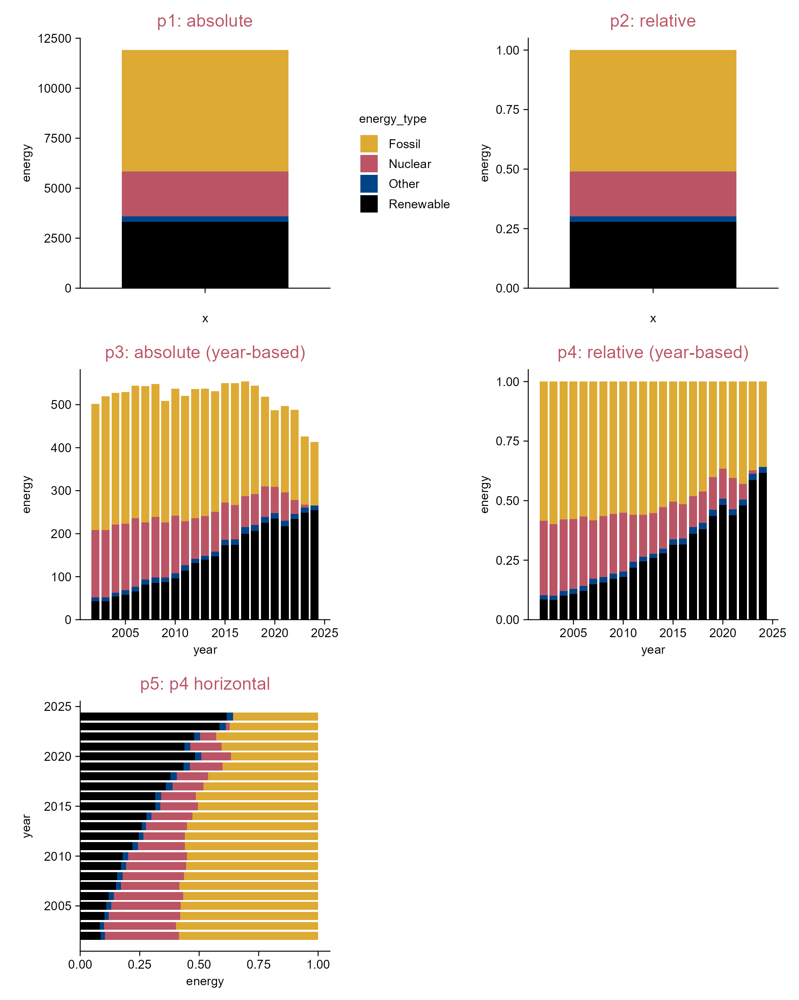
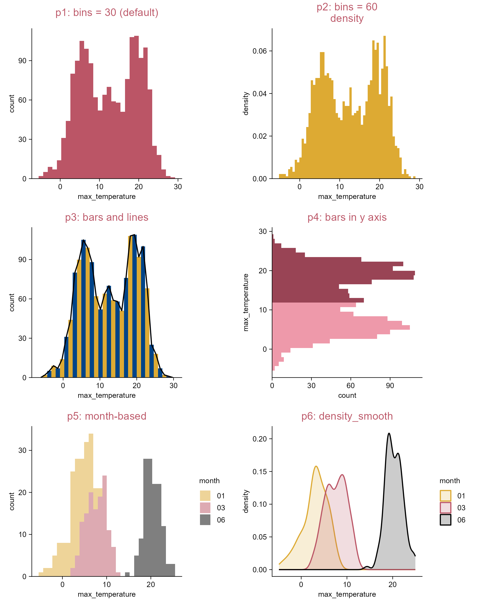

# Additional plot types and techniques

```{r}
#| eval: false
#| echo: false
tidyplots |> library()

# Define style
my_default_style <- function(x) {
  x |> 
  adjust_colors(new_colors = c("#ddaa33", "#bb5566", "#004488", "#000000")) |> 
  adjust_title(fontsize = 10, color = "#bb5566")
}

# Set global options
tidyplots_options(my_style = my_default_style)
```

```{r}
#| eval: false
#| echo: false
# For occupying a page
df <- tibble::tibble(
  x = 1,
  y = 1
)

df |> 
  tidyplot(x = x, y = y, paper = "#cceeff") |> 
  add_annotation_text(
    text = "There is tension between simple and powerful.\n\nTidyplots will never be as powerful as ggplot2.",
    x = 1,
    y = 1,
    fontsize = 12,
    fontface = "bold.italic") |> 
  add_annotation_text(
    text = "--- Jan Broder Engler",
    x = 1.9,
    y = 0.6,
    hjust = 1,
    fontface = "italic") |> 
  adjust_size(width = 100) |> 
  adjust_x_axis(limits = c(0, 2)) |> 
  adjust_y_axis(limits = c(0.5, 1.5)) |> 
  adjust_size(
    width = 100) |> 
  remove_x_axis() |> 
  remove_y_axis() |> 
  save_plot(
    "images/tidyplots-tension.png",
    view_plot = FALSE)
```

{width="100%" fig-align="center"}

## Violin plot

```{r}
#| message: false
library(tidyplots)

# View top 10 rows of the columns used
study |> 
  dplyr::select(treatment, score) |> 
  dplyr::slice_head(n = 10)
```

```{r}
#| eval: false
# Plot
p1 <- study |> 
  tidyplot(x = treatment, y = score, color = treatment) |> 
  add_data_points_beeswarm(white_border = TRUE) |> 
  add_title(title = "p1")

p2 <- p1 |> 
  adjust_title(title = "p2: violin without tail") |> 
  add_violin()

p3 <- p1 |> 
  adjust_title(title = "p3: violin with tail") |> 
  add_violin(trim = FALSE)

p4 <- p1 |> 
  adjust_title(title = "p4: violin with tail and quantiles") |> 
  add_violin(
    trim = FALSE, 
    quantile.linetype = "solid", 
    linewidth = 1)

p5 <- p2 |> 
  adjust_title(title = "p5: compare to 'A'") |> 
  add_test_asterisks(ref.group = "A", hide_info = TRUE)

p6 <- p3 |> 
  adjust_title(title = "p6: compare to 'A'") |> 
  add_test_pvalue(ref.group = "A", padding_top = 0.2, 
    bracket.nudge.y = 0.3, step.increase = 0.2, hide_info = TRUE)
```

```{r}
#| eval: false
#| echo: false
patchwork::wrap_plots(p1, p2, p3, p4, p5, p6, ncol = 2) |> 
  save_plot("images/violin.png", 
    view_plot = FALSE, width = 160, height = 210)
```

{width=100% fig-align="center"}

## (Rasterize) correlation heatmap

```{r}
#| eval: false
#| echo: false
# Read the correlation-matrix.csv and save to the data folder
# Then the locally saved file could be read.
# In case that the internet does not work at some time.
"https://tidyplots.org/data/correlation-matrix.csv" |> 
  readr::read_csv(show_col_types = FALSE) |> 
  readr::write_csv(file = "data/correlation-matrix.csv")
```

```{r}
#| echo: false
df <- "data/correlation-matrix.csv" |> 
  readr::read_csv(show_col_types = FALSE)
```

```{r}
#| eval: false
library(tidyplots)

df <- "https://tidyplots.org/data/correlation-matrix.csv" |> 
  readr::read_csv(show_col_types = FALSE)
```

```{r}
df |> dim()

# View top 10 rows of the columns used
df |> dplyr::select(x, y, correlation) |> 
  dplyr::slice_head(n = 10)
```

```{r}
#| eval: false
# Define a new color scheme
new_colors <- c("#000000", "#994455", "#ee99aa", "#eecc66")

# Plot
p0 <- df |> 
  tidyplot(x = x, y = y, color = correlation) |>    
  remove_legend_title() |> 
  adjust_colors(new_colors = new_colors) |> 
  adjust_theme_details(legend.key.height = ggplot2::unit(1, "null"),
    legend.margin = ggplot2::margin_part(t = 0, b = 0)) |> 
  add_caption("Data source: Mol Biol Cell. 1998. PMID: 9843569")

# Save vector images without rasterization
p0 |> 
  add_heatmap() |> 
  sort_x_axis_levels(order_x) |> sort_y_axis_levels(order_y) |> 
  remove_x_axis() |> remove_y_axis() |> 
  save_plot("images/rasterize_correlation_no.pdf", view_plot = FALSE) |> 
  save_plot("images/rasterize_correlation_no.svg", view_plot = FALSE)

# Save vector images with rasterization (dpi = 100)
p0 |> 
  add_heatmap(rasterize = TRUE, rasterize_dpi = 100) |> 
  sort_x_axis_levels(order_x) |> sort_y_axis_levels(order_y) |> 
  remove_x_axis() |> remove_y_axis() |> 
  save_plot("images/rasterize_correlation_yes_dpi100.pdf", view_plot = FALSE) |> 
  save_plot("images/rasterize_correlation_yes_dpi100.svg", view_plot = FALSE)
```

List the figures saved:

```{r}
#| eval: true
#| echo: false
"images" |> 
  fs::dir_tree(regexp = "^images/rasterize_correlation")
```

```{r}
#| eval: false
#| echo: false
#| message: false

fs |> library()
dplyr |> library()
tidyplots |> library()

# Plot
p1 <- df |> 
  tidyplot(x = x, y = y, color = correlation) |> 
  add_heatmap(rasterize = TRUE, rasterize_dpi = 100) |> 
  sort_x_axis_levels(order_x) |> 
  sort_y_axis_levels(order_y) |> 
  remove_x_axis() |> 
  remove_y_axis() |> 
  remove_legend_title() |> 
  adjust_colors(new_colors = new_colors) |> 
  adjust_theme_details(legend.key.height = ggplot2::unit(1, "null"),
    legend.margin = ggplot2::margin_part(t = 0, b = 0)) |> 
  add_caption("Data source: Mol Biol Cell. 1998. PMID: 9843569") |> 
  add_title(title = "p1: correlation heatmap")

df <- data.frame(
  figure_names = c(
    "rasterize_correlation_no.pdf",
    "rasterize_correlation_yes_dpi100.pdf",
    "rasterize_correlation_no.svg",
    "rasterize_correlation_yes_dpi100.svg"),
  file_type = c(rep(c("pdf", "svg"), each = 2))
)

df <- df |> 
  mutate(figure_names_full = paste0("images/", figure_names)) |> 
  mutate(size_byte = fs::file_size(figure_names_full)) |> 
  mutate(for_color = rep(c("rasterize_no", "rasterize_dpi100"), 2))

df <- df |> 
  dplyr::mutate(for_color = for_color |> 
    factor(levels = c(
      "rasterize_no", 
      "rasterize_dpi100")))

p2 <- df |> tidyplot(x = file_type, y = size_byte, color = for_color) |> 
  add_sum_bar(alpha = 0.3) |>
  add_sum_dash() |> 
  adjust_legend_position(position = "right") |> 
  add_title(title = "p2: figure size") |> 
  remove_legend_title()
```

```{r}
#| eval: false
#| echo: false
patchwork::wrap_plots(p1, p2, ncol = 1) |> 
  save_plot("images/rasterize-correlation_size.png",
    view_plot = FALSE, width = 100, height = 130)
```

{width=97% fig-align="center"}

## Heatmap (z-score)

:::{.callout-tip icon="true"}
This is expecially useful when you want to focus on the dynamics within rows or columns.
:::

```{r}
library(tidyplots)

# View top 10 rows of the columns used
climate |> 
  dplyr::select(month, year, max_temperature) |> 
  dplyr::slice_head(n = 10)
```

```{r}
#| eval: false
# Plot
p1 <- climate |> 
  tidyplot(
    x = month, 
    y = year, 
    color = max_temperature) |> 
  adjust_colors(new_colors = c(
    "#ddaa33", 
    "#ffffff", 
    "#bb5566")) |>
  add_title("p1")

p2 <- p1 |> 
  adjust_title("p2: max temperature") |> 
  add_heatmap() 

p3 <- p1 |> 
  add_heatmap(scale = "row") |> 
  adjust_colors(new_colors = c(
    "#ddaa33", 
    "#ffffff", 
    "#bb5566")) |> 
  adjust_title("p3: row z-score")

p4 <- p2 |> 
  sort_x_axis_levels(max_temperature) |>
  adjust_title(paste(
    "p4: max_temperature", 
    "sort x axis levels", 
    sep = "\n"))
```

```{r}
#| eval: false
#| echo: false
patchwork::wrap_plots(p1, p2, p3, p4, ncol = 2) |> 
  save_plot("images/heatmap_z-scores.png",
    view_plot = FALSE, width = 180, height = 140)
```

{width=100% fig-align="center"}

## (Rasterize) volcano plot

```{r}
#| eval: false
#| echo: false
"https://tidyplots.org/data/differential-expression-analysis.csv" |> 
  readr::read_csv(show_col_types = FALSE) |> 
  dplyr::mutate(
    neg_log10_padj = -log10(padj),
    direction = dplyr::if_else(log2FoldChange > 0, "up", "down", "NA"),
    candidate = abs(log2FoldChange) >= 1 & padj < 0.05
  ) |> 
  readr::write_csv("data/differential-expression-analysis.csv")
```

```{r}
#| eval: false
#| warning: false
#| message: false
library(tidyplots)

df <- 
  "https://tidyplots.org/data/differential-expression-analysis.csv" |> 
  readr::read_csv(show_col_types = FALSE) |> 
  dplyr::mutate(
    neg_log10_padj = -log10(padj),
    direction = dplyr::if_else(log2FoldChange > 0, "up", "down", "NA"),
    candidate = abs(log2FoldChange) >= 1 & padj < 0.05)
```

```{r}
#| echo: false
df <- "data/differential-expression-analysis.csv" |> 
  readr::read_csv(show_col_types = FALSE)
```

```{r}
#| eval: true
df |> dim()

# View top 10 rows of the columns used
df |> 
  dplyr::select(
    log2FoldChange, neg_log10_padj, candidate, 
    direction, padj, external_gene_name) |> 
  dplyr::slice_head(n = 10)
```

```{r}
#| eval: false

p0 <- df |> 
  tidyplot(x = log2FoldChange, y = neg_log10_padj) |> 
  add_data_labels_repel(
    data = min_rows(padj, 6, by = direction), 
    label = external_gene_name, 
    color = "#000000", 
    min.segment.length = 0, 
    background = TRUE, 
    fontface = "italic") |> 
  adjust_x_axis_title("$Log[2]~fold~change$") |> 
  adjust_y_axis("$-Log[10]~italic(P)~adjusted$")

# Save vector images without rasterization
p0 |> 
  add_data_points(data = filter_rows(!candidate), color = "#dddddd") |> 
  add_data_points(
    data = filter_rows(candidate, direction == "up"), 
    color = "#bb5566", alpha = 0.5) |> 
  add_data_points(
    data = filter_rows(candidate, direction == "down"), 
    color = "#004488", alpha = 0.5) |>   
  add_reference_lines(x = c(-1, 1), y = -log10(0.05)) |> 
  save_plot("images/rasterize_volcano_no.pdf", view_plot = FALSE) |> 
  save_plot("images/rasterize_volcano_no.svg", view_plot = FALSE)

# Save vector images with rasterization (dpi = 100)
p0 |>   
  add_data_points(data = filter_rows(!candidate), color = "#dddddd", 
  rasterize = TRUE, rasterize_dpi = 100) |> 
  add_data_points(
    data = filter_rows(candidate, direction == "up"), color = "#bb5566", 
    alpha = 0.5, rasterize = TRUE, rasterize_dpi = 100) |> 
  add_data_points(
    data = filter_rows(candidate, direction == "down"), color = "#004488", 
    alpha = 0.5, rasterize = TRUE, rasterize_dpi = 100) |>   
  add_reference_lines(x = c(-1, 1), y = -log10(0.05)) |> 
  save_plot("images/rasterize_volcano_yes_dpi100.pdf", view_plot = FALSE) |> 
  save_plot("images/rasterize_volcano_yes_dpi100.svg", view_plot = FALSE)
```

List the figures saved:

```{r}
#| eval: true
#| echo: false
"images" |> 
  fs::dir_tree(regexp = "^images/rasterize_correlation")
```

```{r}
#| eval: false
#| echo: false
#| message: false

fs |> library()
dplyr |> library()
tidyplots |> library()

p1 <- df |> 
  tidyplot(x = log2FoldChange, y = neg_log10_padj) |> 
  add_data_points(data = filter_rows(!candidate), color = "#dddddd", rasterize = TRUE, rasterize_dpi = 100) |> 
  add_data_points(data = filter_rows(candidate, direction == "up"), color = "#bb5566", alpha = 0.5, rasterize = TRUE, rasterize_dpi = 100) |> 
  add_data_points(data = filter_rows(candidate, direction == "down"), color = "#004488", alpha = 0.5, rasterize = TRUE, rasterize_dpi = 100) |> 
  add_reference_lines(x = c(-1, 1), y = -log10(0.05)) |> 
  add_data_labels_repel(data = min_rows(padj, 6, by = direction), label = external_gene_name, color = "#000000", min.segment.length = 0, background = TRUE, fontface = "italic") |> 
  adjust_x_axis_title("$Log[2]~fold~change$") |> 
  adjust_y_axis("$-Log[10]~italic(P)~adjusted$") |> 
  add_title(title = "p1: volcano plot")

df <- data.frame(
  figure_names = c(
    "rasterize_volcano_no.pdf",
    "rasterize_volcano_yes_dpi100.pdf",
    "rasterize_volcano_no.svg",
    "rasterize_volcano_yes_dpi100.svg"),
  file_type = c(rep(c("pdf", "svg"), each = 2))
)

df <- df |> 
  mutate(figure_names_full = paste0("images/", figure_names)) |> 
  mutate(size_byte = fs::file_size(figure_names_full))  |> 
  mutate(for_color = rep(c("rasterize_no", "rasterize_dpi100"), 2))

df <- df |> 
  dplyr::mutate(for_color = for_color |> 
    factor(levels = c(
      "rasterize_no", 
      "rasterize_dpi100")))

p2 <- df |> tidyplot(x = file_type, y = size_byte, color = for_color) |> 
  add_sum_bar(alpha = 0.3) |> 
  add_sum_dash() |> 
  add_title(title = "p2: figure size") |> 
  add(ggplot2::scale_y_continuous(labels = scales::label_scientific(), expand = 0)) |> 
  adjust_legend_position(position = "top") |> 
  remove_legend_title()
```

```{r}
#| eval: false
#| echo: false
patchwork::wrap_plots(p1, p2, ncol = 2) |> 
  save_plot("images/rasterize-volcano-size.png",
    view_plot = FALSE, width = 140, height = 80)
```

{width=100% fig-align="center"}

## Lollipop plot

```{r}
#| message: false
library(tidyplots)

# View top 10 rows of the columns used
spendings |> 
  dplyr::select(amount, category) |> 
  dplyr::slice_head(n = 10)
```

```{r}
#| eval: false
# Plot
p1 <- spendings |> 
  tidyplot(
    x = amount, 
    y = category, 
    color = category) |> 
  add_sum_bar(
    width = 0.8, 
    alpha = 0.2) |> 
  add_sum_dot() |> 
  add_title("p1: wide bars") |> 
  remove_legend()

p2 <- spendings |> 
  tidyplot(
    x = amount, 
    y = category, 
    color = category) |> 
  add_sum_bar(
    width = 0.05, 
    alpha = 1) |> 
  add_sum_dot() |> 
  add_title("p2: lollipop plot") |> 
  remove_legend()
```

```{r}
#| eval: false
#| echo: false
patchwork::wrap_plots(p1, p2, ncol = 1) |> 
  save_plot("images/lollipop_charts.png", 
  view_plot = FALSE, width = 80, height = 140)
```

{width=70% fig-align="center"}

:::{.callout-tip icon="true"}
In essence, lollipop plot is generated via narrowing down bar width.
:::

## Dumbbell plot

```{r}
library(tidyplots)

# View top 10 rows of the columns used
study |> 
  dplyr::select(participant, score, group) |> 
  dplyr::slice_head(n = 10)
```

```{r}
#| eval: false
# Plot
p1 <- study |> 
  tidyplot(
    x = participant, 
    y = score, 
    color = group) |> 
  add_data_points(size = 2.5) |> 
  add_title(title = "p1")

p2 <- p1 |> 
  adjust_title(title = "p2: add 'group'-based lines") |>  
  add_line(color = "#bbbbbb") |> 
  remove_legend()

p3 <- p1 |> 
  adjust_title(title = "p3: add 'participant'-based lines") |> 
  add_line(
    group = participant, 
    color = "#bbbbbb") |>   
  remove_legend()

p4 <- study |> 
  tidyplot(
    x = participant, 
    y = score, 
    color = group, 
    dodge_width = 0) |> 
  add_title(title = "p4: dumbbell plot") |> 
  add_line(
    group = participant, 
    color = "#bbbbbb") |> 
  add_data_points(size = 2.5) |> 
  remove_legend()
```

```{r}
#| eval: false
#| echo: false
patchwork::wrap_plots(p1, p2, p3, p4, ncol = 2) |> 
  save_plot("images/dumbbell.png",
    view_plot = FALSE, width = 150, height = 140)
```

{width="100%" fig-align="center"}

## Pie and donut plots

```{r}
library(tidyplots)

# View top 10 rows of the columns used
energy |> 
  dplyr::select(energy, energy_source) |> 
  dplyr::slice_head(n = 10)
```

```{r}
#| eval: false

# Plot
p0 <- energy |> 
  tidyplot(
    y = energy, 
    color = energy_type)

p1 <- p0 |> 
  add_pie() |> 
  add_title(title = "p1: pie")

p2 <- p0 |>  
  add_donut() |> 
  add_title(title = "p2: donut")

p3 <- p0 |> 
  add_donut(alpha = 0.5) |> 
  add_title(title = paste("p3: donut", "alpha = 0.5", sep = "\n"))

p4 <- p0 |> 
  add_donut(reverse = TRUE) |> 
  add_title(title = paste("p4: donut", "reverse = TRUE", sep = "\n"))

p5 <- p0 |> 
  add_donut(width = 2) |> 
  add_title(title = paste("p5: donut", "width = 2", sep = "\n"))

p6 <- p0 |> 
  add_donut(width = 4) |> 
  add_title(title = paste("p6: donut", "width = 4", sep = "\n"))
```

```{r}
#| eval: false
#| echo: false
patchwork::wrap_plots(p1, p2, p3, p4, p5, p6, ncol = 2) |> 
  save_plot("images/donut-pie.png",
    view_plot = FALSE, width = 160, height = 190)
```

{width="100%" fig-align="center"}

## Stacked bar plot

```{r}
library(tidyplots)

# View top 10 rows of the columns used
energy |> 
  dplyr::select(year, energy, energy_type) |> 
  dplyr::slice_head(n = 10)
```

```{r}
#| eval: false
# Plot
p1 <- energy |> 
  tidyplot(y = energy, color = energy_type) |> 
  add_title(title = "p1: absolute") |> 
  add_barstack_absolute()

p2 <- energy |> 
  tidyplot(y = energy, color = energy_type) |> 
  add_title(title = "p2: relative") |> 
  add_barstack_relative() |> 
  remove_legend()

p3 <- energy |> 
  tidyplot(x = year, y = energy, color = energy_type) |> 
  add_title(title = "p3: absolute (year-based)") |> 
  add_barstack_absolute() |>
  remove_legend()  

p4 <- energy |> 
  tidyplot(x = year, y = energy, color = energy_type) |> 
  add_title(title = "p4: relative (year-based)") |> 
  add_barstack_relative() |>
  remove_legend() 

p5 <- energy |> 
  tidyplot(x = energy, y = year, color = energy_type) |> 
  add_title(title = "p5: p4 horizontal") |> 
  add_barstack_relative(orientation = "y") |> 
  remove_legend()
```

```{r}
#| eval: false
#| echo: false
patchwork::wrap_plots(p1, p2, p3, p4, p5, ncol = 2) |> 
  save_plot("images/stacked-bar.png",
    view_plot = FALSE, width = 160, height = 200)
```

{width="100%" fig-align="center"}

## Histogram

```{r}
library(tidyplots)

# View top 10 rows of the columns used
climate |> 
  dplyr::select(max_temperature, month) |> 
  dplyr::slice_head(n = 10)
```

```{r}
#| eval: false
# Plot
p0 <- climate |> 
  tidyplot(x = max_temperature)

p1 <- p0 |> 
  add_title(title = "p1: bins = 30 (default)") |> 
  add_histogram(color = "#bb5566")

p2 <- p0 |> 
  add_title(title = paste("p2: bins = 60", "density", sep = "\n")) |> 
  add_histogram(bins = 60, mapping = ggplot2::aes(y = ggplot2::after_stat(density)))

p3 <- p0 |>
  add_histogram(color = rep(c("#ddaa33", "#004488"), length.out = 30)) |> 
  adjust_title(title = "p3: bars and lines") |> 
  add(ggplot2::geom_freqpoly(bins = 30, color = "#000000"))

p4 <- climate |> 
  tidyplot(y = max_temperature) |>   
  add_title(title = "p4: bars in y axis") |> 
  add_histogram(color = rep(c("#ee99aa", "#994455"), each  = 15))

p5 <- climate |> 
  dplyr::filter(month %in% c("01", "03", "06")) |> 
  tidyplot(x = max_temperature, color = month) |> 
  add_title(title = "p5: month-based") |> 
  add_histogram(alpha = 0.5)

p6 <- climate |> 
  dplyr::filter(month %in% c("01", "03", "06")) |> 
  tidyplot(x = max_temperature, color = month) |> 
  add_title(title = "p6: density_smooth") |> 
  add(ggplot2::geom_density(ggplot2::aes(color = month), 
    position = ggplot2::position_identity(), alpha = 0.2))
```

```{r}
#| eval: false
#| echo: false
patchwork::wrap_plots(p1, p2, p3, p4, p5, p6, ncol = 2) |> 
  save_plot("images/histogram.png",
    view_plot = FALSE, width = 160, height = 200)
```

{width="100%" fig-align="center"}