# Plots and skills

```{r}
#| eval: false
#| echo: false
tidyplots |> library()

# Define style
my_default_style <- function(x) {
  x |> 
  adjust_colors(new_colors = c("#ddaa33", "#bb5566", "#004488", "#000000")) |> 
  adjust_title(fontsize = 10, color = "#bb5566")
}

# Set global options
tidyplots_options(my_style = my_default_style)
```

```{r}
#| eval: false
#| echo: false
# For occupying a page
df <- tibble::tibble(
  x = 1,
  y = 1
)

df |> 
  tidyplot(x = x, y = y, paper = "#cceeff") |> 
  add_annotation_text(
    text = "The goal of tidyplots is to lower the barrier to entry\n\nand make it easier for users to get started.",
    x = 1,
    y = 1,
    fontsize = 11,
    fontface = "bold.italic") |> 
  add_annotation_text(
    text = "--- Jan Broder Engler",
    x = 1.9,
    y = 0.6,
    hjust = 1,
    fontface = "italic") |> 
  adjust_size(width = 100) |> 
  adjust_x_axis(limits = c(0, 2)) |> 
  adjust_y_axis(limits = c(0.5, 1.5)) |> 
  adjust_size(
    width = 100) |> 
  remove_x_axis() |> 
  remove_y_axis() |> 
  save_plot(
    "images/tidyplots-goal.png",
    view_plot = FALSE)
```

{width="100%" fig-align="center"}

## Three main verbs (e.g. bar plot)

:::{.callout-tip icon="true"}
There are three main verbs in `tidyplots`:

- `add` 👉 to add element to the plots.
- `adjust` 👉 to modify elements in the plot.
- `remove` 👉 to remove elements form the plot.
:::

```{r}
#| message: false
#| eval: true
library(tidyplots)

# View top 10 rows of the columns used
study |> 
  dplyr::select(treatment, score) |> 
  dplyr::slice_head(n = 10)
```

```{r}
#| eval: false
# Plot
p1 <- study |> 
  tidyplot(
    x = treatment, 
    y = score, 
    color = treatment)

p2 <- p1 |> 
  add_mean_bar() |>
  add_title(title = "p2: add bars and title")

p3 <- p2 |> 
  adjust_title(title = "p3: adjust y axis title (red)") |> 
  adjust_y_axis_title(color = "#bb5566")

p4 <- p3 |> 
  adjust_title(title = "p4: remove y axis title") |> 
  remove_y_axis_title()
```

```{r}
#| echo: false
#| eval: false
#| message: false
patchwork::wrap_plots(p1, p2, p3, p4, ncol = 2) |> 
  save_plot("images/three_main_verbs.png", 
    view_plot = FALSE, width = 160, height = 130)
```

:::{.callout-note icon="true"}
Explore the `package index` (<https://jbengler.github.io/tidyplots/reference/index.html>) for a full list of functions.
:::

{width=100% fig-align="center"}

## The scheme of `add` functions (e.g. bar plot)

:::{.callout-tip icon="true"}
Most `add` funtions in `tidyplots` follow the same scheme

`add_<statistical-entity>_<graphical-representation>`

- `add_mean_dot()`, `add_mean_dash()`, `add_mean_bar()`, `add_median_bar()`, `add_sum_bar()` etc.

- `add_sem_errorbar()`, `add_sd_errorbar()` etc.
:::

```{r}
#| eval: true
library(tidyplots)

# View top 10 rows of the columns used
study |> 
  dplyr::select(treatment, score) |> 
  dplyr::slice_head(n = 10)
```

```{r}
#| eval: false
# Plot
p1 <- study |> 
  tidyplot(x = treatment, y = score, color = treatment) |> 
  add_sum_bar() |> add_title(title = "p1: sum bar")

p2 <- study |> 
  tidyplot(x = treatment, y = score, color = treatment) |> 
  add_median_bar() |> add_title(title = "p2: median bar")

p3 <- study |> 
  tidyplot(x = treatment, y = score) |> 
  add_mean_bar() |> add_title(title = "p3: mean bar")

p4 <- p3 |> 
  adjust_title(title = paste("p4: mean bar", "points", sep = "\n")) |> 
  add_data_points_beeswarm(white_border = TRUE, size = 2)

p5 <- p4 |> 
  adjust_title(title = paste("p5: mean bar", "points", "line", sep = "\n")) |> 
  add_mean_line()

p6 <- p5 |> 
  adjust_title(title = paste(
    "p6: mean bar", "points", "line", "area", sep = "\n")) |> 
  add_mean_area(alpha = 0.6)
```

```{r}
#| echo: false
#| eval: false
#| message: false
patchwork::wrap_plots(p1, p2, p3, p4, p5, p6, ncol = 2) |> 
  save_plot("images/add_scheme.png",
    view_plot = FALSE, width = 160, height = 220)
```

{width=100% fig-align="center"}

## Color `alpha` *vs.* `saturation` (e.g. bar plot)

```{r}
#| eval: true
library(tidyplots)

# View top 10 rows of the columns used
study |> 
  dplyr::select(treatment, score) |> 
  dplyr::slice_head(n = 10)
```

```{r}
#| eval: true
# Plot
p1 <- study |> 
  tidyplot(
    x = treatment, 
    y = score, 
    color = treatment) |>
  add_annotation_text(
    text = c("see me?", "see me?"), 
    x = c(2, 3), 
    y = 100, 
    angle = 90, 
    color = "#bb5566", 
    fontface = "bold") |> 
  add_title(title = "p1") |> 
  adjust_y_axis(limit = c(0, 200)) |> 
  adjust_x_axis(limit = c(1, 4))

p2 <- p1 |> 
  adjust_title(title = "p2") |> 
  add_sum_bar()

p3 <- p1 |> 
  adjust_title(title = "p3: decreased intensity via `alpha`") |> 
  add_sum_bar(alpha = 0.5)

p4 <- p1 |> 
  adjust_title(title = "p4: decreased intensity via `saturation`") |>
  add_sum_bar(saturation = 0.5)
```

```{r}
#| echo: false
#| eval: false
#| message: false
patchwork::wrap_plots(p1, p2, p3, p4, ncol = 2) |> 
  save_plot("images/alpha-vs-saturation.png", 
  view_plot = FALSE, width = 160, height = 140)
```

{width=100% fig-align="center"}

## Plot size (e.g. bar plot) {#sec-plot-size}

```{r}
#| eval: true
library(tidyplots)

# View top 10 rows of the columns used
study |> 
  dplyr::select(group, score) |> 
  dplyr::slice_head(n = 10)
```

```{r}
#| eval: false
# Plot
p1 <- study |> 
  tidyplot(
    x = group, 
    y = score, 
    color = group) |> 
  add_median_bar() |> 
  add_title(title = "p1")

p2 <- p1 |> 
  adjust_title(title = "p2: width reduced") |> 
  adjust_size(width = 20)

p3 <- p1 |> 
  adjust_title(title = "p3: height reduced") |> 
  adjust_size(height = 20)

p4 <- p1 |> 
  adjust_title(title = "p4: width and height enlarged") |> 
  adjust_size(
    width = 8, 
    height = 8, 
    unit = "cm")
```

```{r}
#| echo: false
#| eval: false
# Save the plots
p1 |> save_plot(
  "images/adjust-plot-size-p1.png", 
  view_plot = FALSE,
  padding = 0
  )
p2 |> save_plot(
  "images/adjust-plot-size-p2.png", 
  view_plot = FALSE,
  padding = 0
  )
p3 |> save_plot(
  "images/adjust-plot-size-p3.png", 
  view_plot = FALSE,
  padding = 0
  )
p4 |> save_plot(
  "images/adjust-plot-size-p4.png", 
  view_plot = FALSE,
  padding = 0)

# Read the saved plots
p1png <- "images/adjust-plot-size-p1.png" |> 
  magick::image_read()
p2png <- "images/adjust-plot-size-p2.png" |> 
  magick::image_read()
p3png <- "images/adjust-plot-size-p3.png" |> 
  magick::image_read()
p4png <- "images/adjust-plot-size-p4.png" |> 
  magick::image_read()

# Change the plots to grobs
p1png_grob <- p1png |> grid::rasterGrob()
p2png_grob <- p2png |> grid::rasterGrob()
p3png_grob <- p3png |> grid::rasterGrob()
p4png_grob <- p4png |> grid::rasterGrob()

# Get the image info
p1png_info <- p1png |> magick::image_info()
p2png_info <- p2png |> magick::image_info()
p3png_info <- p3png |> magick::image_info()
p4png_info <- p4png |> magick::image_info()

# Plot dimensions
plot_width <- p1png_info$width + p2png_info$width
plot_height <- p1png_info$height + p3png_info$height + p4png_info$height

# Put the four plots together
df <- tibble::tibble(
  x = c(seq(0, plot_width)),
  y = c(seq(0, plot_height, by = plot_height/plot_width))
)

df |> 
  tidyplot(x = x, y = y) |> 
  add_data_points(alpha = 0) |>  
  add(ggplot2::annotation_custom( # add p1
    p1png_grob, 
    xmin = 0, 
    xmax = 0 + p1png_info$width, 
    ymin = plot_height, 
    ymax = plot_height - p1png_info$height
  )) |> 
  add(ggplot2::annotation_custom( # add p2
    p2png_grob,
    xmin = p1png_info$width,
    xmax = p1png_info$width + p2png_info$width,
    ymin = plot_height, 
    ymax = plot_height - p2png_info$height 
  )) |> 
  add(ggplot2::annotation_custom( # add p3
    p3png_grob,
    xmin = 0,
    xmax = 0 + p3png_info$width,
    ymin = plot_height - p1png_info$height,
    ymax = plot_height - p1png_info$height - p3png_info$height 
  )) |> 
  add(ggplot2::annotation_custom(
    p4png_grob,
    xmin = 0,
    xmax = 0 + p4png_info$width,
    ymin = plot_height - p1png_info$height - p3png_info$height,
    ymax = plot_height - p1png_info$height - p3png_info$height - p4png_info$height
  )) |> 
  add(ggplot2::theme_void()) |> 
  adjust_size(
    width = 100,
    height = 100 * (plot_height/plot_width)
  ) |> 
  save_plot(
    "images/adjust_plot_size_p1234.png",
    padding = 0,
    bg = "#FFFFFF",
    view_plot = FALSE
  )
```

:::{.callout-note icon="true"}
All plots in `tidyplots` have absolute dimensions.

By default this is 50 mm in width and 50 mm in height.

If you want the plot to fill all available space (ggplot2 default), do `adjust_size(width = NA, height = NA)`.

Absolute dimention is to be the only reliable way to maintain consistent proportions of plot area size, font size, line width, etc.
:::

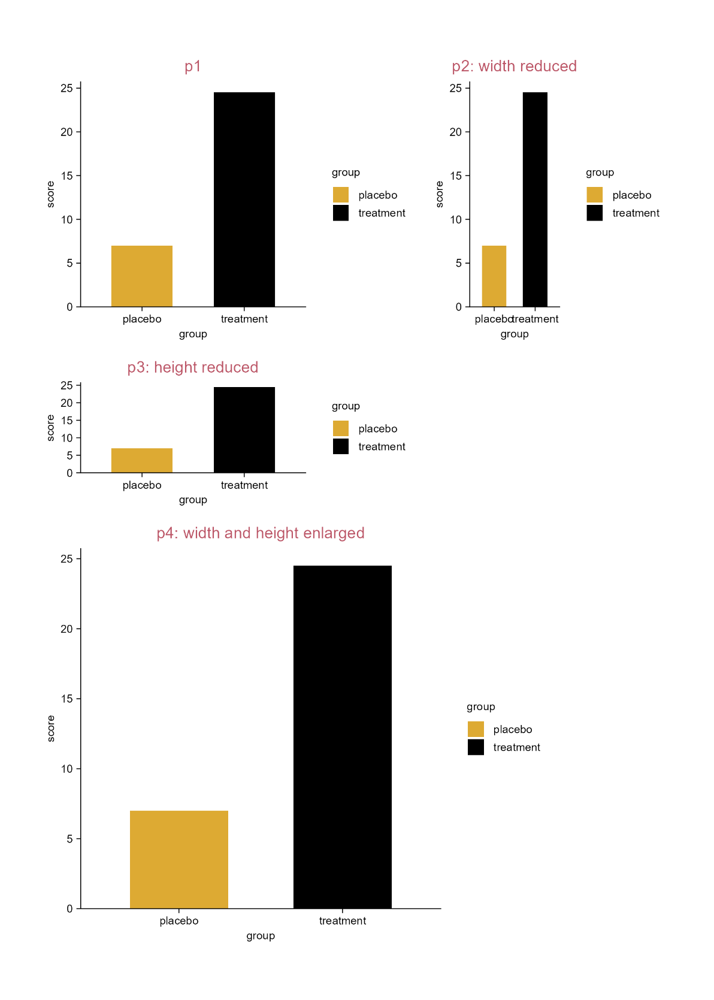{width=100% fig-align="center"}

## Remove plot elements (e.g. bar plot)

```{r}
#| eval: true
library(tidyplots)

# View top 10 rows of the columns used
study |> 
  dplyr::select(treatment, score) |> 
  dplyr::slice_head(n = 10)
```

```{r}
#| eval: false
# Plot
p1 <- study |> 
  tidyplot(
    x = treatment, 
    y = score, 
    color = treatment) |> 
  add_mean_bar(alpha = 0.4) |> 
  add_sem_errorbar() |> 
  add_data_points_beeswarm() |> 
  add_title(title = "p1")

p2 <- p1 |> 
  adjust_title(title = "p2: remove legend") |> 
  remove_legend()

p3 <- p2 |> 
  adjust_title(title = "p3: remove x axis title") |> 
  remove_x_axis_title()

p4 <- p3 |> 
  adjust_title(title = "p4: remove x axis labels") |> 
  remove_x_axis_labels()

p5 <- p4 |> 
  adjust_title(title = "p5: remove y axis title") |> 
  remove_y_axis_title()

p6 <- p5 |> 
  adjust_title(title = "p6: remove y axis labels") |> 
  remove_y_axis_labels()
```

```{r}
#| eval: false
#| echo: false
patchwork::wrap_plots(p1, p2, p3, p4, p5, p6, ncol = 2) |> 
  save_plot("images/remove-plot-elements.png",
    view_plot = FALSE, width = 150, height = 200)
```

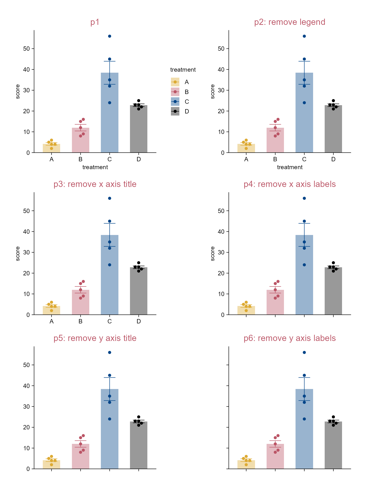{width=100% fig-align="center"}

## Highlight a subset of dataset (i.e. dot plot)

```{r}
library(tidyplots)

# View top 10 rows of the columns used
animals |> 
  dplyr::select(weight, size, animal) |> 
  dplyr::slice_head(n = 10)
```

```{r}
#| eval: false
# Plot
p1 <- animals |> 
  tidyplot(x = weight, y = size) |> 
  add_data_points(color = "#ddaa33") |> 
  add_title(title = "p1")

p2 <- p1 |> 
  add_data_points(
    data = max_rows(weight, n = 3),
    color = "#bb5566") |> 
  adjust_title(title = "p2: point highlight")

p3 <- p2 |> 
  add_data_labels_repel(data = max_rows(weight, n = 3), 
    label = animal, color = "black") |> 
  adjust_title(title = paste(
    "p3: point highlight", 
    "point labels", 
    sep = "\n"))

p4 <- p2 |> 
  add_data_labels_repel(data = max_rows(weight, n = 3), 
    background = TRUE, background_color = "#ffcccc", 
    min.segment.length = 0, 
    label = animal, 
    color = "black") |> 
  add_title(title = paste(
    "p4: point highlight", 
    "point labels", 
    "label background", 
    sep = "\n"))
```

```{r}
#| eval: false
#| echo: false
patchwork::wrap_plots(p1, p2, p3, p4, ncol = 2) |> 
  save_plot("images/highlight_subset.png",
    view_plot = FALSE, width = 130, height = 140)
```

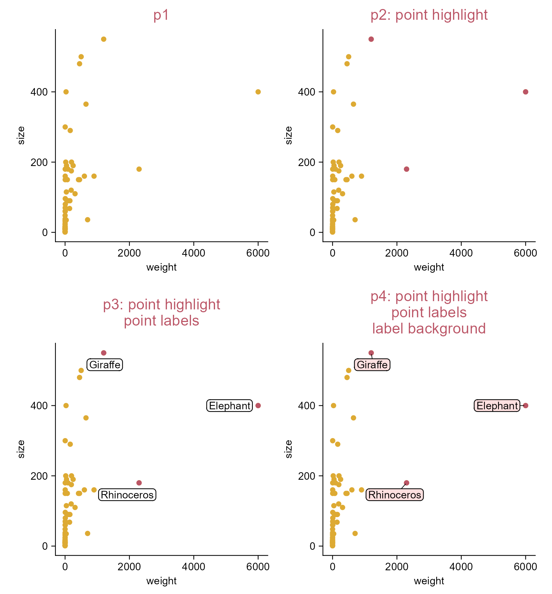{width=100% fig-align="center"}

## Point shape and size (e.g. dot plot)

```{r}
library(tidyplots)

# View top 10 rows of the columns used
animals |> 
  dplyr::select(weight, size, animal) |> 
  dplyr::slice_head(n = 10)
```

```{r}
#| eval: false
# Plot
p0 <- animals |> 
  tidyplot(x = weight, y = size)

p1 <- p0 |> 
  add_title(title = "p1: filled circle (default)") |> 
  add_data_points(color = "#ddaa33", shape = 19)

p2 <- p0 |> 
  add_title(title = "p2: empty circle") |> 
  add_data_points(color = "#ddaa33", shape = 1)

p3 <- p0 |> 
  add_title(title = "p3: filled triangle") |> 
  add_data_points(color = "#ddaa33", shape = 17)

p4 <- p0 |> 
  add_title(title = "p4: empty triangle") |> 
  add_data_points(color = "#ddaa33", shape = 2)

p5 <- p0 |> 
  add_title(title = "p5: enlarged and filled triangle") |> 
  add_data_points(
    color = "#ddaa33", fill = "#004488", shape = 24, size = 2)

p6 <- p0 |> 
  add_title(title = paste(
    "p6: enlarged and filled triangle", "wider border", sep = "\n")) |> 
  add_data_points(
    color = "#ddaa33", fill = "#004488", shape = 24, size = 2, 
    stroke = 2)
```

```{r}
#| eval: false
#| echo: false
patchwork::wrap_plots(p1, p2, p3, p4, p5, p6, ncol = 2) |> 
  save_plot("images/point-shape-size.png",
    view_plot = FALSE, width = 130, height = 200)
```

:::{.callout-note icon="true"}
See @sec-point-shapes and @sec-point-white-borders-and-width for details about `shape`.
:::

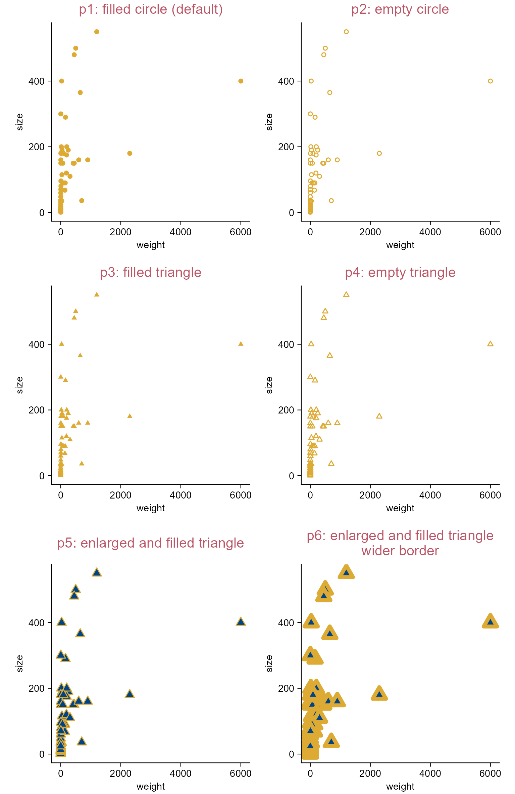{width=100% fig-align="center"}

## Reference lines/rectangle (e.g. dot plot)

```{r}
library(tidyplots)

# View top 10 rows of the columns used
animals |> 
  dplyr::select(weight, speed) |> 
  dplyr::slice_head(n = 10)
```

```{r}
#| eval: false
p1 <- animals |> 
  tidyplot(x = weight, y = speed) |> 
  add_data_points(white_border = TRUE) |>
  add_title(title = "p1") 

p2 <- p1 |> 
  adjust_title(title = "p2: reference line (dotdash)") |> 
  add_reference_lines(
    x = 4000, y = c(100, 200), linetype = "dotdash")

p3 <- p1 |> 
  adjust_title(title = "p3: annotation line (dashed)") |> 
  add_annotation_line(
    x = 2000, xend = 2000, y = 20, yend = 150, linetype = "dashed") |> 
  add_annotation_text(text = "line", x = 2000, y = 160)

p4 <- p1 |> 
  adjust_title(title = "p4: annotation line with arrowhead") |> 
  add_annotation_line(
    x = 2000, xend = 2000, y = 20, yend = 150,
    arrow = grid::arrow(length = grid::unit(2, "mm"))) |> 
  add_annotation_text(text = "line with arrowhead", x = 2000, y = 160)

p5 <- p1 |> 
  adjust_title(title = "p5: annotation rectangle (dotted)") |> 
  add_annotation_rectangle(
    xmin = 2000, xmax = 6200, ymin = 20, ymax = 150, 
    linetype = "dotted", color = "#000000", fill = NA)

p6 <- p1 |> 
  adjust_title(title = "p6: filled annotation rectangle (dotted)") |> 
  add_annotation_rectangle(
    xmin = 2000, xmax = 6200, ymin = 20, ymax = 150, 
    linetype = "dotted", color = "#000000", fill = "#eecc66")
```

```{r}
#| eval: false
#| echo: false
patchwork::wrap_plots(p1, p2, p3, p4, p5, p6, ncol = 2) |> 
  save_plot("images/reference-lines-rect.png",
    view_plot = FALSE, width = 135, height = 205)
```

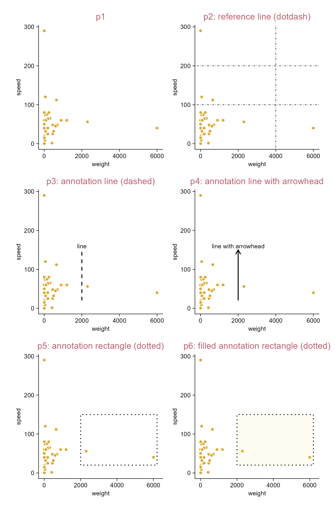{width=100% fig-align="center"}

## Rename axis levels (e.g. violin plot)

```{r}
library(tidyplots)

# View the top 10 rows of the columns used
study |> 
  dplyr::select(group, score, dose) |> 
  dplyr::slice_head(n = 10)
```

```{r}
#| eval: false
# Plot
p1 <- study |> 
  tidyplot(
    x = group, 
    y = score, 
    color = dose) |> 
  add_violin(trim = FALSE) |> 
  add_data_points_beeswarm(white_border = TRUE) |> 
  add_title(title = "p1")

p2 <- p1 |> 
  adjust_title(
    title = "p2: rename x axis levels") |> 
  rename_x_axis_levels(
    new_names = c(
      "placebo" = "A", 
      "treatment" = "B"))

p3 <- p2 |> 
  adjust_title(
    title = "p3: rename color levels") |> 
  rename_color_levels(
    new_names = c(
      "high" = "up", 
      "low" = "down"))
```

```{r}
#| eval: false
#| echo: false
patchwork::wrap_plots(p1, p2, p3, ncol = 1) |> 
  save_plot("images/rename-axis-levels.png",
    view_plot = FALSE, width = 80, height = 200)
```

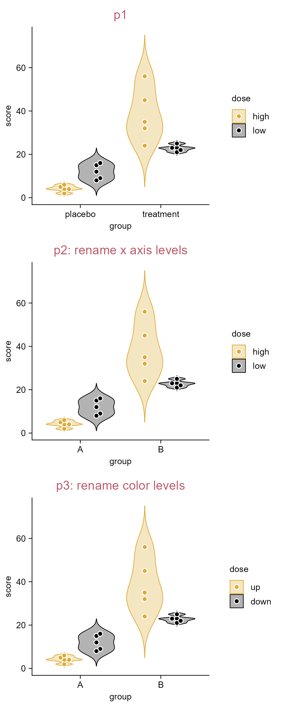{width=60% fig-align="center"}

## Assign colors (e.g. violin plot)

```{r}
library(tidyplots)

# View top 10 rows of the columns used
study |> 
  dplyr::select(group, score, dose) |> 
  dplyr::slice_head(n = 10)
```

```{r}
#| eval: false
p1 <- study |> 
  tidyplot(
    x = group, 
    y = score, 
    color = dose) |> 
  add_violin(trim = FALSE) |> 
  add_data_points_beeswarm() |> 
  add_title(title = "p1")  

p2 <- p1 |> 
  adjust_title(title = "p2: assign colors") |> 
  adjust_colors(
    new_colors = c(
      "high" = "#bb5566", 
      "low" = "#ddaa33"))

p3 <- study |> 
  tidyplot(
    x = treatment, 
    y = score, 
    color = treatment) |> 
  add_violin(trim = FALSE) |> 
  add_data_points_beeswarm() |> 
  add_title(title = "p3")

p4 <- p3 |> 
  adjust_title(title = "p4: assign colors") |> 
  adjust_colors(
    new_colors = c(
      "A" = "#000000", 
      "B" = "#004488",
      "C" = "#bb5566", 
      "D" = "#ddaa33"))
```

```{r}
#| eval: false
#| echo: false
patchwork::wrap_plots(p1, p2, p3, p4, ncol = 2) |> 
  save_plot("images/assign-colors.png",
    view_plot = FALSE, width = 160, height = 140)
```

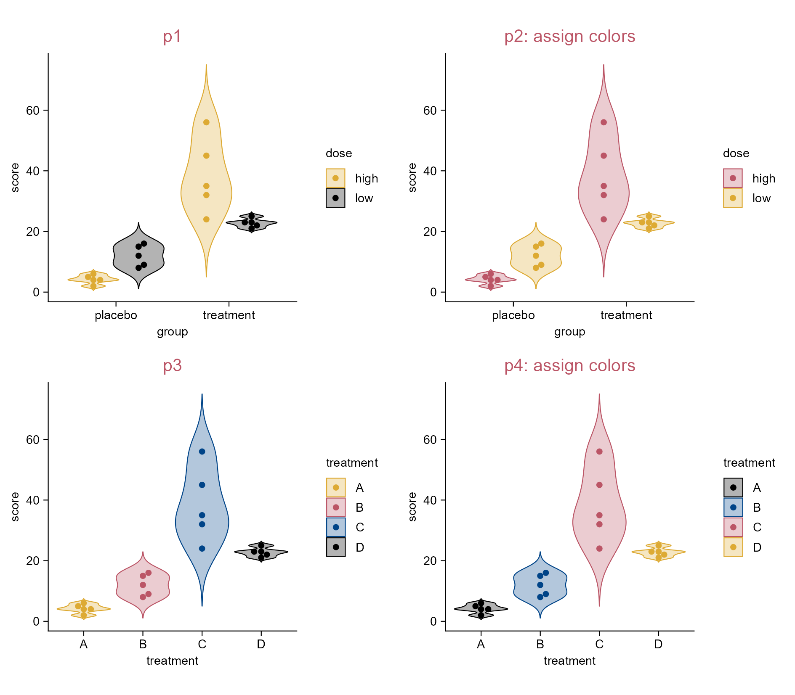{width=100% fig-align="center"}

## Define a custom color scheme (e.g. violin plot)

```{r}
library(tidyplots)

# Define a custom color scheme
high_contrast_qualitative_colour <- new_color_scheme(
  c("#000000", 
    "#004488", 
    "#bb5566", 
    "#ddaa33"), 
  name = "high_contrast_qualitative_colour")

# View top 10 rows of the columns used
study |> 
  dplyr::select(treatment, score) |> 
  dplyr::slice_head(n = 10)
```

```{r}
#| eval: false
# Plot
p1 <- study |> 
  tidyplot(
    x = treatment, 
    y = score, 
    color = treatment) |> 
  add_violin(trim = FALSE) |> 
  add_data_points_beeswarm(white_border = TRUE) |> 
  adjust_legend_position(position = "bottom") |> 
  add_title(title = "p1")

p2 <- p1 |> 
  adjust_title(title = "p2: a custom color scheme") |> 
  adjust_colors(new_colors = high_contrast_qualitative_colour)
```

```{r}
#| eval: false
#| echo: false
patchwork::wrap_plots(p1, p2, ncol = 1) |> 
  save_plot("images/custom-color-scheme.png", 
    view_plot = FALSE, height = 160)
```

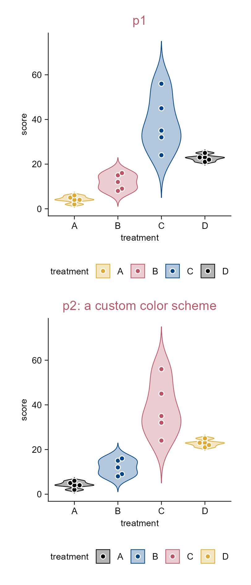{width=60% fig-align="center"}

## Add sum values (e.g. bar plot)

```{r}
library(tidyplots)

# View top 10 rows of the columns used
spendings |> 
  dplyr::select(category, amount) |> 
  dplyr::slice_head(n = 10)
```

```{r}
#| eval: false
# Plot
p1 <- spendings |> 
  tidyplot(
    x = category, 
    y = amount, 
    color = category) |> 
  add_sum_bar(alpha = 0.2) |> 
  add_sum_dash() |> 
  add_title(title = "p1") |> 
  adjust_x_axis(rotate_labels = TRUE) |> 
  remove_legend()

p2 <- p1 |> 
  adjust_title(title = "p2: add sum values") |> 
  add_sum_value(accuracy = 1)

p3 <- p1 |> 
  adjust_title(title = paste(
    "p3: add sum values in black",
    "one decimal place",
    sep = "\n")) |> 
  add_sum_value(accuracy = 0.1, color = "black")

p4 <- p1 |> 
  adjust_title(title = paste(
    "p4: add sum values in black",
    "rotate 45",
    sep = "\n")) |> 
  add_sum_value(
    accuracy = 1, 
    color = "black",
    angle = 45, 
    hjust = -0.1) |> 
  adjust_padding(top = 0.2)
```

```{r}
#| eval: false
#| echo: false
patchwork::wrap_plots(p1, p2, p3, p4, ncol = 2) |> 
  save_plot("images/add-sum-values.png",
    view_plot = FALSE, width = 130, height = 160)
```

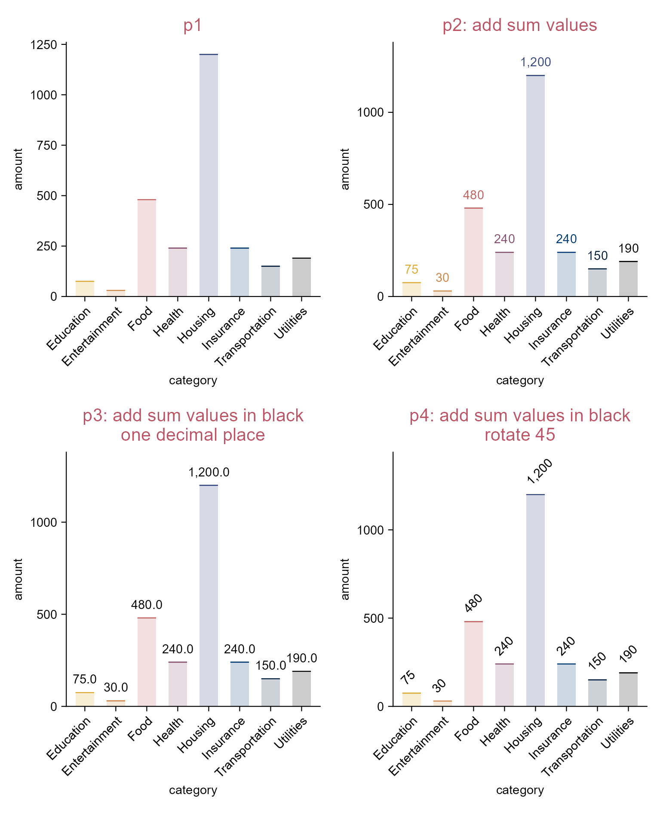{width=100% fig-align="center"}

## Sort axis levels (e.g. bar plot)

```{r}
library(tidyplots)

# View the top 10 rows of the columns used
spendings |> 
  dplyr::select(category, amount) |> 
  dplyr::slice_head(n = 10)
```

```{r}
#| eval: false
# Plot
p1 <- spendings |> 
  tidyplot(
    x = category, 
    y = amount, 
    color = category) |> 
  add_sum_bar(alpha = 0.2) |> 
  add_sum_dash() |> 
  add_sum_value(
    accuracy = 1, 
    color = "black") |> 
  adjust_x_axis(rotate_labels = TRUE) |> 
  add_title(title = "p1") |> 
  remove_legend()

p2 <- p1 |> 
  adjust_title(title = "p2: sort x axis levels by score") |> 
  sort_x_axis_levels()

p3 <- p1 |> 
  adjust_title(title = "p3: sort x axis levels by score in reverse") |> 
  sort_x_axis_levels(.reverse = TRUE)

p4 <- p1 |> 
  adjust_title(title = "p4: sort color levels by score") |> 
  sort_color_levels()
```

```{r}
#| eval: false
#| echo: false
patchwork::wrap_plots(p1, p2, p3, p4, ncol = 2) |> 
  save_plot("images/sort-axis-levels.png",
    view_plot = FALSE, width = 140, height = 160)
```

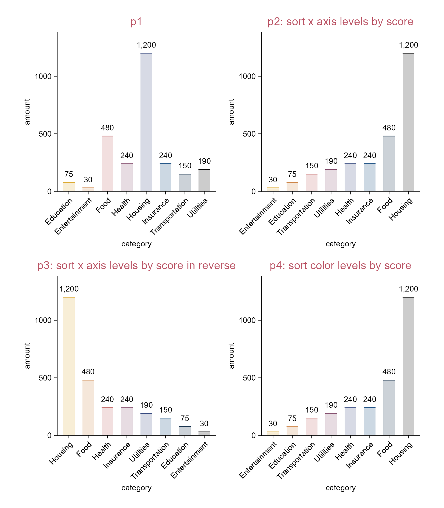{width=100% fig-align="center"}

## Reorder axis levels (e.g. violin plot)

```{r}
library(tidyplots)

# View top 10 rows of the columns used
study |> 
  dplyr::select(treatment, score) |> 
  dplyr::slice_head(n = 10)
```

```{r}
#| eval: false
# Plot
p1 <- study |> 
  tidyplot(
    x = treatment, 
    y = score, 
    color = treatment) |> 
  add_violin(trim = FALSE) |> 
  add_data_points_beeswarm(white_border = TRUE) |> 
  add_title(title = "p1")

p2 <- p1 |> 
  adjust_title(title = "p2: custom x axis level order") |> 
  reorder_x_axis_levels("C", "D", "A", "B")

p3 <- p1 |> 
  adjust_title(title = "p3: reverse x axis levels") |> 
  reverse_x_axis_levels()

p4 <- p1 |>
  adjust_title(title = "p4: sort x axis levels by score") |> 
  sort_x_axis_levels()

p5 <- p1 |>
  adjust_title(title = "p5: custom color level order") |> 
  reorder_color_levels("C", "D")

p6 <- p1 |> 
  adjust_title(title = "p6: sort color levels by score") |> 
  sort_color_levels()
```

```{r}
#| eval: false
#| echo: false
patchwork::wrap_plots(p1, p2, p3, p4, p5, p6, ncol = 2) |> 
  save_plot("images/reorder-axis-levels.png",
    view_plot = FALSE, width = 160, height = 210)
```

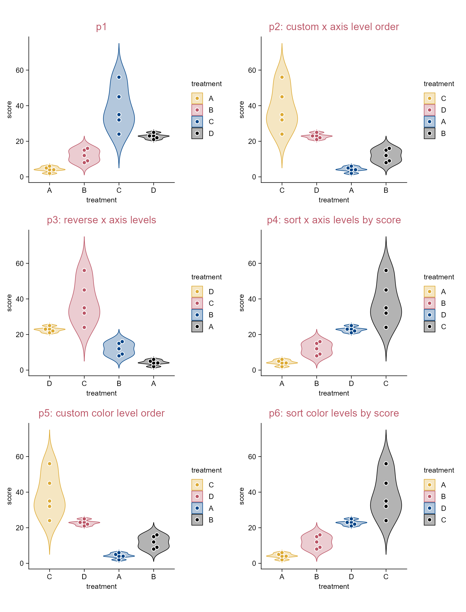{width=100% fig-align="center"}

## Guide attention (e.g. bar plot)

```{r}
#| warning: false
library(tidyplots)

# View top 10 rows of the columns used
spendings |> 
  dplyr::select(category, amount) |> 
  dplyr::slice_head(n = 10)
```

```{r}
#| eval: false
# Plot
p1 <- spendings |> 
  tidyplot(
    x = category, 
    y = amount, 
    color = category) |> 
  add_sum_bar() |> 
  add_title(title = "p1") |> 
  adjust_x_axis(rotate_labels = TRUE)  
  
p2 <- p1 |> 
  adjust_title(title = "p2: other bars in gray") |> 
  adjust_colors(
    new_colors = c(
      "Health" = "#994455", 
      na.value = "#dddddd"))

p3 <- p1 |> 
  adjust_title(title = paste(
    "p3: other bars in gray",
    "sum value",
    sep = "\n")) |> 
  add_sum_value(accuracy = 1) |> 
  adjust_colors(
    new_colors = c(
      "Health" = "#994455", 
      na.value = "#dddddd"))

p4 <- p3 |> 
  adjust_title(title = paste(
    "p4: other bars in gray",
    "sum value",
    "sort x axis",
    sep = "\n")) |> 
  sort_x_axis_levels()
```

```{r}
#| eval: false
#| echo: false
patchwork::wrap_plots(p1, p2, p3, p4, ncol = 2) |> 
  save_plot("images/guide-attention.png",
    view_plot = FALSE, width = 180, height = 160)
```

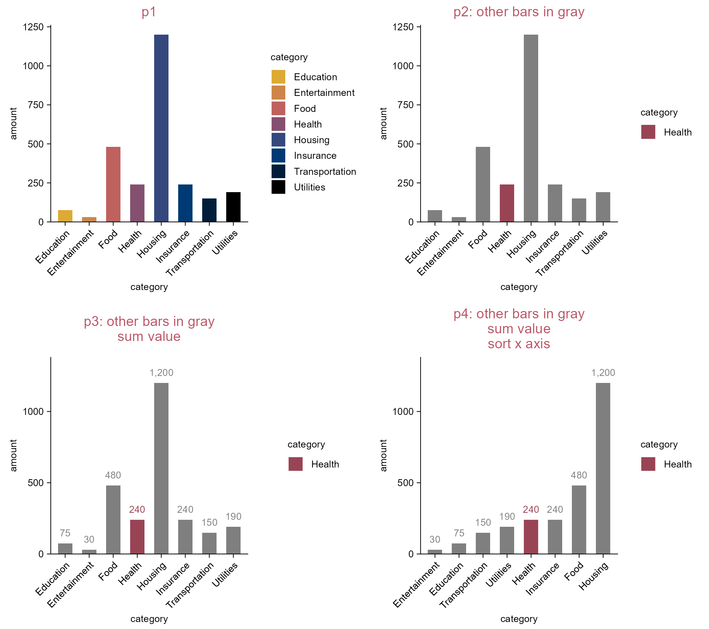{width=100% fig-align="center"}

## Horizontal bars (e.g. bar plot)

```{r}
library(tidyplots)

# View top 10 rows of the columns used
spendings |> dplyr::select(amount, category) |> dplyr::slice_head(n = 10)
```

```{r}
#| eval: false
# Plot
p1 <- spendings |> 
  tidyplot(x = category, y = amount, color = category) |> 
  add_sum_bar(alpha = 0.2) |> 
  add_sum_dash() |> 
  add_sum_value(accuracy = 1, color = "black") |>
  add_title(title = "p1") |> 
  sort_x_axis_levels() |> 
  adjust_x_axis(rotate_labels = TRUE) |> 
  adjust_colors(new_colors = c("#eecc66", "#ee99aa", "#6699cc", 
    "#997700", "#994455", "#004488", "#000000")) |> 
  remove_legend() |> 
  adjust_padding(right = 0.2)

p2 <- spendings |> 
  tidyplot(x = amount, y = category, color = category) |> 
  add_sum_bar(alpha = 0.2) |> 
  add_sum_dash() |> 
  add_sum_value(accuracy = 1, color = "black") |> 
  adjust_title(title = "p2: horizontal") |> 
  sort_y_axis_levels() |> 
  adjust_colors(new_colors = c("#eecc66", "#ee99aa", "#6699cc", 
    "#997700", "#994455", "#004488", "#000000")) |> 
  remove_legend()

p3 <- p2 |> 
  adjust_title(title = "p3: adjust right padding") |> 
  adjust_padding(right = 0.2)

p4 <- p2 |> 
  adjust_title(title = "p4: adjust x axis limit") |> 
  adjust_x_axis(limits = c(0, 1500))

p5 <- p2 |> 
  adjust_title(title = "p5: via 'add()'") |> 
  add(ggplot2::coord_cartesian(clip = "off"))

p6 <- p2 |> 
  adjust_title(title = "p6: via 'remove_clipping()'") |> 
  remove_clipping()
```

```{r}
#| eval: false
#| echo: false
patchwork::wrap_plots(p1, p2, p3, p4, p5, p6, ncol = 2) |> 
  save_plot("images/horizontal-bars.png",
    view_plot = FALSE, width = 155, height = 215)
```

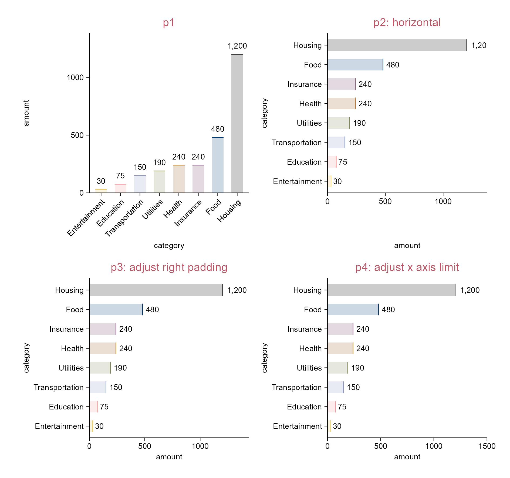{width=95% fig-align="center"}

:::{.callout-note icon="true"}
`remove_clipping()` is only available if you install a specific commit (on 2026-04-01), i.e. `pak("jbengler/tidyplots@4a08bfe")` via the `pak` package, or use a later version.
:::

## Preview a subset of dataset (e.g. violin plot)

```{r}
library(tidyplots)

# View top 10 rows of the columns used
gene_expression |> 
  dplyr::select(group, expression, external_gene_name) |> 
  dplyr::slice_head(n = 10)
```

```{r}
#| eval: false
# Plot
gene_expression |> 
  tidyplot(
    x = group, 
    y = expression, 
    color = group) |> 
  add_violin(trim = FALSE) |> 
  add_data_points_beeswarm(
    white_border = TRUE) |>
  view_plot(
    title = "All") |> 
  view_plot(
    data = filter_rows(
      external_gene_name %in% c(
        "Apol6", 
        "Col5a3")),
    title = "Apol6 & Col5a3")
```

```{r}
#| eval: false
#| echo: false
# Plot
p1 <- gene_expression |> 
  tidyplot(
    x = group, 
    y = expression, 
    color = group) |> 
  add_violin(trim = FALSE) |> 
  add_data_points_beeswarm(white_border = TRUE) |>
  add_title(title = "All") |> 
  view_plot(
    data = filter_rows(
      external_gene_name %in% c("Apol6", "Col5a3")),
    title = "Apol6 & Col5a3")

p2 <- gene_expression |> 
  dplyr::filter(external_gene_name %in% c("Apol6", "Col5a3")) |> 
  tidyplot(
    x = group, 
    y = expression, 
    color = group) |> 
  add_violin(trim = FALSE) |> 
  add_data_points_beeswarm(
    white_border = TRUE) |>
  add_title(title = "Apol6 & Col5a3")

patchwork::wrap_plots(p1, p2, ncol = 1) |> 
  save_plot("images/preview_a_subset.png",
    view_plot = FALSE, width = 80, height = 135)
```

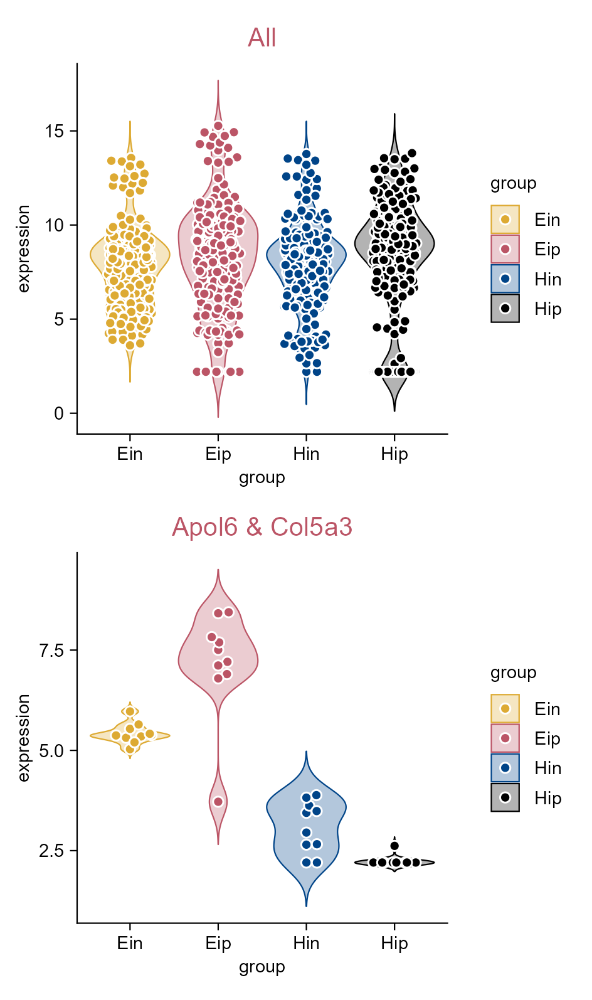{width="90%" fig-align="center"}

## Set a global default style (e.g. bar plot)

```{r}
library(tidyplots)

# View top 10 rows of the columns used
study |> 
  dplyr::select(group, score, dose) |> 
  dplyr::slice_head(n = 10)
```

```{r}
# eval: false

# Define a global style
my_style <- function(x) {
  x |> 
  adjust_colors(new_colors = c("#bb5566", "#ddaa33")) |> 
  adjust_size(width = 50, height = 30, unit = "mm") |> 
  adjust_title(fontsize = 10, color = "#004488")}

# Plot
p1 <- study |> 
  tidyplot(
    x = group, 
    y = score, 
    color = dose) |> 
  add_mean_bar() |> 
  adjust_size() |> 
  add_title("p1: default style")

# Set global options
tidyplots_options(my_style = my_style)

# Plot
p2 <- study |> 
  tidyplot(
    x = group, 
    y = score, 
    color = dose) |> 
  add_mean_bar() |> 
  add_title("p2: defined global style")
```

```{r}
#| eval: false
#| echo: false
patchwork::wrap_plots(p1, p2, ncol = 1) |> 
  save_plot("images/global-default-style.png",
    view_plot = FALSE, height = 120)
```

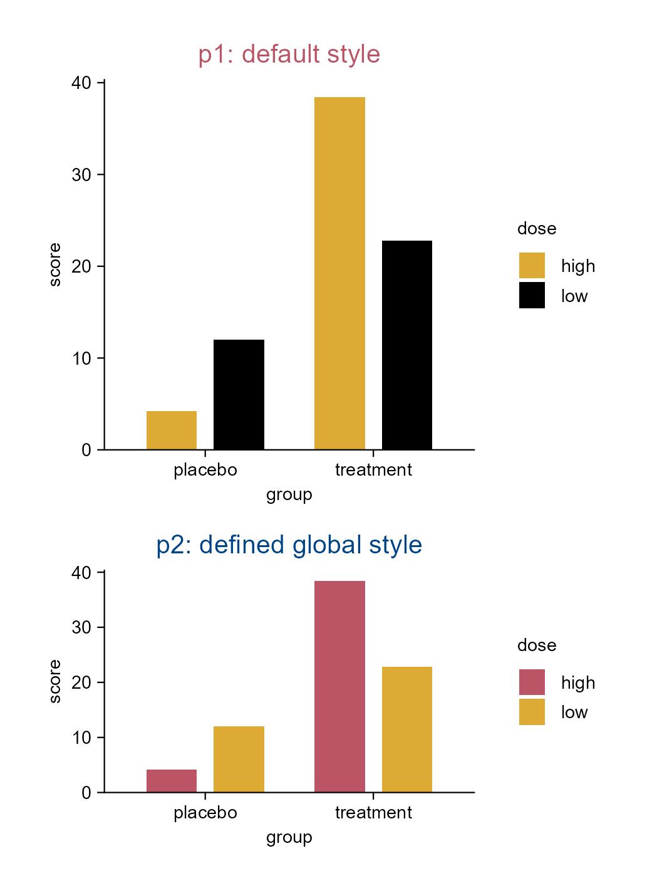{width=100% fig-align="center"}

```{r}
#| eval: false
#| echo: false

# Change back to default options
tidyplots_options(my_style = my_default_style)
```

## Set a custom style to reuse (e.g. bar plot)

```{r}
library(tidyplots)

# View top 10 rows of the columns used
study |> 
  dplyr::select(group, score, dose) |> 
  dplyr::slice_head(n = 10)
```

```{r}
#| eval: false
# Define a style
my_style <- function(x) {
  x |> 
  adjust_colors(new_colors = c("#bb5566", "#ddaa33")) |> 
  adjust_size(width = 50, height = 30, unit = "mm") |> 
  adjust_title(fontsize = 10, color = "#ddaa33")}

p1 <- study |> 
  tidyplot(
    x = group, 
    y = score, 
    color = dose) |> 
  add_mean_bar() |> 
  adjust_size() |> 
  add_title("p1: default style")

p2 <- study |> 
  tidyplot(
    x = group, 
    y = score, 
    color = dose) |> 
  add_mean_bar() |> 
  add_title("p2: defined custom style") |> 
  my_style()
```

```{r}
#| eval: false
#| echo: false
patchwork::wrap_plots(p1, p2, ncol = 1) |> 
  save_plot("images/set-custom-style.png",
    view_plot = FALSE, height = 120)
```

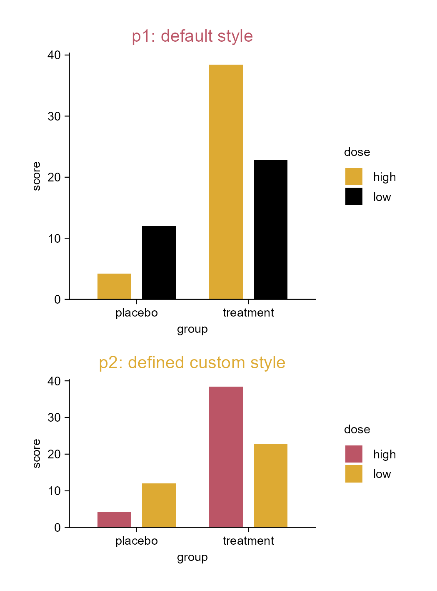{width=100% fig-align="center"}

## Set a custom style to reuse (e.g. areastack plot) {#sec-custom-reuse}

```{r}
library(tidyplots)

# View top 10 rows of the columns used
energy_week |> 
  dplyr::select(date, power, energy_source) |> 
  dplyr::slice_head(n = 10)
```

```{r}
#| eval: false
# Define a style
my_style <- function(x) {
  x |> 
    adjust_font(family = "mono", face = "bold") |> 
    adjust_title(fontsize = 10) |> 
    reverse_color_levels() |> 
    adjust_x_axis(labels = scales::label_date( # display dates as "Sep 05" etc.
      format = "%b %d", locale = "en"))}

# Plot
p1 <- energy_week |> 
  tidyplot(
    x = date, 
    y = power, 
    color = energy_source) |> 
  add_areastack_relative() |> 
  add_title(title = "p1: areastack relative")

p2 <- p1 |> 
  adjust_title(
    title = paste("p2: areastack relative", "defined custom style", sep = "\n")) |> 
  adjust_legend_title(title = "ENERGY_SOURCE", color = "#bb5566") |>   
  adjust_legend_position(position = "left") |> 
  my_style()

p3 <- energy_week |> 
  tidyplot(
    x = date, 
    y = power, 
    color = energy_source) |> 
  adjust_title(
    title = paste("p3: areastack absolute", "defined custom style", sep = "\n")) |> 
  add_areastack_absolute() |> 
  my_style()
```

```{r}
#| eval: false
#| echo: false
patchwork::wrap_plots(p1, p2, p3, ncol = 1) |> 
  save_plot("images/set-custom-style_areastack.png",
    view_plot = FALSE, width = 170, height = 210)
```

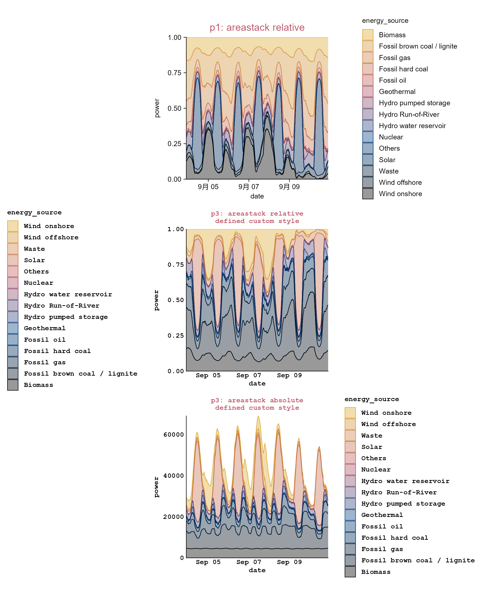{width=100% fig-align="center"}

:::{.callout-note}
Please note the Chinese character "月" on the x-axis of p1, as the code was run on an `x86_64-w64-mingw32/x64` platform with the locale set to `Chinese (Simplified)_China.utf8`.
:::

## Plot paper and ink colors (e.g. bar plot)

```{r}
library(tidyplots)

# View top 10 rows of the columns used
study |> 
  dplyr::select(treatment, score) |> 
  dplyr::slice_head(n = 10)
```

```{r}
#| eval: false
# Define a style to reuse
my_style <- function(x) {
  x |> 
  add_mean_bar(alpha = 0.4) |> 
  add_sem_errorbar() |> 
  add_data_points_beeswarm()}

p1 <- study |> 
  tidyplot(x = treatment, y = score, color = treatment) |> 
  my_style() |> 
  add_title(title = "p1")

p2 <- study |> 
  tidyplot(x = treatment, y = score, color = treatment, paper = "#dddddd") |> 
  my_style() |> 
  add_title(title = "p2: paper/background color changed")

p3 <- study |> 
  tidyplot(x = treatment, y = score, color = treatment, paper = "#dddddd", ink = "#004488") |> 
  my_style() |> 
  add_title(title = "p3: paper/background and ink/foreground\n color changed")
```

```{r}
#| eval: false
# Set global options
tidyplots_options(paper = "#dddddd", ink = "#004488")

p4 <- study |> 
  tidyplot(x = treatment, y = score, color = treatment) |> 
  my_style() |> 
  add_title(
    title = "p4: paper/background and ink/foreground\n color changed via 'tidyplots_options()'")

# Reset tidyplots options
tidyplots_options()
```

```{r}
#| eval: false
#| echo: false
tidyplots |> library()

# Define style
my_default_style <- function(x) {
  x |> 
  adjust_colors(new_colors = c("#ddaa33", "#bb5566", "#004488", "#000000")) |> 
  adjust_title(fontsize = 10, color = "#bb5566")
}

# Set global options
tidyplots_options(paper = "#dddddd", ink = "#004488", my_style = my_default_style)

p4 <- study |> 
  tidyplot(x = treatment, y = score, color = treatment) |> 
  my_style() |> 
  add_title(
    title = "p4: paper/background and ink/foreground\n color changed via 'tidyplots_options()'")

# Reset tidyplots options
tidyplots_options()
# Set global options
tidyplots_options(my_style = my_default_style)

patchwork::wrap_plots(p1, p2, p3, p4, ncol = 2) |> 
  save_plot("images/paper-ink.png",
    view_plot = FALSE, width = 160, height = 140)
```

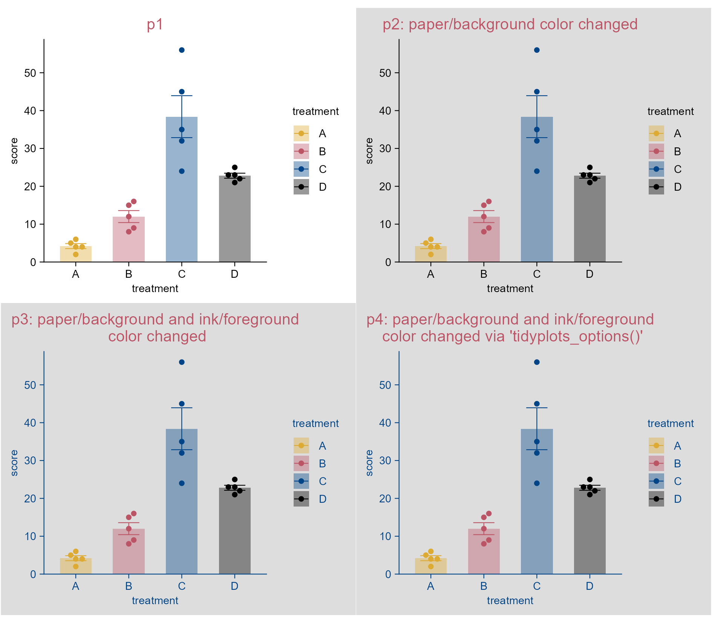{width="100%" fig-align="center"}

:::{.callout-note icon="true"}
The title color of p3 and p4 should be in the `ink` color (i.e. blue #004488). However, it has been changed to red (i.e. #bb5566) to follow the global setting applied throughout this book.

By the way, it seems unreasonable to change the default `paper` and `ink` colors for scientific figures.
:::

## Change color scheme (e.g. bar plot)

```{r}
#| warning: false
library(tidyplots)

# View top 10 rows of the columns used
spendings |> 
  dplyr::select(category, amount) |> 
  dplyr::slice_head(n = 10)
```

```{r}
#| eval: false
# Plot
p1 <- spendings |> 
  tidyplot(
    x = category, 
    y = amount, 
    color = category) |> 
  add_sum_bar() |> 
  add_title(title = "p1") |> 
  adjust_x_axis(rotate_labels = TRUE) |> 
  adjust_size(width = 40) |> 
  sort_x_axis_levels() 

p2 <- p1 |> 
  adjust_title(title = "p2: colors_discrete_friendly (3rd & 4th colors)") |> 
  adjust_colors(new_colors = colors_discrete_friendly[3:4])

p3 <- p1 |> 
  adjust_title(title = "p3: custom color scheme (2 colors)") |> 
  adjust_colors(new_colors = c("#eecc66", "#997700"))

p4 <- p1 |> 
  adjust_title(title = "p4: colors_continuous_cividis (265 colors)") |> 
  adjust_colors(new_colors = colors_continuous_cividis)
```

:::{.callout-note icon="true"}
`Tidyplots` comes with a number of default color schemes.

A color scheme (default or custom) might contain limited number of colors (e.g. p3), `tidyplots` will automatically fill up the gaps between colors to deliver exactly the number that is required for the plot.

Similarly, when a color scheme contains more colors than needed (e.g. p4), `tidyplots` will select the required number of colors by attempting to evenly sample from the supplied color vector.
:::

```{r}
#| eval: false
#| echo: false
patchwork::wrap_plots(p1, p2, p3, p4, ncol = 2) |> 
  save_plot("images/change-color-scheme.png",
    view_plot = FALSE, width = 165, height = 160)
```

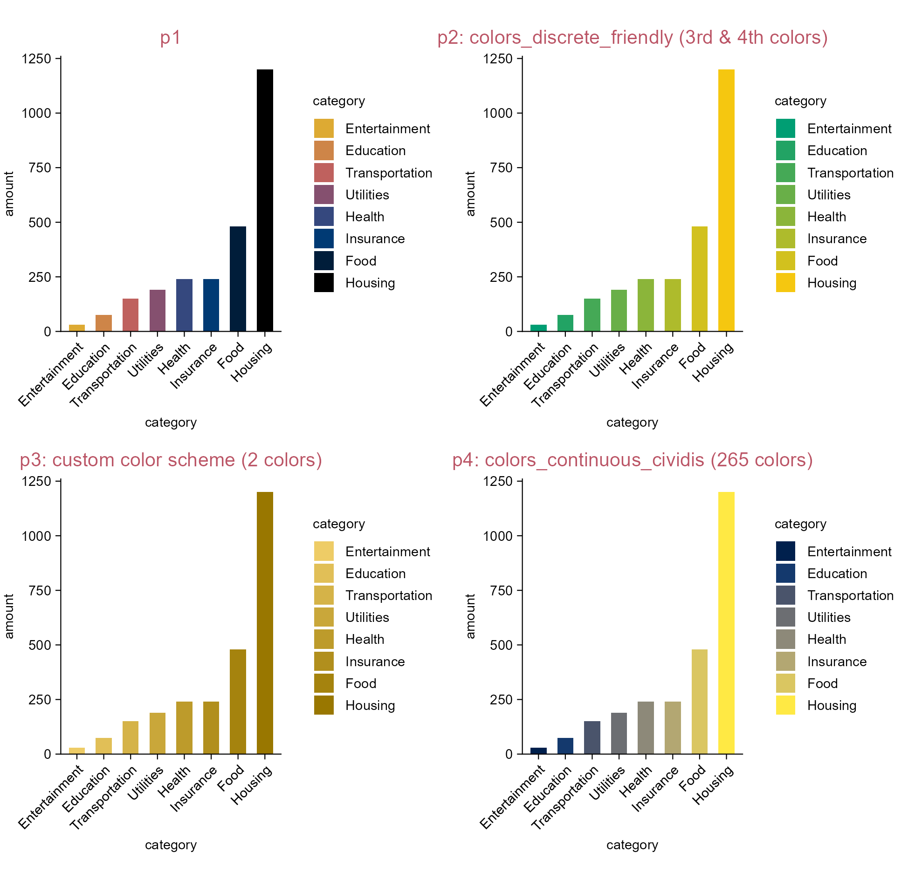{width=100% fig-align="center"}

## Add data ellipses (e.g. dot plot)

```{r}
library(tidyplots)

# View top 10 rows of the columns used
pca |> 
  dplyr::select(pc1, pc2, group) |> 
  dplyr::slice_head(n = 10)
```

```{r}
#| eval: false
# Plot
p1 <- pca |> 
  tidyplot(
    x = pc1, 
    y = pc2, 
    color = group) |> 
  add_data_points(white_border = TRUE) |> 
  add_title(title = "p1")

p2 <- p1 |> 
  adjust_title(title = "p2: ellipses") |> 
  add_ellipse()

p3 <- p1 |> 
  adjust_title(title = "p3: dotted ellipses") |> 
  add_ellipse(linetype = "dotted")

p4 <- p1 |> 
  adjust_title(title = "p4: filled ellipses") |> 
  add_ellipse(geom = "polygon", alpha = 0.2)

p5 <- p1 |> 
  adjust_title(title = paste("p5: filled ellipses", 
  "reduced level", sep = "\n")) |> 
  add_ellipse(geom = "polygon", alpha = 0.2, level = 0.8)

p6 <- p1 |> 
  adjust_title(title = paste("p6: filled ellipses", 
  "reduced level", "'norm' type", sep = "\n")) |> 
  add_ellipse(geom = "polygon", alpha = 0.2, level = 0.8, type = "norm")
```

```{r}
#| eval: false
#| echo: false
patchwork::wrap_plots(p1, p2, p3, p4, p5, p6, ncol = 2) |> 
  save_plot("images/add-ellipses.png",
    view_plot = FALSE, width = 160, height = 210)
```

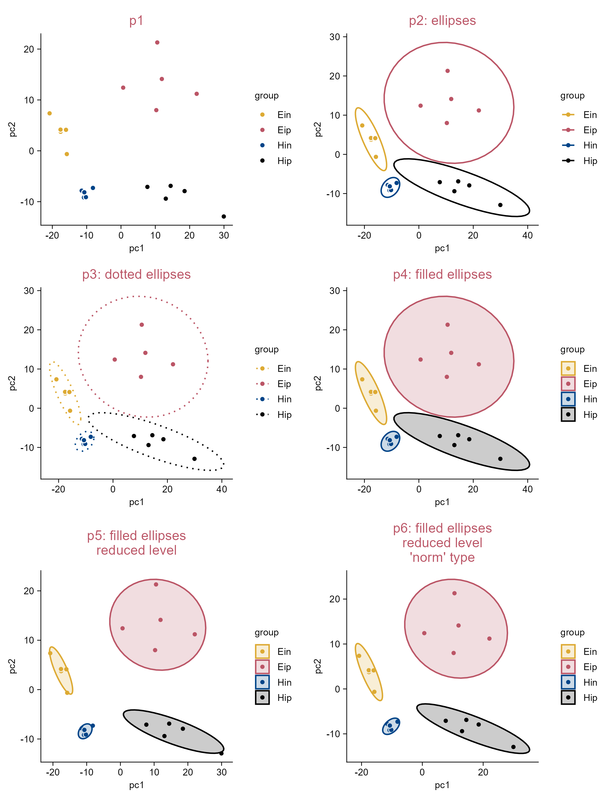{width=100% fig-align="center"}

## Add mean and summary statistics to raw data points (e.g. dot plot)

```{r}
library(tidyplots)

# View top 10 rows of the column used
climate |> 
  dplyr::select(month, max_temperature) |> 
  dplyr::slice_head(n = 10)
```

```{r}
#| eval: false
# Plot
p1 <- climate |> 
  tidyplot(x = month, y = max_temperature) |> 
  add_data_points_beeswarm(alpha = 0.3, color = "#bbbbbb", white_border = TRUE) |> 
  add_mean_line() |> 
  add_title(title = "p1")

p2 <- p1 |> 
  adjust_title(title = "p2: sem ribbon and errorbar") |> 
  add_sem_ribbon() |> 
  add_sem_errorbar()

p3 <- p1 |> 
  adjust_title(title = "p3: sd ribbon and errorbar") |> 
  add_sd_ribbon() |> 
  add_sd_errorbar()

p4 <- p1 |> 
  adjust_title(title = "p4: ci95 ribbon and errorbar") |> 
  add_ci95_ribbon() |> 
  add_ci95_errorbar()

p5 <- p1 |> 
  adjust_title(title = "p5: range ribbon and bar") |> 
  add_range_ribbon() |> 
  add_range_errorbar()

p6 <- p1 |> 
  adjust_title(title = paste(
    "p6: range ribbon (defined color)", 
    "range bar", 
    sep = "\n")) |> 
  add_range_ribbon(color = "#bb5566", fill = "#bb5566") |> 
  add_range_errorbar()
```

```{r}
#| eval: false
#| echo: false
patchwork::wrap_plots(p1, p2, p3, p4, p5, p6, ncol = 2) |> 
  save_plot("images/add-mean-summary-data-points.png",
    view_plot = FALSE, width = 140, height = 210)
```

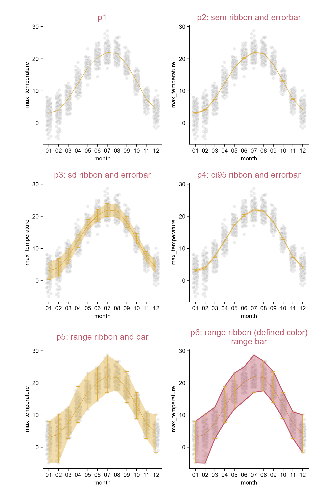{width=100% fig-align="center"}

## Add mean and summary statistics to grouped raw data points (e.g. dot plot)

```{r}
#| warning: false
library(tidyplots)

# View top 10 rows of the columns used
time_course |> 
  dplyr::select(day, score, treatment) |> 
  dplyr::slice_head(n = 10)
```

```{r}
#| eval: false
# Plot
p1 <- time_course |> 
  tidyplot(
    x = day, 
    y = score, 
    color = treatment) |> 
  add_mean_line() |> 
  add_mean_dot(size = 1.5) |> 
  add_title(title = "p1: mean line/dot")

p2 <- p1 |> 
  adjust_title(title = "p2: sem ribbon") |> 
  add_data_points(alpha = 0.3) |> 
  add_sem_ribbon()  

p3 <- p1 |> 
  adjust_title(title = "p3: sem errorbar") |> 
  add_sem_errorbar(width = 1.5)

p4 <- p1 |> 
  adjust_title(title = paste("p4: sem ribbon", "sem errorbar", sep = "\n")) |> 
  add_sem_ribbon() |> 
  add_sem_errorbar(width = 1.5)

p5 <- p1 |> 
  adjust_title(title = "p5: sd errorbar") |> 
  add_sd_errorbar(width = 1.5)

p6 <- p1 |> 
  adjust_title(title = paste("p6: sd ribbon", "sd errorbar", sep = "\n")) |> 
  add_sd_ribbon() |> 
  add_sd_errorbar(width = 1.5)
```

```{r}
#| eval: false
#| echo: false
patchwork::wrap_plots(p1, p2, p3, p4, p5, p6, ncol = 2) |> 
  save_plot("images/time-course-plot.png",
    view_plot = FALSE, width = 170, height = 210)
```

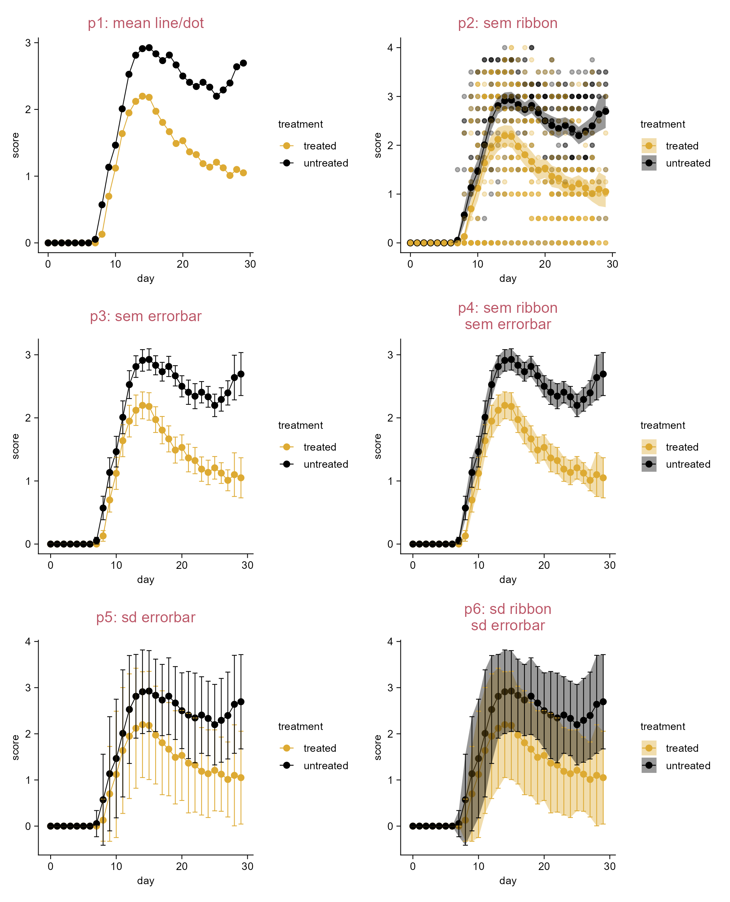{width="100%" fig-align="center"}

## Add fit curve to raw data points (i.e. dot plot)

```{r}
library(tidyplots)

# View top 10 rows of the columns used
time_course |> 
  dplyr::select(score, day) |> 
  dplyr::slice_head(n = 10)
```

```{r}
#| eval: false
# Plot
p1 <- time_course |> 
  tidyplot(
    x = score, 
    y = day) |> 
  add_title(title = "p1") |> 
  add_data_points(alpha = 0.2, color = "#dddddd")

p2 <- p1 |> 
  adjust_title(title = "p2: orientation = y") |> 
  add_curve_fit(
    orientation = "y", color = "#bb5566", fill = "#bb5566")

p3 <- p1 |> 
  adjust_title(title = "p3: orientation = x") |> 
  add_curve_fit(
    orientation = "x", color = "#bb5566", fill = "#bb5566")

p4 <- p1 |> 
  adjust_title(title = paste("p4: orientation = x", "sem ribbon", sep = "\n")) |> 
  add_curve_fit(
    orientation = "x", color = "#bb5566", fill = "#bb5566") |> 
  add_sem_ribbon(fill = "#000000")

p5 <- p1 |> 
  adjust_title(title = paste("p5: orientation = x", "method: 'lm'", sep = "\n")) |> 
  add_curve_fit(
    method = "lm", orientation = "x", color = "#bb5566", fill = "#bb5566")

p6 <- p1 |> 
  adjust_title(title = paste("p6: orientation = x", "method: 'gam'", sep = "\n")) |> 
  add_curve_fit(
    method = "gam", orientation = "x", color = "#bb5566", fill = "#bb5566")
```

```{r}
#| eval: false
#| echo: false
patchwork::wrap_plots(p1, p2, p3, p4, p5, p6, ncol = 2) |> 
  save_plot("images/add-fit-curve.png",
    view_plot = FALSE, width = 140, height = 210)
```

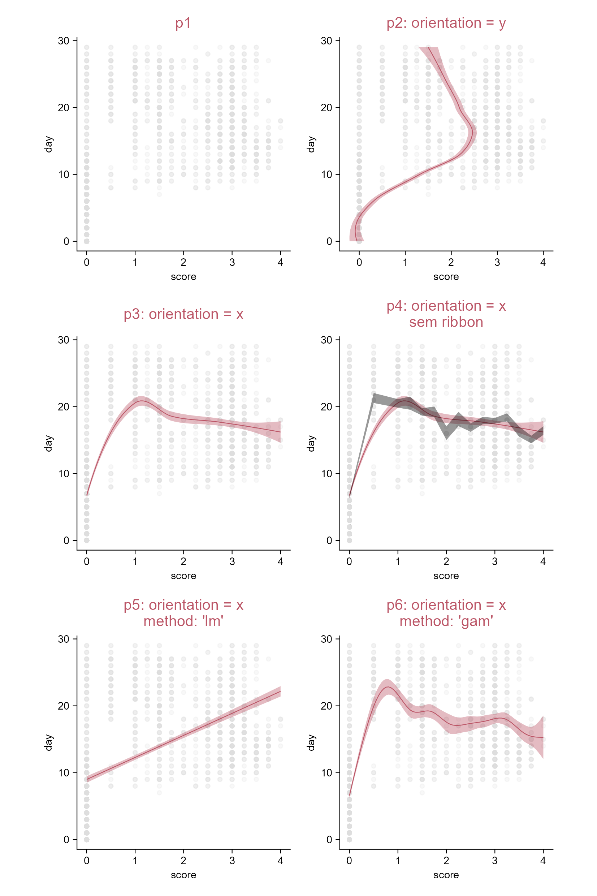{width=100% fig-align="center"}

## Plotmath expressions in title (e.g. bar plot)

```{r}
#| echo: false
library(tidyplots)

# View top 10 rows of the columns used
study |> 
  dplyr::select(treatment, score) |> 
  dplyr::slice_head(n = 10)
```

```{r}
# eval: false
# Plot
p1 <- study |> 
  tidyplot(
    x = treatment, 
    y = score, 
    color = treatment) |> 
  add_data_points() |> 
  add_mean_bar(alpha = 0.4) |> 
  adjust_title(title = "p1") |> 
  add_sem_errorbar()

p2 <- p1 |>  
  adjust_title(
    title = 
      "$p2:~italic(M)==frac(1,italic(c)(italic(c)-1))*sum(AUC[italic(list(k,l))])$",  
    family = "sans") |> 
  add_caption(caption = "family = 'sans'")

p3 <- p1 |> 
  adjust_title(
    title = 
      "$p3:~italic(M)==frac(1,italic(c)(italic(c)-1))*sum(AUC[italic(list(k,l))])$",  
    family = "serif") |> 
  add_caption(caption = "family = 'serif'")

p4 <- p1 |> 
  adjust_title(
    title = 
      "$p4:~italic(M)==frac(1,italic(c)(italic(c)-1))*sum(AUC[italic(list(k,l))])$",  
    family = "mono") |> 
  add_caption(caption = "family = 'mono'")
```

```{r}
#| eval: false
#| echo: false
patchwork::wrap_plots(p1, p2, p3, p4, ncol = 2) |> 
  save_plot("images/plotmath-in-title.png",
    view_plot = FALSE, width = 160, height = 155)
```

:::{.callout-tip icon="true"}
Just surrond your string by "$" characters.

Plotmath expressions work with plot titles, legend titles, axis titles, axis labels, caption, and more.
:::

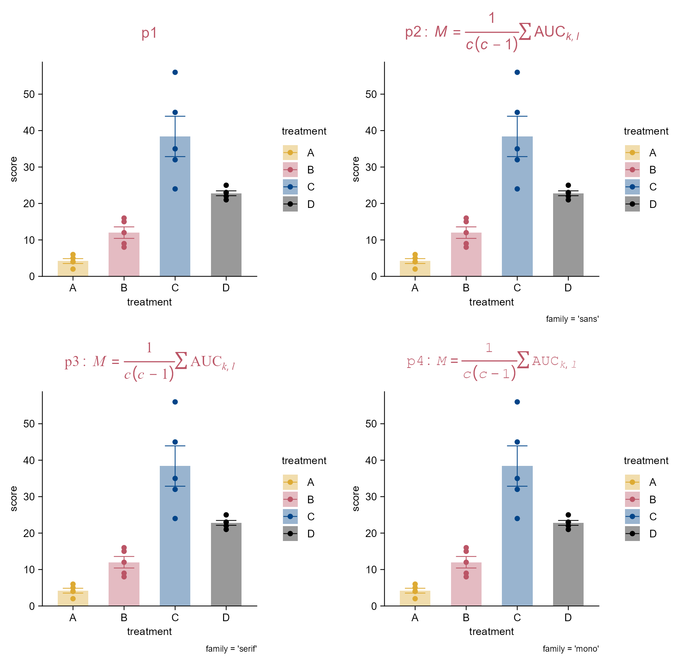{width=100% fig-align="center"}

## Plotmath expressions in more positions (e.g. bar plot)

```{r}
library(tidyplots)

# View top 10 rows of the columns used
study |> 
  dplyr::select(x = treatment, y = score) |> 
  dplyr::slice_head(n = 10)
```

```{r}
#| eval: false
# Plot
p1 <- study |> 
  tidyplot(
    x = treatment, 
    y = score, 
    color = treatment) |> 
  add_data_points() |> 
  add_mean_bar(alpha = 0.4) |> 
  add_sem_errorbar() |> 
  add_title(title = "p1")

p2 <- p1 |> 
  rename_x_axis_levels(
    new_names = c(
      "A" = "$IFN*gamma$",
      "B" = "$TNF*alpha$",
      "C" = "$H[2]*O$",
      "D" = "$C[8]*H[10]*N[4]*0[2]$")) |> 
  adjust_title(
    title = "$p2:~italic(E)==italic(m)*italic(c^{2})$") |> 
  add_caption(
    caption = "$Caption:~H[2]*O~level$") |> 
  add_annotation_text(
    text = "$H[2]*O$", x = 2, y = 45) |> 
  adjust_x_axis_title(
    title = "$italic(Mycobacterium~tuberculosis)$") |> 
  adjust_y_axis_title(
    title = "$A==pi*italic(r)^{2}$") |> 
  adjust_legend_title(
    title = "$italic(M.tb)$")
```

```{r}
#| eval: false
#| echo: false
patchwork::wrap_plots(p1, p2, ncol = 1) |> 
  save_plot("images/plotmath-in-more.png",
    view_plot = FALSE, width = 90, height = 140)
```

:::{.callout-tip icon="true"}
Just surrond your string by "$" characters.

Plotmath expressions work with plot titles, legend titles, axis titles, axis labels, caption, and more.
:::

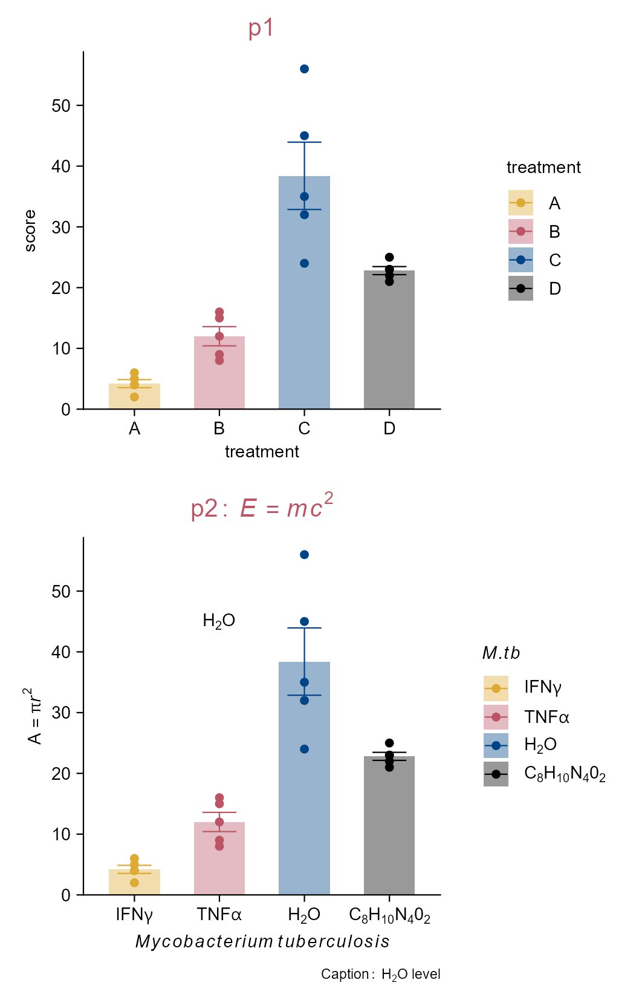{width=100% fig-align="center"}

## Group comparisons (e.g. bar plot)

```{r}
library(tidyplots)

# View top 10 rows of the columns used
study |> dplyr::select(treatment, score) |> 
  dplyr::slice_head(n = 10)
```

```{r}
#| eval: false
# Plot
p1 <- study |> 
  tidyplot(
    x = treatment, 
    y = score, 
    color = treatment) |> 
  add_mean_bar(alpha = 0.3) |> 
  add_sem_errorbar() |> 
  add_data_points() |> 
  add_title(title = "p1") |> 
  sort_x_axis_levels()

p2 <- p1 |> 
  adjust_title(title = "p2: among groups") |> 
  add_test_pvalue()

p3 <- p1 |> 
  adjust_title(title = "p3: hide statistical info") |> 
  add_test_pvalue(hide_info = TRUE)

p4 <- p1 |> 
  adjust_title(title = "p4: test_pvalue at fixed y position") |> 
  add_test_pvalue(hide_info = TRUE, y = 90)

p5 <- p1 |> 
  adjust_title(
    title = paste(
      "p5: test_pvalue at fixed y position",
      "minimize overlap", sep = "\n")) |> 
  add_test_pvalue(hide_info = TRUE, y = 90, step.increase = 0.3)

p6 <- p1 |> 
  adjust_title(title = "p6: to group A") |> 
  add_test_pvalue(ref.group = "A", hide_info = TRUE)
```

```{r}
#| eval: false
#| echo: false
patchwork::wrap_plots(p1, p2, p3, p4, p5, p6, ncol = 2) |> 
  save_plot("images/group-comparisons.png",
    view_plot = FALSE, width = 170, height = 220)
```

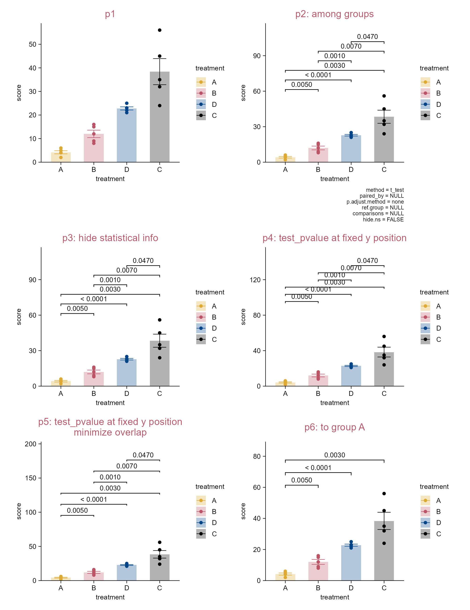{width=100% fig-align="center"}

## Test selected comparisons (e.g. dot plot)

```{r}
library(tidyplots)

# View top 10 rows of the columns used
study |> 
  dplyr::select(treatment, score) |> 
  dplyr::slice_head(n = 10)
```

```{r}
#| eval: false
# Plot
p1 <- study |> 
  tidyplot(x = treatment, y = score, color = treatment) |> 
  add_mean_dash() |> 
  add_sem_errorbar() |> 
  add_data_points() |> 
  add_title(title = "p1")

p2 <- p1 |> 
  adjust_title(title = "p2: selected comparisons") |> 
  add_test_pvalue(
    comparisons = list(c(1, 3), c(2, 4)))

p3 <- p1 |> 
  adjust_title(
    title = paste(
      "p3: selected comparisons", 
      "padding_top",
      "adjusted p", 
      sep = "\n")) |> 
  add_test_pvalue(
    comparisons = list(c(1, 3), c(2, 4)), 
    padding_top = 0.5,
    p.adjust.method = "bonferroni")

p4 <- p1 |> 
  adjust_title(
    title = paste(
      "p4: selected comparisons", 
      "wilcox_test", 
      "hide statistical info", 
      sep = "\n")) |> 
  add_test_pvalue(
    comparisons = list(c(1, 3), c(2, 4)), 
    method = "wilcox_test", 
    label = "wilcox test: italic(p) = {p}",
    hide_info = TRUE)
```

```{r}
#| eval: false
#| echo: false
patchwork::wrap_plots(p1, p2, p3, p4, ncol = 2) |> 
  save_plot("images/test-selected-comparisons.png",
    view_plot = FALSE, width = 160, height = 170)
```

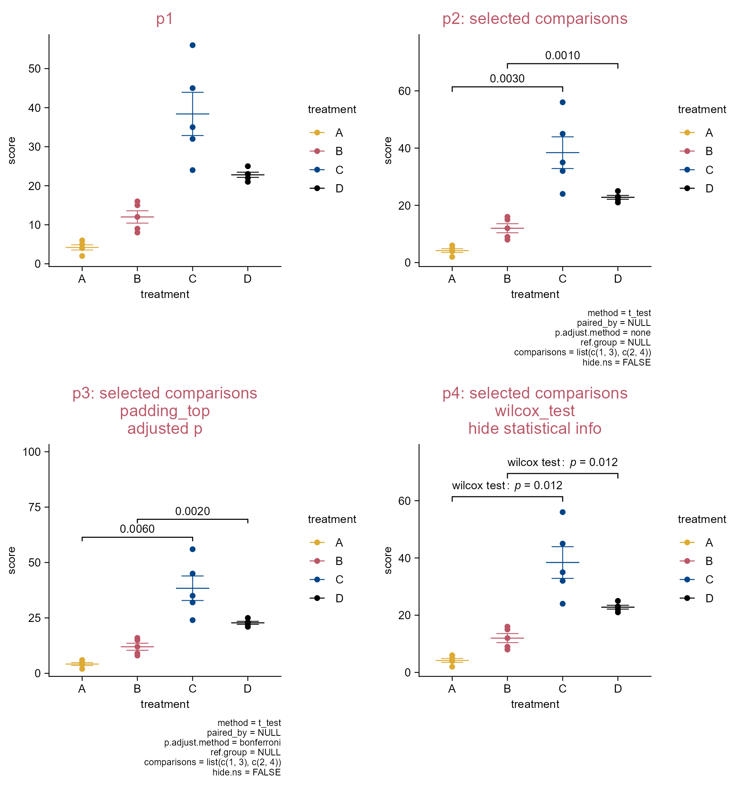{width=100% fig-align="center"}

## Add pre-computed group comparisons (e.g. dot plot)

```{r}
library(tidyplots)

# View top 5 rows of the columns used
study |> dplyr::select(treatment, score) |> dplyr::slice_head(n = 5)

# Pre-computed statistical test results.
stat_df <- tibble::tibble(
  group1 = c("A"), group2 = c("B", "C", "D"),
  p = c(0.005, 0.003, 0.0001), p.adj = c(0.01, 0.006, 0.001),
  p.signif = c("**", "**", "***"), y.position = c(25, 55, 55))
stat_df
```

```{r}
#| eval: false
# Plot
p1 <- study |> 
  tidyplot(x = treatment, y = score, color = treatment) |> 
  add_mean_dash() |> 
  add_sem_errorbar() |> 
  add_data_points() |> 
  add_title(title = "p1")

p2 <- p1 |> 
  adjust_title(title = "p2: all pre-computed p values") |> 
  add_test_pvalue_manual(data = stat_df, label = "p")

p3 <- p1 |> 
  adjust_title(title = "p3: all pre-computed p.adj values") |> 
  add_test_pvalue_manual(data = stat_df, label = "p.adj")

p4 <- p1 |> 
  adjust_title(title = "p4: specify 'p.adj'") |> 
  add_test_pvalue_manual(data = stat_df, label = "p.adj = {p.adj}")

stat_df_sub <- stat_df |> dplyr::slice_head(n = 1)
p5 <- p1 |> 
  adjust_title(title = "p5: 1st pre-computed p values") |> 
  add_test_pvalue_manual(data = stat_df_sub)

p6 <- p1 |> 
  adjust_title(title = "p6: all pre-computed asterisks") |> 
  add_test_asterisks_manual(data = stat_df)
```

```{r}
#| eval: false
#| echo: false
patchwork::wrap_plots(p1, p2, p3, p4, p5, p6, ncol = 2) |> 
  save_plot("images/add_test_mannually.png",
    view_plot = FALSE, width = 160, height = 205)
```

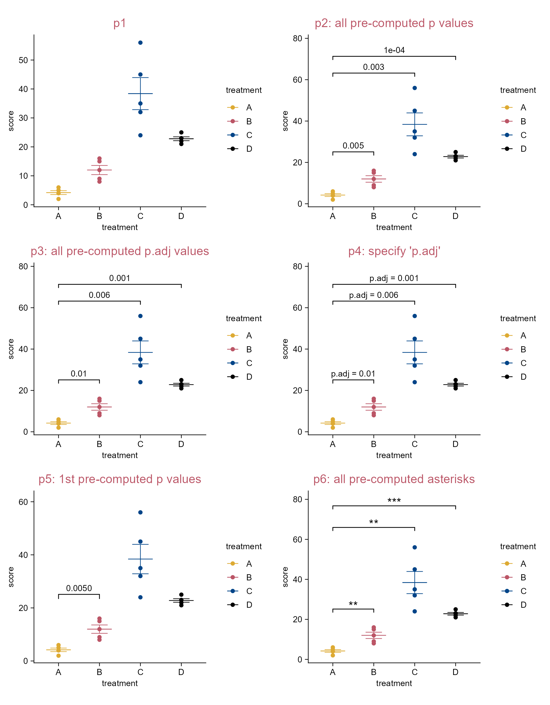{width="100%" fig-align="center"}

:::{.callout-note icon="true"}
`add_test_pvalue_manual()` and `add_test_asterisks_manual()` expect a discrete variable on the x-axis and a continuous variable on the y-axis. To produce horizontal plots, use `flip_plot()`.
:::

## Compare groups (e.g. boxplot)

```{r}
library(tidyplots)

# View top 10 rows of the columns used
study |> 
  dplyr::select(group, score, dose, treatment) |> 
  dplyr::slice_head(n = 10)
```

```{r}
#| eval: false
p1 <- study |> 
  tidyplot(
    x = group, 
    y = score, 
    color = dose) |> 
  add_boxplot() |> 
  add_data_points() |> 
  add_title(title = "p1")

p2 <- p1 |> 
  adjust_title(title = "p2: test asterisks") |> 
  add_test_asterisks()

p3 <- p1 |> 
  adjust_title(title = "p3: test p value") |> 
  add_test_pvalue(hide_info = TRUE)

p4 <- study |> 
  tidyplot(
    x = treatment, 
    y = score, 
    color = treatment) |> 
  add_boxplot() |> 
  add_data_points() |> 
  add_test_asterisks(hide_info = TRUE) |> 
  add_title(title = "p4: test asterisks")
```

```{r}
#| eval: false
#| echo: false
patchwork::wrap_plots(p1, p2, p3, p4, ncol = 2) |> 
  save_plot("images/compare-groups.png",
    view_plot = FALSE, width = 160, height = 160)
```

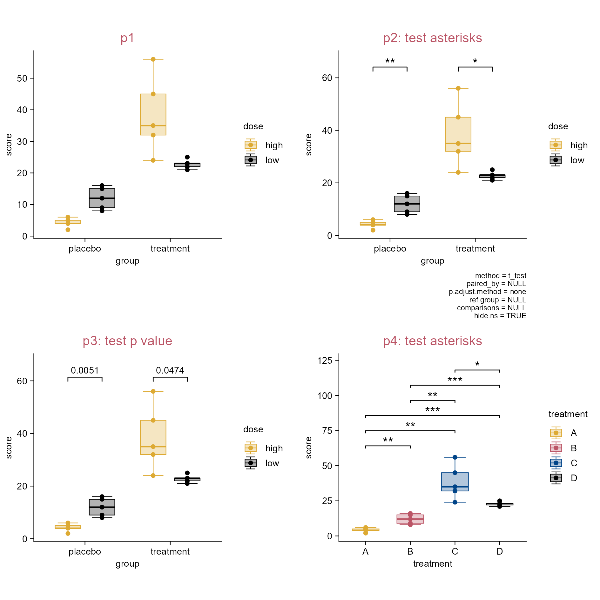{width=100% fig-align="center"}

## Paired testing (e.g. boxplot)

```{r}
library(tidyplots)

y <- c(2.3, 4.5, 6.3, 3.4, 7.8, 6.7)
df <- data.frame(
  y = c(y, y + c(0.8, 0.75)),
  group = paste0("g", rep(c(1, 2), each = 6)),
  batch = paste0("b", c(1:6, 1:6)))

# View df
df |> tibble::tibble()
```

```{r}
#| eval: false
# Plot
p1 <- df |> 
  tidyplot(
    x = group, 
    y = y, 
    color = group) |> 
  add_boxplot() |> 
  add_data_points() |> 
  add_title(title = "p1")

p2 <- p1 |> 
  remove_legend() |> 
  adjust_title(title = "p2: p value") |> 
  add_test_pvalue() |> 
  add_test_asterisks(bracket.nudge.y = 0.25, hide.ns = FALSE, 
    hide_info = TRUE, vjust = -0.3)

p3 <- p1 |> 
  remove_legend() |> 
  adjust_title(title = "p3: paired p value") |> 
  add_test_pvalue(paired_by = batch, hide_info = TRUE) |> 
  add_test_asterisks(paired_by = batch, bracket.nudge.y = 0.25, hide_info = TRUE)

p4 <- p1 |> 
  remove_legend() |> 
  adjust_title(title = paste("p4: paired p value", "paired lines", sep = "\n")) |> 
  add_test_asterisks(paired_by = batch, hide_info = TRUE) |> 
  add_line(group = batch, color = "#000000", linetype = "dotted")
```

```{r}
#| eval: false
#| echo: false
patchwork::wrap_plots(p1, p2, p3, p4, ncol = 2) |> 
  save_plot("images/paired-testing.png",
    view_plot = FALSE, width = 150, height = 160)
```

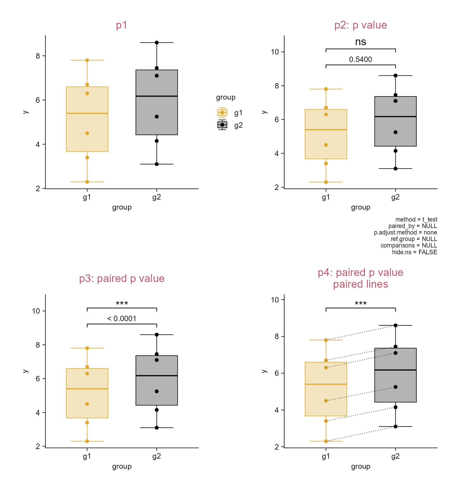{width=100% fig-align="center"}

## Add `ggplot2` (extension) code (e.g. dot plot)

:::{.callout-tip icon="true"}
Because `tidyplots` is based on `ggplot2` ... thereby, `tidyplots` provides access to a wide range of features that are implemented within `ggplot2` or `ggplot2` extension packages ... `add()` helper function.
:::

```{r}
library(tidyplots)

# View top 10 rows of the columns used
study |> 
  dplyr::select(treatment, score) |> 
  dplyr::slice_head(n = 10)
```

```{r}
#| eval: false
# Plot
p1 <- study |> 
  tidyplot(x = treatment, y = score, color = treatment) |> 
  add_title(title = "p1")

p2 <- p1 |> 
  adjust_title(title = paste(
    "p2: add points", 
    "via ggplot2::geom_point()", 
    sep = "\n")) |> 
  add(ggplot2::geom_point()) |> 
  add_data_points(shape = 1, white_border = TRUE)

p3 <- p2 |> 
  adjust_title(title = "p3: *M. tuberculosis*-infected cells")

p4 <- p2 |> 
  adjust_title(title = 
    "p4: *M. tuberculosis*  
    via ggtext::element_markdown()") |> 
  add(ggplot2::theme(plot.title = ggtext::element_markdown()))
```

:::{.callout-note}
For the title of p4: "p4: *M. tuberculosis*" is followed by clicking `Space` bar twice and `Enter` button once, then followed with "via ggtext::element-markdown()".
:::

```{r}
#| eval: false
#| echo: false
patchwork::wrap_plots(p1, p2, p3, p4, ncol = 2) |> 
  save_plot("images/add-ggplot2-extension-code.png",
    view_plot = FALSE, width = 160, height = 140)
```

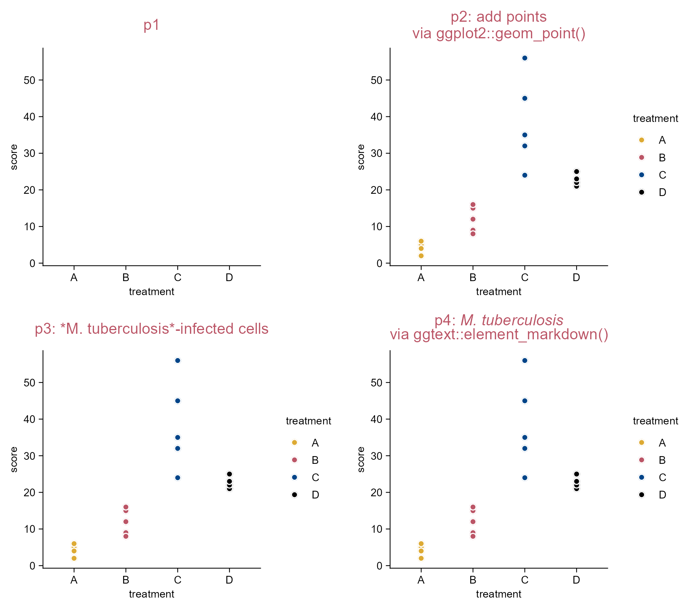{width=100% fig-align="center"}

## Add `ggplot2` (extention) code (three more plots)

```{r}
library(tidyplots)

# View top 10 rows of the columns used
climate |> dplyr::select(max_temperature, month) |> dplyr::slice_head(n = 10)
```

```{r}
#| eval: false
p1 <- climate |> 
  tidyplot(x = max_temperature, y = month, color = month) |> 
  add_title(title = "p1") |> remove_legend() |> 
  add_data_points_beeswarm(white_border = TRUE)

p2 <- p1 |> 
  add(ggplot2::coord_polar(theta = "y")) |> 
  theme_ggplot2() |> 
  adjust_title(
    title = "p2: polar coordinates", fontsize = 10, color = "#bb5566") |> 
  remove_legend()

p3 <- climate |> 
  tidyplot(x = max_temperature, y = month, color = month) |> 
  add_title(title = "p3: ridge plot") |> remove_legend() |> 
  add(
    ggridges::geom_density_ridges(alpha = 0.3, point_alpha = 0.2, 
      jittered_points = TRUE, point_size = 1))

p4 <- climate |> 
  tidyplot(x = month, y = max_temperature, color = month) |> 
  add_title(title = "p4: violin plot") |> 
  remove_legend() |> add_violin(trim = FALSE) |> 
  add_data_points_beeswarm(alpha = 0.5, size = 0.5, white_border = TRUE)

p5 <- climate |> 
  tidyplot(x = month, y = max_temperature, color = month) |> 
  add_title(title = "p5: violin/dot plot") |> remove_legend() |> 
  add(
    see::geom_violindot(dots_size = 12, trim = FALSE, 
      alpha = 0.5, color_dots = "#00000033"))
```

:::{.callout-note}
`Tidyplots` is easier for many common plotting tasks.

For more complex plots, you can either augment tidyplots with custom `ggplot2` code using the `add()` function or switch to `ggplot2` for full flexibility.
:::

```{r}
#| eval: false
#| echo: false
patchwork |> library()
design <- "
  AB
  CD
  EE" 
(p1 + p2 + p3 + p4 + p5 + plot_layout(design = design)) |> 
  save_plot("images/add-ggplot2-extension-code1.png",
    view_plot = FALSE, width = 130, height = 200)
```

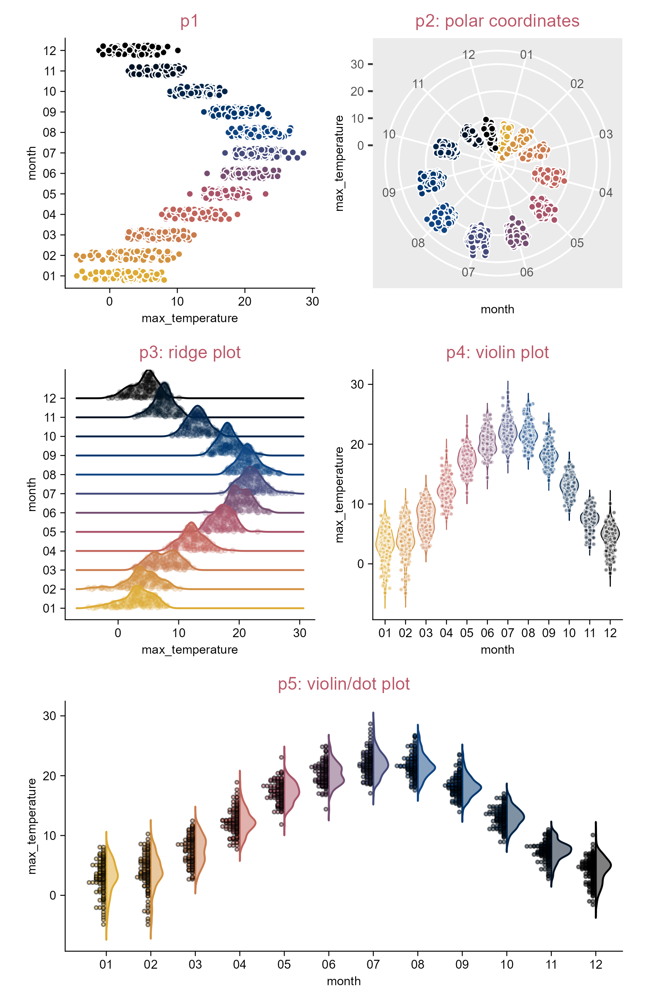{width="100%" fig-align="center"}

## Save multiple formats by piping through (e.g. dot plot)

```{r}
#| message: false
library(tidyplots)

# View
study
```

```{r}
#| eval: false
# Plot and save
study |> 
  tidyplot(
    x = group, 
    y = score, 
    color = dose) |> 
  add_data_points_beeswarm() |> 
  add_sem_errorbar() |> 
  save_plot(
    "images/multiple-formats-via-pipe.pdf", 
    view_plot = FALSE) |> 
  save_plot(
    "images/multiple-formats-via-pipe.png", 
    view_plot = FALSE) |> 
  save_plot(
    "images/multiple-formats-via-pipe.svg", 
    view_plot = FALSE)
```

List the figures saved:

```{r}
#| eval: true
#| echo: false
# List the files saved:
"images/" |> 
  fs::dir_tree(regexp = "^images/multiple-formats-via-pipe")
```

{width=100% fig-align="center"}

## Save multiple PDFs by piping through (e.g. violin plot)

```{r}
#| message: false
library(tidyplots)

# View top 10 rows of the columns used
gene_expression |> 
  dplyr::select(
    group, expression, condition, 
    sample_type, is_immune_gene) |> 
  dplyr::slice_head(n = 10)
```

```{r}
#| eval: false
# Plot and save
gene_expression |> 
  tidyplot(
    x = group, 
    y = expression, 
    color = group) |> 
  add_violin(trim = FALSE) |> 
  add_data_points_beeswarm(white_border = TRUE) |> 
  save_plot(
    "images/multiple-pdf-by-piping-1.pdf", 
    view_plot = FALSE) |> 
  split_plot(
    by = condition, 
    axis.titles = "margins") |> 
  save_plot(
    "images/multiple-pdf-by-piping-2.pdf", 
    view_plot = FALSE) |> 
  split_plot(
    by = sample_type) |> 
  save_plot(
    "images/multiple-pdf-by-piping-3.pdf", 
    view_plot = FALSE) |> 
  split_plot(
    rows = condition, 
    cols = is_immune_gene,
    axis.titles = "margins") |> 
  save_plot(
    "images/multiple-pdf-by-piping-4.pdf", 
    view_plot = FALSE)
```

List the figures saved:

```{r}
#| echo: false
# List the saved figures
"images" |> fs::dir_tree(regexp = "^images/multiple-pdf-by-piping-")
```

{width=100% fig-align="center"}

## Save multiple PDFs at once (e.g. violin plot)

```{r}
library(tidyplots)

# View 10 rows of the columns used
gene_expression |> 
  dplyr::select(
    group, 
    expression, 
    external_gene_name) |> 
  dplyr::slice(c(1:2, 101:102, 201:202, 301:302, 401:402))
```

```{r}
#| eval: false
# Plot and save
gene_expression |> 
  tidyplot(
    x = group, 
    y = expression, 
    color = group) |> 
  add_violin(trim = FALSE) |> 
  add_data_points_beeswarm(white_border = TRUE) |>   
  adjust_size(overall_width = 100) |> # see the note of next page
  adjust_theme_details(
    strip.text.x.top = ggplot2::element_text(face = "italic")) |> # gene names in italic
  split_plot(
    by = external_gene_name, 
    ncol = 2, 
    nrow = 2) |> 
  save_plot(
    "images/multiple-pdf-at-once.pdf", 
    multiple_files = TRUE, 
    view_plot = FALSE)
```

List the figure names saved:

```{r}
#| eval: true
#| echo: false
# List the saved figures
"images/" |> 
  fs::dir_tree(
    regexp = "^images/multiple-pdf-at-once.*\\.pdf")
```

{width=100% fig-align="center"}

:::{.callout-note icon="true"}
The `overall_width` and `overall_height` parameters of the `adjust_size()` function control the overall dimensions of a multiplot layout generated with `split_plot()`.

The function `adjust_theme_details()` is a wrapper around `ggplot2::theme()`. 
:::

## Save intermediate stages (e.g. bar plot)

```{r}
#| message: false
library(tidyplots)

# View top 10 rows of the columns used
study |> dplyr::select(treatment, score) |> 
  dplyr::slice_head(n = 10)
```

```{r}
#| eval: false
# Plot and save
study |> 
  tidyplot(
    x = treatment, 
    y = score, 
    color = treatment) |> 
  add_mean_bar(alpha = 0.5) |> 
  adjust_legend_position(position = "none") |> 
  add_title("stage_1") |> 
  save_plot(
    "images/stage_1.png", 
    view_plot = FALSE) |> 
  adjust_title("stage_2") |> 
  add_sem_errorbar() |> 
  save_plot(
    "images/stage_2.png", 
    view_plot = FALSE) |> 
  adjust_title("stage_3") |> 
  add_data_points_beeswarm(white_border = TRUE) |> 
  save_plot(
    "images/stage_3.png", 
    view_plot = FALSE) |> 
  adjust_title("stage_4") |> 
  add_test_asterisks(hide_info = TRUE) |> 
  save_plot(
    "images/stage_4.png", 
    view_plot = FALSE)
```

List the figures saved:
```{r}
#| echo: false
# List the save images
"images/" |> 
  fs::dir_tree(regexp = "^images/stage_.\\.png")
```

```{r}
#| eval: false
#| echo: false
#| message: false

magick |> library()
grid |> library()
patchwork |> library()

p1 <- study |> 
  tidyplot(x = treatment, y = score, color = treatment) |> 
  add_mean_bar(alpha = 0.5) |> 
  adjust_legend_position(position = "none") |> 
  add_title(title = "stage_1")

p2 <- p1 |> 
  adjust_title(title = "stage_2") |> 
  add_sem_errorbar()

p3 <- p2 |> 
  adjust_title(title = "stage_3") |> 
  add_data_points_beeswarm(white_border = TRUE)

p4 <- p3 |> 
  adjust_title(title = "stage_4") |> 
  add_test_asterisks(hide_info = TRUE)

patchwork::wrap_plots(p1, p2, p3, p4, ncol = 2) |> 
  save_plot("images/stage_1234.png", 
    view_plot = FALSE, width = 130, height = 140)
```

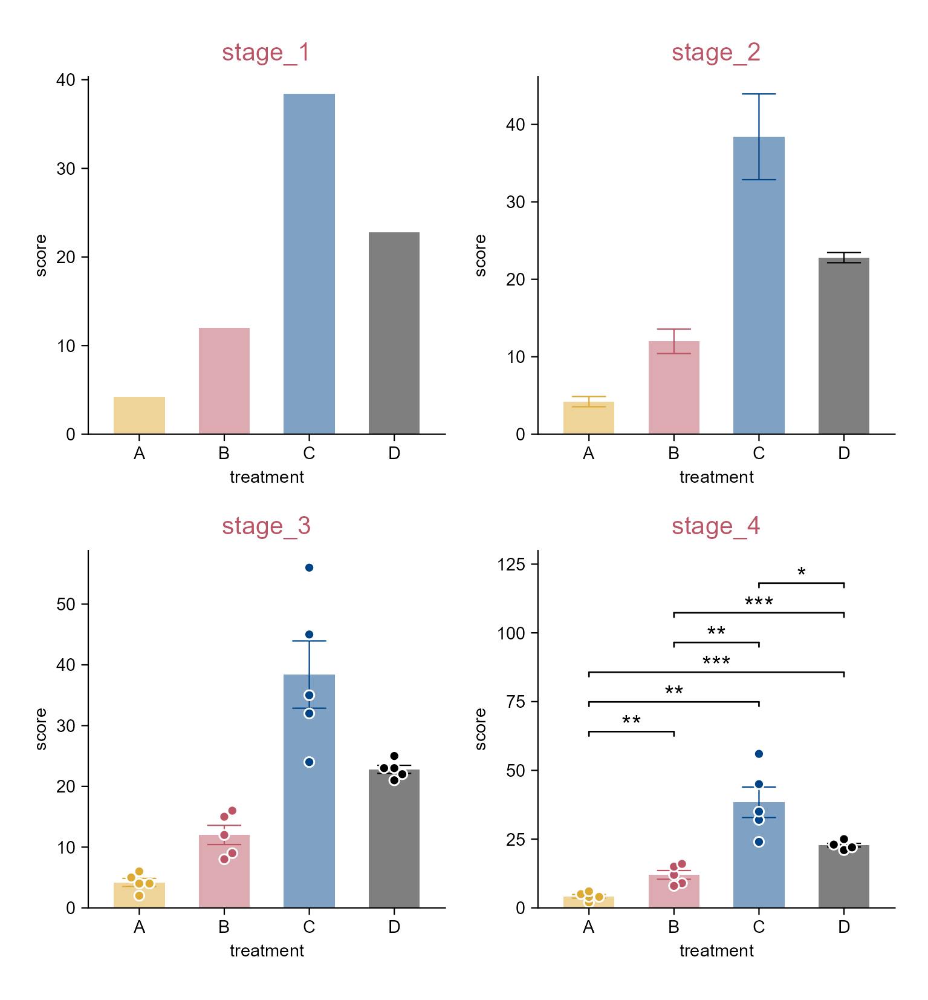{width=100% fig-align="center"}

## Panel and plot padding {#sec-plot-panel-padding}

```{r}
library(tidyplots)

# View top 10 rows of the columns used
animals |> dplyr::select(weight, size) |> 
  dplyr::slice_head(n = 10)
```

```{r}
#| eval: false
# Plot
p1 <- animals |> 
  tidyplot(x = weight, y = size, color = size, paper = "#dddddd") |> 
  add_data_points(white_border = TRUE, size = 3) |> 
  add_title(title = "p1") |> 
  remove_legend()

p2 <- p1 |> 
  adjust_title(title = "p2: different padding in four panel sides") |> 
  adjust_padding(
    top = 0.2, 
    right = 0.3, 
    bottom = 0.4, 
    left = 0.5)

p3 <- p1 |> 
  adjust_title(title = "p3: same padding in four panel sides") |> 
  adjust_padding(
    all = 0.2)

p4 <- p1 |> 
  adjust_title(title = "p4: remove panel padding") |> 
  remove_padding()

p5 <- p1 |> 
  adjust_title(title = "p5: different padding in four plot sides") |> 
  adjust_theme_details(
    plot.margin = ggplot2::margin(t = 0.5, r = 0.5, b = 1, l = 1, unit = "cm"))

p6 <- p1 |> 
  adjust_title(title = "p6: same plot padding via saving") |> 
  save_plot(
    "images/plot_panel_padding_p6.png", 
    padding = 0.3) # defaults to 0.1 meaning 10%
```

```{r}
#| eval: false
#| echo: false
# Need to run the above chunk first
# Plot, save
p1 |> 
  save_plot("images/plot_panel_padding_p1.png")

p2 |> 
  save_plot("images/plot_panel_padding_p2.png")

p3 |> 
  save_plot("images/plot_panel_padding_p3.png")

p4 |> 
  save_plot("images/plot_panel_padding_p4.png")

p5 |> 
  save_plot("images/plot_panel_padding_p5.png")
```

```{r}
#| eval: false
#| echo: false
# Get list of plots
plots_names <- fs::dir_ls(path = "images", regexp = "^images/plot_panel_padding_p.*")

# Read the 6 plots
plots <- purrr::set_names(
  purrr::map(plots_names, magick::image_read),
  paste0("p", 1:length(plots_names)))

# Get the width and height of each plots
plots_dimension <- purrr::map_dfr(
  plots,
  \(x) magick::image_info(x)[, c("width", "height")],
  .id = "plot")

# Change plots to graphic objectives
plots_grob <- purrr::set_names(
  purrr::map(plots, grid::rasterGrob),
  paste0("p", 1:length(plots)))

# The intended width of combined plots
plots_width = 145 # unit: mm
plots_height = 230

# Set a data frame for plotting
df <- tibble::tibble(x = 1:100, y = 1:100)

# Set the range of each plot covered
plot_cover_width <- 41 * (plots_dimension$width / plots_dimension$width[1])
plot_cover_height <- plot_cover_width * (plots_dimension$height / plots_dimension$width) * (plots_width / plots_height)

# Set an intuitive function to add image to plot
add_image <- function(
  x, grob, top_left_x, top_left_y, 
  img_cover_width, img_cover_height) {
  x |> add(ggplot2::annotation_custom(
    grob = grob,
    xmin = top_left_x, xmax = top_left_x + img_cover_width,
    ymin = top_left_y - img_cover_height, ymax = top_left_y))}

df |> 
  tidyplot(x = x, y = y) |> 
  add_data_points(alpha = 0) |> 
  add_image(
    grob = plots_grob$p1,
    top_left_x = 1,
    top_left_y = 100,
    img_cover_width = plot_cover_width[1],
    img_cover_height = plot_cover_height[1]) |> 
  add_image(
    grob = plots_grob$p2,
    top_left_x = 50,
    top_left_y = 100,
    img_cover_width = plot_cover_width[2],
    img_cover_height = plot_cover_height[2]
  ) |> 
  add_image(
    grob = plots_grob$p3,
    top_left_x = 1,
    top_left_y = 67,
    img_cover_width = plot_cover_width[3],
    img_cover_height = plot_cover_height[3]
  ) |> 
  add_image(
    grob = plots_grob$p4,
    top_left_x = 50,
    top_left_y = 67,
    img_cover_width = plot_cover_width[4],
    img_cover_height = plot_cover_height[4]
  ) |> 
  add_image(
    grob = plots_grob$p5,
    top_left_x = 0,
    top_left_y = 34,
    img_cover_width = plot_cover_width[5],
    img_cover_height = plot_cover_height[5]
  ) |> 
  add_image(
    grob = plots_grob$p6,
    top_left_x = 50,
    top_left_y = 34,
    img_cover_width = plot_cover_width[6],
    img_cover_height = plot_cover_height[6]
  ) |> 
  adjust_size(width = plots_width, height = plots_height) |> 
  remove_padding() |> 
  remove_x_axis() |> 
  remove_y_axis() |> 
  save_plot("images/plot_panel_padding.png",
    view_plot = FALSE, padding = 0)
```

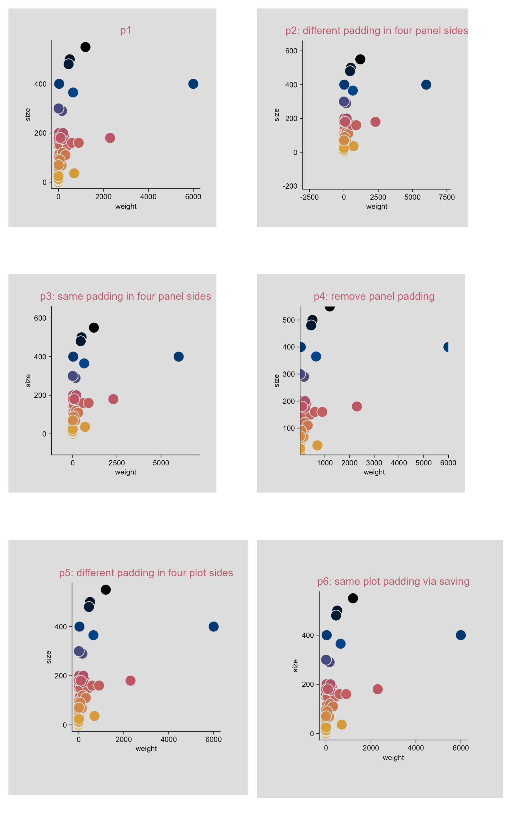{width="100%" fig-align="center"}

## Use a log10 axis for data containing zero and negative values (e.g. dot plot)

```{r}
library(tidyplots)

set.seed(42)

y <- runif(n = 500, min = 0, max = 100)

# change 30 values to zero
y[sample(NROW(y), size = 30)] <- 0

df <- tibble::tibble(x = "test", y = c(y, y * -1))

# View rows 496 - 505
df |> 
  dplyr::slice(496:505)
```

```{r}
#| eval: false
# Plot
p1 <- df |> 
  tidyplot(
    x = x, 
    y = y) |> 
  add_data_points_beeswarm(white_border = TRUE) |>  
  add_title(title = "p1")

p2 <- p1 |> 
  adjust_title(title = "p2: zero points in red") |> 
  add_data_points_beeswarm(
    data = filter_rows(y == 0), 
    white_border = TRUE, 
    color = "#bb5566")

p3 <- p2 |> 
  adjust_title(title = "p3: log") |> 
  adjust_y_axis(
    transform = "pseudo_log", 
    breaks = c(-100, -10, -1, 0, 1, 10, 100))

p4 <- p3 |> 
  adjust_title(title = "p4: log + axis_logticks") |> 
  add(ggplot2::guides(y = "axis_logticks"))
```

```{r}
#| eval: false
#| echo: false
patchwork::wrap_plots(p1, p2, p3, p4, ncol = 2) |> 
  save_plot("images/log10-axis.png",
    view_plot = FALSE, width = 130, height = 135)
```

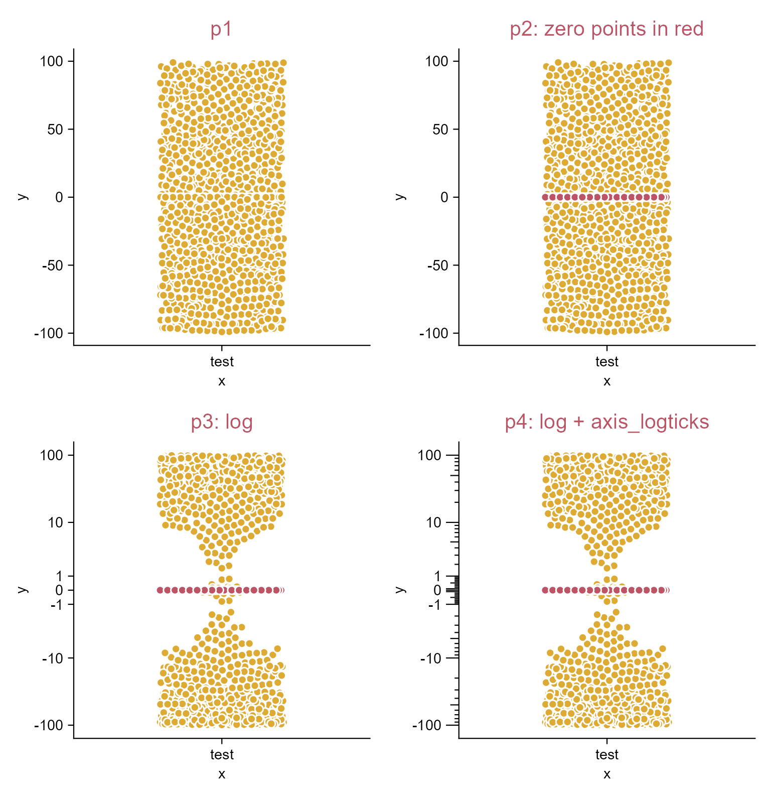{width=100% fig-align="center"}

## Change plot themes (e.g. dot plot)

```{r}
library(tidyplots)

# View top 10 rows of the columns used
study |> 
  dplyr::select(treatment, score) |> 
  dplyr::slice_head(n = 10)
```

```{r}
#| eval: false
# Plot
p0 <- study |> 
  tidyplot(x = treatment, y = score, color = treatment) |> 
  add_data_points() |> 
  add_median_dash() |> 
  add_sem_errorbar()

p1 <- p0 |>
  add_title(title = "p1: theme_tidyplot (default)")

p2 <- p0 |>
  add_title(title = "p2: theme_ggplot2") |> 
  theme_ggplot2() |> 
  adjust_title(fontsize = 10, color = "#bb5566")

p3 <- p0 |>
  add_title(title = "p3: theme_minimal_x") |> 
  theme_minimal_x() |> 
  adjust_title(fontsize = 10, color = "#bb5566")

p4 <- p0 |>
  add_title(title = "p4: theme_minimal_y") |> 
  theme_minimal_y() |> 
  adjust_title(fontsize = 10, color = "#bb5566")

p5 <- p0 |>
  add_title(title = "p5: theme_minimal_xy") |> 
  theme_minimal_xy() |> 
  adjust_title(fontsize = 10, color = "#bb5566")

p6 <- p0 |>
  add_title(title = "p6: ggplot2::theme_void") |>
  add(ggplot2::theme_void()) |> 
  adjust_title(fontsize = 10, color = "#bb5566")
```

```{r}
#| eval: false
#| echo: false
patchwork::wrap_plots(p1, p2, p3, p4, p5, p6, ncol = 2) |> 
  save_plot("images/change-plot-themes.png",
    view_plot = FALSE, width = 170, height = 200)
```

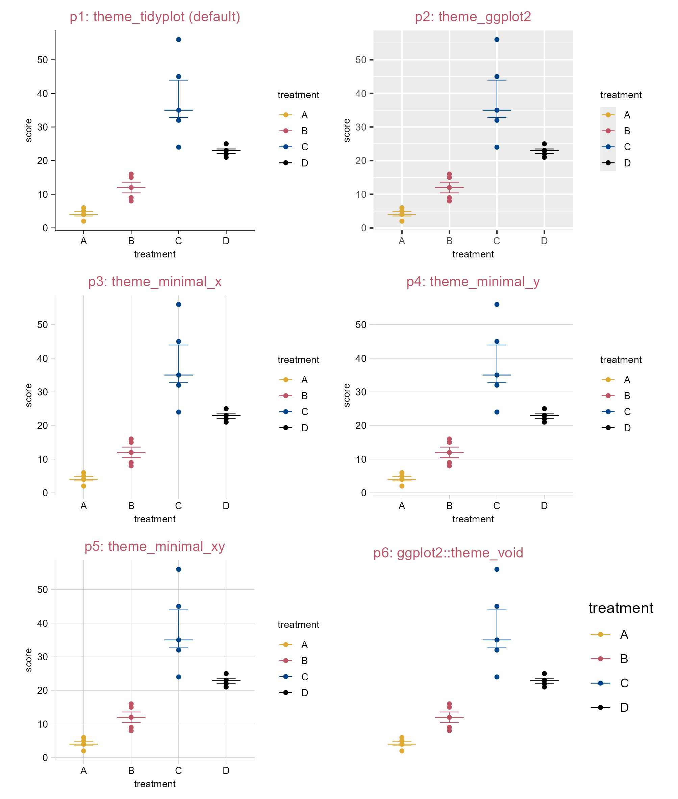{width=100% fig-align="center"}

## Rasterize data points (e.g. dot plot) selectively

:::{.callout-tip icon="true"}
Too many vector shapes can or might slow down software performance. This is how you can selectively rasterize data points.
:::

```{r}
#| message: false
#| eval: true
library(tidyplots)
library(svglite)

# View top 10 rows of the columns used
climate |> 
  dplyr::select(month, max_temperature) |> 
  dplyr::slice_head(n = 10)
```

```{r}
#| eval: false
# Save vector images without rasterization
climate |> 
  tidyplot(x = month, y = max_temperature, color = month) |> 
  add_data_points_beeswarm(white_border = TRUE) |> 
  adjust_legend_position(position = "none") |> 
  save_plot("images/rasterize_data-points_no.pdf", view_plot = FALSE) |> 
  save_plot("images/rasterize_data-points_no.svg", view_plot = FALSE)

# Save vector images with rasterization (dpi = 100)
climate |> 
  tidyplot(x = month, y = max_temperature, color = month) |> 
  add_data_points_beeswarm(
    white_border = TRUE, 
    rasterize = TRUE, 
    rasterize_dpi = 100) |> 
  adjust_legend_position(position = "none") |> 
  save_plot("images/rasterize_data-points_yes_dpi100.pdf", view_plot = FALSE) |> 
  save_plot("images/rasterize_data-points_yes_dpi100.svg", view_plot = FALSE)

# Save vector images with rasterization (dpi = 300)
climate |> 
  tidyplot(x = month, y = max_temperature, color = month) |> 
  add_data_points_beeswarm(
    white_border = TRUE, 
    rasterize = TRUE, 
    rasterize_dpi = 300) |> 
  adjust_legend_position(position = "none") |> 
  save_plot("images/rasterize_data-points_yes_dpi300.pdf", view_plot = FALSE) |> 
  save_plot("images/rasterize_data-points_yes_dpi300.svg", view_plot = FALSE)
```

List the figures saved:

```{r}
#| echo: false
"images" |> 
  fs::dir_tree(regexp = "^images/rasterize_data-points")
```

```{r}
#| eval: false
#| echo: false
#| message: false

tidyplots |> library()

# Plot
p1 <- climate |> 
  tidyplot(x = month, y = max_temperature, color = month) |> 
  add_data_points_beeswarm(white_border = TRUE) |> 
  add_title(title = "p1: dot plot") |> 
  adjust_legend_position(position = "none")

df <- data.frame(
  figure_names = c(
    "rasterize_data-points_no.pdf",
    "rasterize_data-points_yes_dpi100.pdf",
    "rasterize_data-points_yes_dpi300.pdf",
    "rasterize_data-points_no.svg",
    "rasterize_data-points_yes_dpi100.svg",
    "rasterize_data-points_yes_dpi300.svg"),
  file_type = c(rep(c("pdf", "svg"), each = 3))
)

df <- df |> 
  dplyr::mutate(figure_names_full = paste0("images/", figure_names)) |> 
  dplyr::mutate(size_byte = fs::file_size(figure_names_full)) |> 
  dplyr::mutate(for_color = rep(c("rasterize_no", "rasterize_dpi100", "rasterize_dpi300"), 2))

df <- df |> 
  dplyr::mutate(for_color = for_color |> 
    factor(levels = c(
      "rasterize_no", 
      "rasterize_dpi100", 
      "rasterize_dpi300")))

p2 <- df |> tidyplot(x = file_type, y = size_byte, color = for_color) |> 
  add_sum_bar(alpha = 0.3) |> 
  add_sum_dash() |> 
  add_title(title = "p2: figure size") |> 
  add(ggplot2::scale_y_continuous(labels = scales::label_scientific(), expand = 0)) |> 
  remove_legend_title()
```

```{r}
#| eval: false
#| echo: false 
patchwork::wrap_plots(p1, p2, ncol = 1) |> 
  save_plot("images/rasterize-data-points_size.png",
    view_plot = FALSE, width = 100, height = 140,
    padding = 0)
```

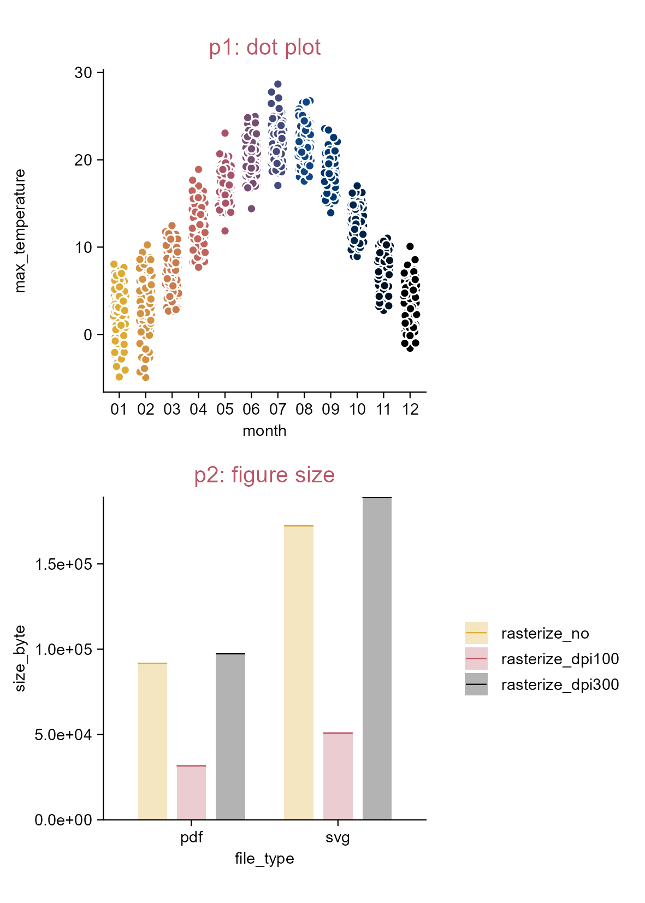{width=90% fig-align="center"}