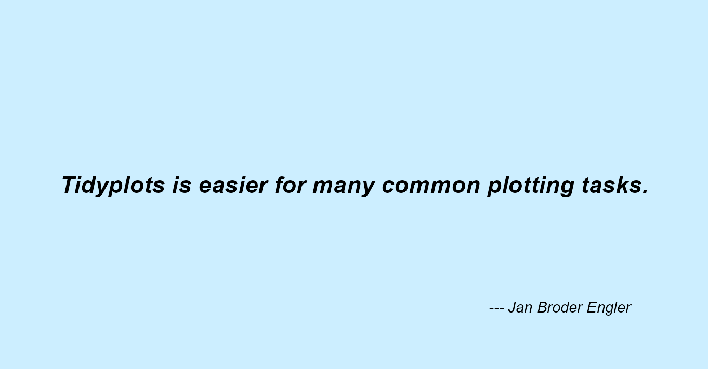
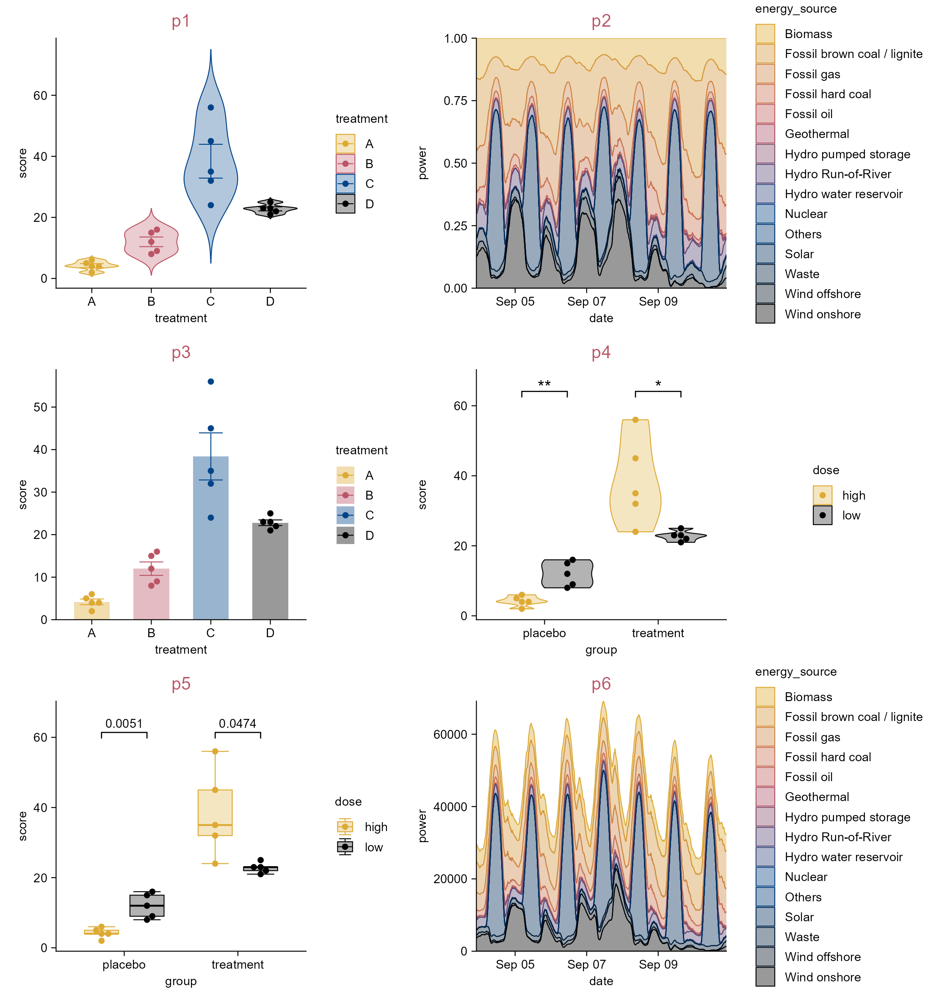
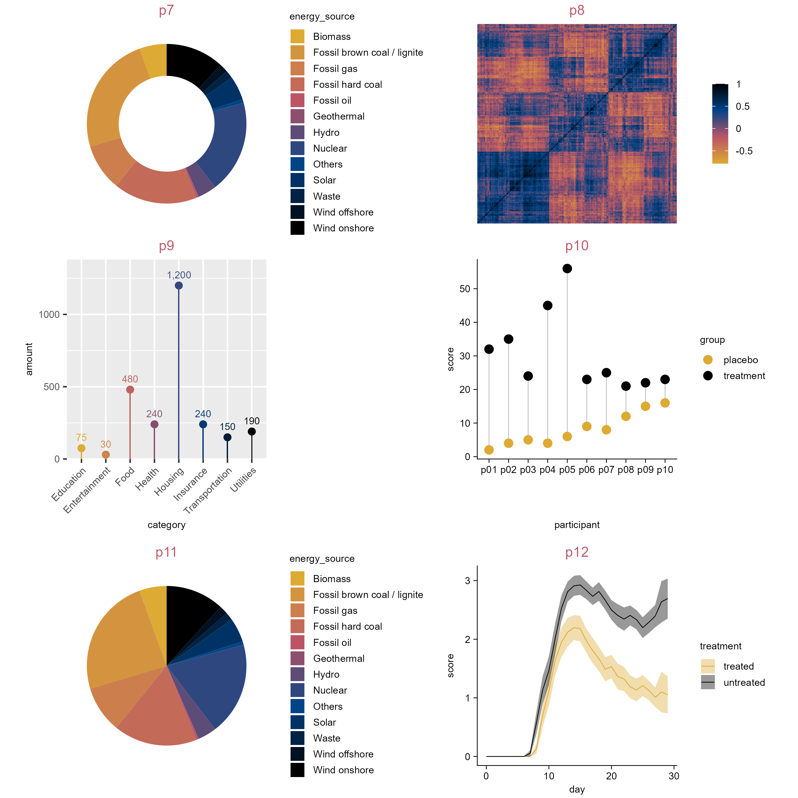
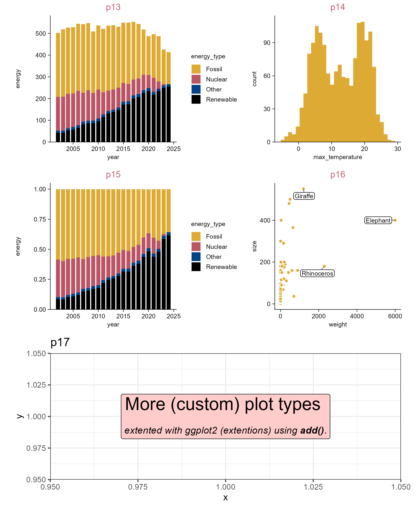
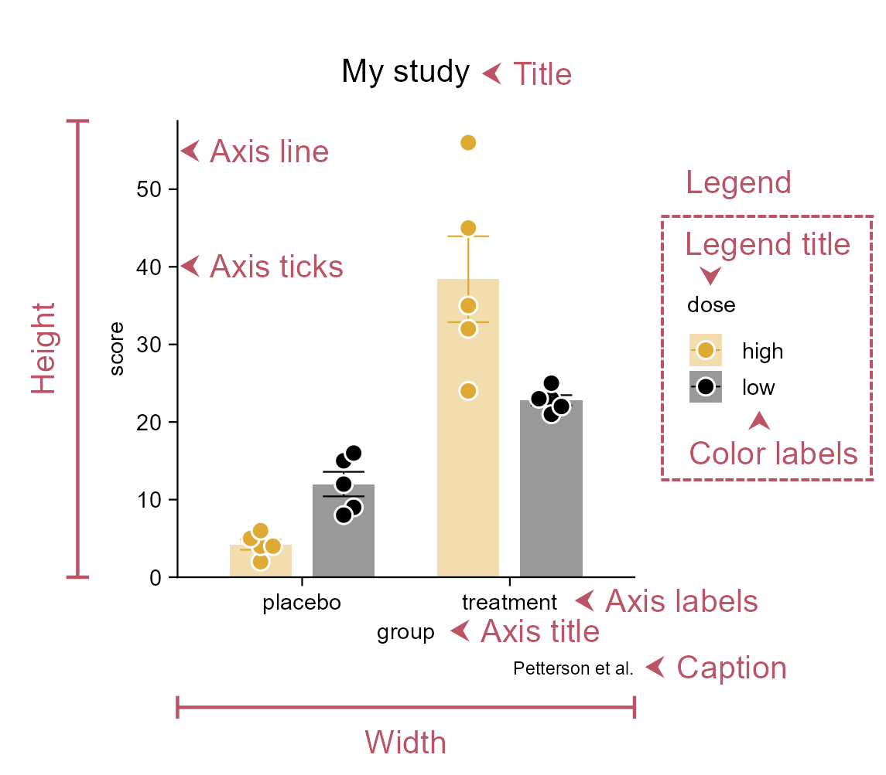

# Plots

```{r}
#| eval: false
#| echo: false

library(tidyplots)

# Define style
my_default_style <- function(x) {
  x |> 
  adjust_colors(new_colors = c("#ddaa33", "#bb5566", "#004488", "#000000")) |> 
  adjust_title(fontsize = 10, color = "#bb5566")}

# Set global options
tidyplots_options(my_style = my_default_style)
```

```{r}
#| eval: false
#| echo: false
# For occupying a page
library(tidyplots)

df <- tibble::tibble(
  x = 1,
  y = 1)

df |> 
  tidyplot(x = x, y = y, paper = "#cceeff") |> 
  add_annotation_text(
    text = "Tidyplots is easier for many common plotting tasks.",
    x = 1,
    y = 1,
    fontsize = 11,
    fontface = "bold.italic") |> 
  add_annotation_text(
    text = "--- Jan Broder Engler",
    x = 1.9,
    y = 0.6,
    hjust = 1,
    fontface = "italic") |> 
  adjust_size(width = 100) |> 
  adjust_x_axis(limits = c(0, 2)) |> 
  adjust_y_axis(limits = c(0.5, 1.5)) |> 
  remove_x_axis() |> 
  remove_y_axis() |> 
  save_plot(
    "images/tidyplots-is-easier.png",
    view_plot = FALSE)
```

{width="100%" fig-align="center"}

## Overview of plots

```{r}
#| eval: false
library(tidyplots)

p1 <- study |> 
  tidyplot(x = treatment, y = score, color = treatment) |> 
  add_title(title = "p1") |> 
  add_violin(trim = FALSE) |> 
  add_sem_errorbar() |> 
  add_data_points_beeswarm()
```

```{r}
#| eval: false
#| echo: false

p2 <- energy_week |> 
  tidyplot(x = date, y = power, color = energy_source) |> 
  add_title(title = "p2") |> 
  add_areastack_relative() |> 
  adjust_x_axis(labels = scales::label_date(
    format = "%b %d",
    locale = "en"))

p6 <- energy_week |> 
  tidyplot(x = date, y = power, color = energy_source) |> 
  add_title(title = "p6") |> 
  add_areastack_absolute() |> 
  adjust_x_axis(labels = scales::label_date(
    format = "%b %d",
    locale = "en"))
```

```{r}
#| eval: false
p2 <- energy_week |> 
  tidyplot(x = date, y = power, color = energy_source) |> 
  add_title(title = "p2") |> 
  add_areastack_relative()
```

```{r}
#| eval: false
p3 <- study |> 
  tidyplot(x = treatment, y = score, color = treatment) |> 
  add_title(title = "p3") |> 
  add_mean_bar(alpha = 0.4) |> 
  add_sem_errorbar() |> 
  add_data_points_beeswarm()

p4 <- study |> 
  tidyplot(x = group, y = score, color = dose) |> 
  add_title(title = "p4") |> 
  add_violin() |> 
  add_data_points_beeswarm() |> 
  add_test_asterisks(hide_info = TRUE)

p5 <- study |> 
  tidyplot(x = group, y = score, color = dose) |> 
  add_title(title = "p5") |> 
  add_boxplot() |> 
  add_data_points_beeswarm() |> 
  add_test_pvalue(hide_info = TRUE)
```

```{r}
#| eval: false
p6 <- energy_week |> 
  tidyplot(x = date, y = power, color = energy_source) |> 
  add_title(title = "p6") |> 
  add_areastack_absolute()
```

```{r}
#| eval: false
#| echo: true
patchwork::wrap_plots(p1, p2, p3, p4, p5, p6, ncol = 2) |> 
  save_plot("images/p1_p6.png",
    view_plot = FALSE, width = 190, height = 200) # width and height should be tailored
```

{width="100%" fig-align="center"}

```{r}
#| eval: false
library(tidyplots)

p7 <- energy |> 
  tidyplot(y = energy, color = energy_source) |> 
  add_donut() |> 
  add_title(title = "p7")
```

```{r}
#| eval: false
df <- "https://tidyplots.org/data/correlation-matrix.csv" |>
  readr::read_csv(show_col_types =FALSE)
```

```{r}
#| eval: false
#| echo: false
df <- "data/correlation-matrix.csv" |> 
  readr::read_csv(show_col_types = FALSE)
```

```{r}
#| eval: false
p8 <- df |> 
  tidyplot(x = x, y = y, color = correlation) |> 
  add_title(title = "p8") |> 
  add_heatmap() |> 
  sort_x_axis_levels(order_x) |> 
  sort_y_axis_levels(order_y) |> 
  remove_x_axis() |> remove_y_axis() |> remove_legend_title()

p9 <- spendings |> 
  tidyplot(x = category, y = amount, color = category) |> 
  add_title(title = "p9") |> 
  add_sum_bar(width = 0.05, alpha = 1) |> 
  add_sum_dot() |> 
  add_sum_value(accuracy = 1) |> 
  remove_legend() |> 
  adjust_x_axis(rotate_labels = 45)

p10 <- study |> 
  tidyplot(x = participant, y = score, color = group, dodge_width = 0) |> 
  add_title(title = "p10") |> 
  add_line(group = participant, color = "#bbbbbb") |> 
  add_data_points(size = 2.5)

p11 <- energy |> 
  tidyplot(y = energy, color = energy_source) |> 
  add_pie() |> 
  add_title(title = "p11")

p12 <- time_course |> 
  tidyplot(x = day, y = score, color = treatment) |> 
  add_title(title = "p12") |> 
  add_mean_line() |> 
  add_sem_ribbon()
```

```{r}
#| eval: false
#| echo: true
patchwork::wrap_plots(p7, p8, p9, p10, p11, p12, ncol = 2) |> 
  save_plot("images/p7_p12.png",
    view_plot = FALSE, width = 200, height = 200) # width and height should be tailored
```

{width="100%" fig-align="center"}

```{r}
#| eval: false
library(tidyplots)

p13 <- energy |> 
  tidyplot(x = year, y = energy, color = energy_type) |> 
  add_title(title = "p13") |> 
  add_barstack_absolute()

p14 <- climate |> 
  tidyplot(x = max_temperature) |> 
  add_title(title = "p14") |> 
  add_histogram()

p15 <- energy |> 
  tidyplot(x = year, y = energy, color = energy_type) |> 
  add_title(title = "p15") |> 
  add_barstack_relative()

p16 <- animals |> 
  tidyplot(x = weight, y = size) |> 
  add_title(title = "p16") |> 
  add_data_points(white_border = TRUE) |> 
  add_data_labels_repel(
    label = animal, 
    data = max_rows(weight, n = 3),
    color = "#000000",
    min.segment.length = 0)

df <- tibble::tibble(
  x = 1,
  y = 1,
  text = c("<span style='font-size:20pt;'>More (custom) plot types</span>
    <br><br><i>extented with ggplot2 (extentions) using <b>add()</b></i>."))

p17 <- df |> 
  tidyplot(x = x, y = y) |> 
  add_title(title = "p17") |> 
  add(ggtext::geom_richtext(
    ggplot2::aes(x = x, y = y, label = text), 
    data = df, 
    color = "#000000", 
    fill = "#ffcccc")) |> 
  add(ggplot2::theme_bw()) |> 
  adjust_size(width = 100)
```

```{r}
#| eval: false
#| echo: true

design <- "AB
           CD
           EE"

(p13 + p14 + p15 + p16 + p17 + patchwork::plot_layout(design = design)) |> 
  save_plot("images/p13_p17.png",
    view_plot = FALSE, width = 165, height = 200) # width and height should be tailored
```

{width="100%" fig-align="center"}

## Anatomy of plot

```{r}
#| eval: false
study |> 
  tidyplot(x = group, y = score, color = dose) |> 
  add_mean_bar(alpha = 0.4) |> 
  add_sem_errorbar() |> 
  add_data_points_beeswarm(white_border = TRUE, size = 1.5) |> 
  add_title(title = "My study") |> 
  add_caption(caption = "Petterson et al.")
```

```{r}
#| eval: false
#| echo: false

plot <- study |> 
  tidyplot(x = group, y = score, color = dose) |> 
  add_mean_bar(alpha = 0.4) |> 
  add_sem_errorbar() |> 
  add_data_points_beeswarm(white_border = TRUE, size = 1.5) |> 
  add_title(title = "My study") |> 
  add_caption(caption = "Petterson et al.")

# https://www.unicode.org/charts/nameslist/n_2B00.html find unicodes of arrowheads
plot_anno <- plot |> 
  add(ggplot2::coord_cartesian(clip = "off")) |> 
  add_annotation_text(text = paste("\u2B9C", "Title"), x = 1.85, y = 50, color = "#bb5566", vjust = -4.5, hjust = 0, fontsize = 10) |> 
  add_annotation_text(text = paste("\u2B9C", "Axis line"), x = 1, y = 55,
    color = "#bb5566", hjust = 0.82, fontsize = 10) |> 
  add_annotation_text(text = paste("\u2B9C", "Axis ticks"), x = 1, y = 40.1,
    color = "#bb5566", hjust = 0.75, fontsize = 10) |> 
  add_annotation_text(text = paste("\u2B9C", "Axis labels"), x = 2.3, y = 0,
    color = "#bb5566", vjust = 1.5, hjust = 0, fontsize = 10) |> 
  add_annotation_text(text = paste("\u2B9C", "Axis title"), x = 1.7, y = 0,
    color = "#bb5566", vjust = 2.8, hjust = 0, fontsize = 10) |> 
  add_annotation_text(text = paste("\u2B9C", "Caption"), x = 2.3, y = 0,
    color = "#bb5566", vjust = 4.35, hjust = -0.48, fontsize = 10) |> 
  add_annotation_text(text = "Legend", x = 2, y = 51,
    color = "#bb5566", hjust = -1.63, fontsize = 10) |> 
  add_annotation_text(text = "\u2B9F", x = 2, y = 39,
    color = "#bb5566", vjust = 0.5, hjust = -6.5, fontsize = 10) |> 
  add_annotation_text(text = "Legend title", x = 2, y = 43,
    color = "#bb5566", vjust = 0.5, hjust = -1.05, fontsize = 10) |> 
  add_annotation_text(text = "\u2B9D", x = 2, y = 20,
    color = "#bb5566", vjust = 0.5, hjust = -8.2, fontsize = 10) |> 
  add_annotation_text(text = "Color labels", x = 2, y = 16,
    color = "#bb5566", vjust = 0.5, hjust = -1.05, fontsize = 10) |> 
  add_annotation_text(text = "--------------------", x = 2, y = 47,
    color = "#bb5566", hjust = -0.7, fontsize = 10) |> 
  add_annotation_text(text = "--------------------", x = 2, y = 13,
    color = "#bb5566", hjust = -0.7, fontsize = 10) |> 
  add_annotation_text(text = "------------------------", x = 2, y = 29.5,
    color = "#bb5566", vjust = 6.9, fontsize = 10, angle = 90) |> 
  add_annotation_text(text = "------------------------", x = 2, y = 29.5,
    color = "#bb5566", vjust = 15.9, fontsize = 10, angle = 90) |> 
  add(ggplot2::theme(legend.background = ggplot2::element_rect(fill = "transparent"))) |> 
  adjust_title(vjust = 3.5, color = "#000000")
  
plot_height <- tibble::tibble(
  x = c(0, 1),
  y = c(0, 1)) |> 
  tidyplot(x = x, y = y) |> 
  add_annotation_line(x = 0.5, xend = 0.5,
    y = 0, yend = 1, color = "#bb5566") |> 
  add_annotation_line(x = 0.45, xend = 0.55,
    y = 0, yend = 0, color = "#bb5566") |> 
  add_annotation_line(x = 0.45, xend = 0.55,
    y = 1, yend = 1, color = "#bb5566") |> 
  remove_padding() |> 
  remove_x_axis() |> 
  remove_y_axis() |> 
  add_annotation_text(text = "Height", x = 0.5, y = 0.5, angle = 90, vjust = -1, fontsize = 10, color = "#bb5566") |> 
  adjust_size(width = 2.5) |> 
  add(ggplot2::coord_cartesian(clip = "off")) |> 
  adjust_theme_details(plot.margin = ggplot2::margin(0, 0, 0, 0))

plot_width <- tibble::tibble(
  x = c(0, 1),
  y = c(0, 1)) |> 
  tidyplot(x = x, y = y) |> 
  add_annotation_line(x = 0, xend = 1,
    y = 0.5, yend = 0.5, color = "#bb5566") |> 
  add_annotation_line(x = 0, xend = 0,
    y = 0.45, yend = 0.55, color = "#bb5566") |> 
  add_annotation_line(x = 1, xend = 1,
    y = 0.45, yend = 0.55, color = "#bb5566") |> 
  remove_padding() |> 
  remove_x_axis() |> 
  remove_y_axis() |> 
  add_annotation_text(text = "Width", x = 0.5, y = 0.5, vjust = 2, fontsize = 10, color = "#bb5566") |> 
  adjust_size(height = 2.5) |> 
  add(ggplot2::coord_cartesian(clip = "off")) |> 
  adjust_theme_details(plot.margin = ggplot2::margin(0, 0, 0, 0))

design <- "AB
           #C"

patchwork::wrap_plots(plot_height, plot_anno, plot_width, design = design) |> 
  save_plot("images/plot_anatomy.png", view_plot = FALSE, width = 97, height = 85)
```

{width="100%" fig-align="center"}

:::{.callout-note icon="true"}
All plots in `tidyplots` have absolute dimensions. By default this is 50 mm in width and 50 mm in height.
:::